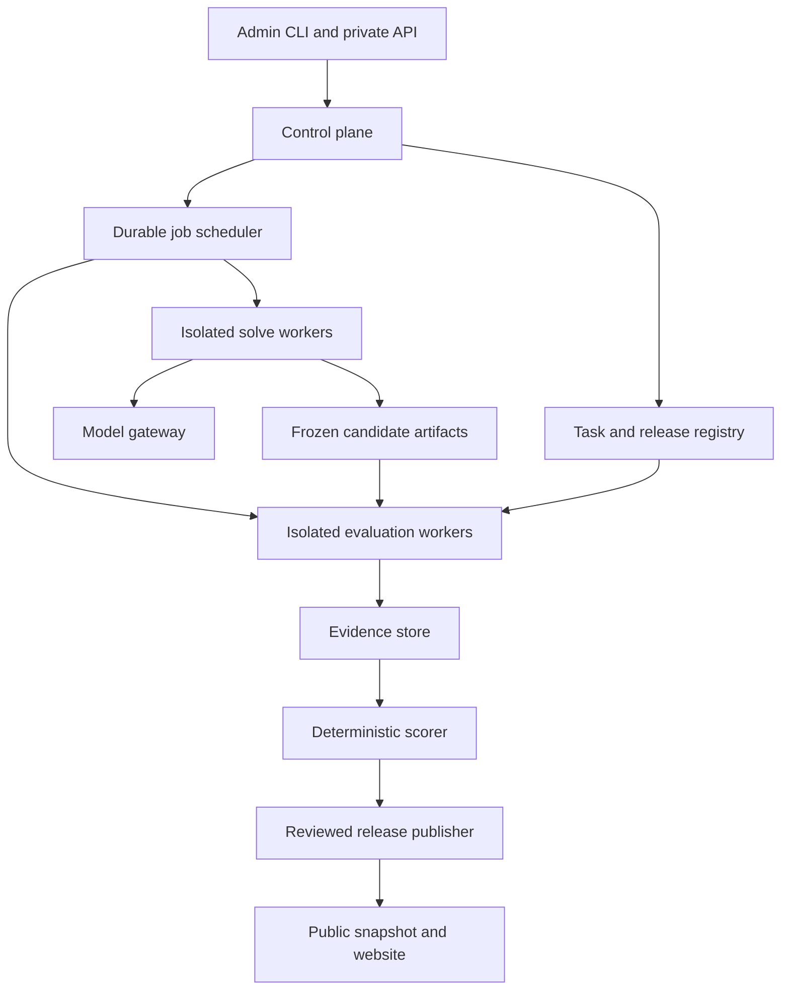
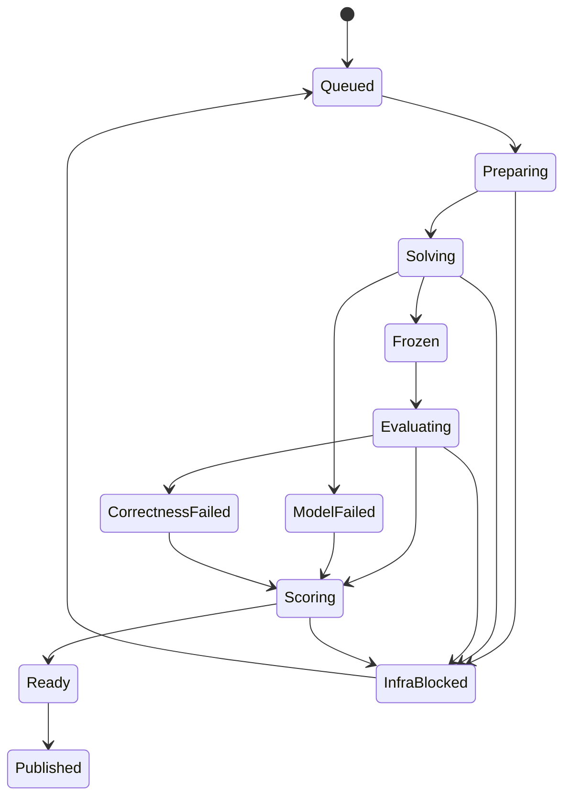

# PolyCodeBench — Architecture and Decision Specification

Version: 1.0 · Prepared: 30 September 2026 (Asia/Karachi)

Status: Proposed architecture, ready for engineering review. No application has been implemented or benchmark results measured as part of this document. Numerical scoring weights and operating thresholds below are proposed defaults to calibrate before a scored release.

Source of requirements: the supplied `Pasted markdown(5).md`. External methodology and technical references were checked on 29 September 2026 UTC. Source links appear in §22.

## 1. Architectural recommendation

Build a **Python modular monolith for the control plane, isolated workers for model execution and evaluation, PostgreSQL for structured records, object storage for evidence, and a Next.js website serving published result snapshots**.

The product’s central object is a **versioned benchmark release**, not a live leaderboard query. A release freezes the tasks, model configurations, agent harness, tool versions, scoring policy, hardware class, and inclusion rules. Every displayed result must trace back to those inputs and the evidence used to calculate it.

The main architectural boundaries are:

1. **Task preparation:** acquire, validate, license-check, and freeze benchmark tasks.
2. **Model execution:** obtain code, patches, bug reports, or factual answers under a declared budget.
3. **Independent evaluation:** evaluate the frozen submission without allowing the model to inspect or change the grading process.
4. **Publication:** release an immutable, reviewed projection of results and permitted evidence.

Use one repository and shared domain contracts initially. Run the API, scheduler, model gateway, worker supervisors, scorer, and publisher as separate processes with different permissions. A modular monolith does not mean running untrusted code inside the web server.

### 1.1 Assumptions

| Area | Working assumption |
|---|---|
| Team | One owner plus a small engineering team; operations must remain manageable. |
| Users | Public visitors read results. Administrators curate tasks and approve evaluations. A submission form requests an evaluation; it does not immediately launch arbitrary code. |
| Initial scope | Python and Rust; Track B code generation; two model configurations. |
| Execution | Linux x86-64 first. GPU resources are required only for local model inference or tasks explicitly requiring them. |
| Product model | Benchmark platform with a controlled evaluation pipeline. A general-purpose conversational agent is not required to run the platform. |
| Deployment | One region, managed database and object storage, disposable execution VMs, one dedicated performance worker initially. Provider selection remains replaceable. |
| Scale | Start with tens to hundreds of tasks per release, then expand from measured throughput and curation capacity. |
| Administration | CLI first; minimal private admin API. Public website follows a working harness. |

### 1.2 Changes needed to make the product brief internally consistent

| Requirement in the brief | Architecture decision |
|---|---|
| Every suite receives six code-quality scores | Only outputs containing evaluated code receive the six-dimensional code score. Repository Q&A and output prediction receive answer metrics; unrelated dimensions are N/A. |
| Existing benchmarks mostly stop at passing tests | Do not use this blanket positioning. CursorBench explicitly discusses quality, efficiency, and interaction behavior [S3]. PolyCodeBench’s proposed distinction is transparent, versioned evidence and language profiles. |
| Docker is the isolation boundary | Use Docker for packaging **inside disposable VMs** for untrusted execution. Docker alone is not treated as sufficient protection for the control plane [S5]. |
| Precision and recall on real repositories | Historical issues do not enumerate every possible bug. Publish strict precision/F1 only for an adjudicated scope; unresolved novel findings are not automatically false positives. |
| Tasks after a model cutoff are contamination-free | Call this a **post-declared-cutoff subset**. Unknown cutoffs remain unknown; dates reduce exposure risk but do not prove absence of contamination. |
| Hardening is the final phase | Reproducibility, hidden-test separation, access control, and provenance begin in Phase 1. The last phase validates and strengthens them. |
| Language idioms are universally good | Reward suitability for the task and repository. Do not reward streams, cloning avoidance, comprehensions, or advanced language features merely for appearing. |

## 2. Methodology and evaluation families

### 2.1 Verified benchmark references

These descriptions summarize the primary sources, not an assertion of exact reimplementation.

| Reference | What the primary source establishes | PolyCodeBench implementation boundary |
|---|---|---|
| SWE-bench [S1, S1b] | Repository patches are evaluated in Docker. Fail-to-pass tests check the requested fix; pass-to-pass tests check preserved behavior. | Import supported official datasets through an adapter, preserve native metrics, and separately append PolyCodeBench quality scores. Custom tasks following the pattern are labeled “SWE-bench-inspired.” |
| LiveCodeBench [S2] | Time-stamped contest problems support code generation, self-repair, code execution, and test-output prediction. | Preserve scenario-specific inputs and evaluation rules. New language ports or custom task sets are adaptations, not official scores. |
| CursorBench [S3] | Tasks originate in real Cursor engineering sessions; the published approach includes correctness, quality, efficiency, and interaction behavior, including agentic grading. | Build independently curated realistic repository tasks. Do not claim access to, or exact reproduction of, its internal task set or graders. |
| DeepCodeBench [S4] | PR-related repository context is used to construct Q&A. Evaluation checks the presence of discrete ground-truth facts in answers using an LLM. | Implement factual repository understanding with pinned code snapshots. Preserve fact recall and add separately labeled grounding and unsupported-claim checks. |

The engineering repository must eventually contain `/docs/methodology/{swebench,livecodebench,cursorbench,deepcodebench}.md`. Each file records source URL, source revision where available, access date, native input/output, native metric, known limitations, license status, and every PolyCodeBench deviation. This specification defines their required content; it does not pretend those repository files already exist.

### 2.2 Task families and outputs

| Track / family | Submission contract | Primary evaluation | Six code dimensions? |
|---|---|---|---|
| A: bug hunting | Structured findings plus final patch | Detection, localization, root cause, severity, repair | For the submitted repair |
| B: code generation | Source files | Functional and adversarial tests | Yes |
| B: repository issue repair | Patch | Fail-to-pass and pass-to-pass | Yes |
| B: realistic repository task | Patch and required artifacts | Acceptance criteria, tests, repository conventions | For generated or modified code |
| B: self-repair | Ordered submissions with explicitly permitted feedback | Initial and final success under fixed repair budget | Final scored code; retain intermediate results |
| B: repository Q&A | Answer with repository citations | Fact recall, evidence validity, unsupported claims | No |
| B: execution/output prediction | Predicted value/output | Exact or specified semantic match | No |
| B: test-output prediction | Predicted test result/output | Scenario-specific oracle | No |

A suite plugin defines whether code execution is permitted. Allowing the agent to execute a program in a reasoning-only output-prediction task changes the task. It must be a different evaluation protocol.

### 2.3 Compare a model configuration, not just a model name

A leaderboard entry identifies:

`provider + model revision + harness revision + execution mode + prompt policy + reasoning setting + sampling settings + context policy + tool set + budget tier`.

Separate:

- **Single-shot:** one submitted response; no environment feedback.
- **Standard agent:** identical PolyCodeBench tools and orchestration policy across models.
- **External agent systems:** optional later integration; ranked as complete systems with their harness versions.

Do not rank a high-budget agent run alongside a single-shot run without a visible protocol distinction. Unsupported provider parameters must be declared, not silently dropped.

## 3. System structure and trust boundaries



The arrows express data flow; they do not grant every component direct database access. Untrusted guests communicate through constrained supervisor channels. The public site can access only published projections.

| Component | Responsibility | Must not do |
|---|---|---|
| Control API | Authentication, task/release registration, run creation, cancellation, approvals | Execute submitted code or expose hidden bundles |
| Task curator | Repository preparation, mutation generation, oracle validation, split assignment | Auto-publish generated tasks without validation |
| Scheduler | Plan stages, lease jobs, enforce quotas, recover infrastructure failures | Retry bad model answers until they pass |
| Model gateway | Provider adapters, rate limits, credential isolation, usage ledger | Give model credentials to candidate code |
| Solve supervisor | Provision guest, serve file/command tools, enforce budgets, freeze output | Access hidden tests or reference patches |
| Evaluation supervisor | Mount evaluation inputs, execute checks, collect measurements | Feed hidden failures back into the solve session |
| Scorer | Transform versioned evidence into reproducible scores | Execute candidate code, browse, or improvise rubric weights |
| Judge service | Assess residual rubric items with fixed prompts and structured outputs | Override executable test results |
| Publisher | Validate completeness and disclosure rules; create signed release manifest | Publish raw private artifacts by default |
| Website | Explain published comparisons and evidence | Query worker databases or launch evaluations directly |

### 3.1 Recommended technology stack

| Layer | Decision | Reason / trade-off |
|---|---|---|
| Core domain and harness | Python, typed contracts with Pydantic | Strong evaluation tooling; fast adapter development. CPU-intensive test workloads run outside the control process. |
| API / CLI | FastAPI + Typer | One domain service layer serves both; CLI supports owner-operated workflows. |
| Database | PostgreSQL, SQLAlchemy, Alembic | Transactions, relational provenance, JSON metadata, and a durable initial queue. |
| Queue | PostgreSQL stage table with leases and `FOR UPDATE SKIP LOCKED` | Avoid a broker initially. Queue consumers are an intended use of this locking pattern [S6]. Correct recovery still requires application logic. |
| Large artifacts | Managed S3-compatible object storage | Code bundles, traces, reports, and raw measurements do not belong in database rows. |
| Images | OCI registry with immutable digests | Rebuildable toolchains; explicit runtime identity. |
| Untrusted execution | Hardened Docker in disposable Linux VMs | Compatibility with existing evaluation tools plus a separate kernel boundary. Higher startup cost is accepted. |
| Frontend | Next.js + TypeScript + Tailwind + Apache ECharts | Read-heavy pages, tables, confidence intervals, heatmaps, and model comparisons. |
| Observability | OpenTelemetry, structured logs, Prometheus-compatible metrics | Correlate run, attempt, stage, and cost without coupling scoring to an observability vendor. |
| Authentication | OIDC provider with MFA for administrators | Avoid custom authentication; server-side role checks. |
| Deployment | Containers for trusted services; infrastructure-as-code for workers/storage | Reproducible environments without requiring Kubernetes initially. |

Exact dependency versions are frozen after an end-to-end compatibility test. No floating `latest` tags in scored runs. This architecture intentionally does not guess future package version numbers.

Do not add Redis, Kafka, a vector database, Temporal, or Kubernetes solely because jobs are asynchronous. Introduce a workflow engine when multi-region recovery, complex branching, or operational load makes the documented stage machine inadequate. Introduce Kubernetes when worker fleet management justifies it. Keep plugin interfaces independent of either choice.

## 4. Task supply chain and benchmark integrity

### 4.1 Task admission

1. Register source repository, immutable commit, upstream issue/CVE where applicable, publication dates, and redistribution status.
2. Prepare a source snapshot without future commits, reference patches, mutation logs, cached answers, or grading artifacts.
3. Resolve dependencies in a quarantined build environment; produce locked offline images and a software bill of materials.
4. Author the task statement and acceptance contract. Declare output type, allowed files, resource limits, public feedback, and measurable quality opportunities.
5. Construct hidden tests, robustness cases, performance workloads, and rubric applicability.
6. Verify that an accepted reference solution passes and that intended faulty variants fail. Historical defects must reproduce before repair.
7. Validate an independently written alternative solution where feasible. Tests must not require one implementation style.
8. Repeat the baseline to detect flaky tests. Repair or quarantine unstable tasks before freezing the release.
9. Deduplicate at repository/fork, issue, semantic task, and mutation-family level. Keep related tasks in the same development/held-out split.
10. Review, assign difficulty using a frozen author rubric and later pilot evidence, then publish the task version into an immutable task set.

Task curation is likely the largest sustained workload. A reliable oracle and diverse failure cases are more valuable than a large count of weak tasks.

### 4.2 Track A sources

**Historical bugs:** prefer the actual pre-fix revision. Reverting a fix in a much newer repository can introduce artificial incompatibilities; admit that construction only after it is independently validated and labeled.

**Known security bugs:** use publicly disclosed cases and a minimized, isolated reproducer. Store the vulnerable version, causal evidence, and expected repair behavior. Existing unrelated vulnerabilities are recorded as baseline context.

**Mutations:** version each mutation operator, random seed, changed span, intended fault, and reference repair. Reject equivalent mutations, non-compiling mutations unless compilation defects are the task, and artifacts that trivially reveal the injected location. Maintain some clean/adjudicated controls to measure false alarms.

**Source balance:** report historical, disclosed-security, and injected subsets separately. Freeze their proportions; a cheap mutation generator must not dominate the benchmark.

### 4.3 Visible and hidden task bundles

Each task produces two independently addressable bundles:

- **Visible:** statement, allowed repository snapshot, public tests, interface contract, language constraints, allowed dependency inventory, and generic scoring policy.
- **Hidden:** grading cases, ground-truth bug annotations, reference patch, reference performance artifacts, rubric anchors, mutation provenance, and acceptance secrets where any are needed.

Hidden data never enters solve images, their image layers, shared writable caches, prompts, or public trace exports. Removing a file from the top image layer is insufficient if a model can access its lower layers.

Store the full manifest privately. Generate an explicitly allowlisted visible manifest; do not send the same object with a few fields hidden by the UI.

### 4.4 Time, contamination, and held-out tasks

Record distinct dates: earliest known problem/bug publication, repository commit, issue creation, task curation, first use, and any public disclosure. A newly packaged historical problem is not a new problem.

Model metadata stores declared training cutoff, source, confidence, model release/revision, and whether the provider may have received the held-out content previously. Unknown cutoff means the post-cutoff comparison is unavailable.

Maintain public development, public scored, and private held-out splits. Choose them before tuning rubrics. Use private-provider data handling appropriate to held-out evaluation; if the endpoint’s retention/training policy cannot support the desired isolation, document the exposure or disallow it for that split.

Personal post-cutoff subsets are useful within a model profile. Cross-model comparisons use the **same eligible task intersection** and show its size; otherwise apparent model differences could be dataset differences.

A permanently held-out result cannot reveal its exact task, full patch, and hidden tests publicly while remaining held out. Public evidence is necessarily redacted. Allow confidential audits, or retire and disclose a task in a later release. State this transparency boundary plainly.

## 5. Run lifecycle, recovery, and budgets

### 5.1 Entity hierarchy

`Evaluation campaign → run configuration → task attempt → stage execution → evidence → scorecard → published snapshot`.

A **sample** is a planned independent model attempt. An **infrastructure retry** is recovery of the same intended work. These are different records and must never be merged into “best of retries.”

### 5.2 Stage machine



Requeueing resumes from the earliest incomplete safe stage, not necessarily from model generation. Cancellation and quarantine are explicit terminal/nonpublishable statuses available from all relevant stages. A release is published as a whole; the per-attempt `Published` state means membership in that release snapshot.

### 5.3 Durable execution rules

- Transactionally create jobs with their parent attempt and dependency records.
- Claim a short database lease; never hold a SQL transaction throughout a container run.
- Every lease has an increasing fencing token. Expired workers cannot commit later results or publish artifacts as authoritative.
- Heartbeat, cap retries, and release capacity after termination. A watchdog destroys abandoned guests.
- Commit content-addressed stage artifacts before acknowledging completion. Verify their presence and digest before scoring.
- Unique stage keys include attempt ID, stage kind, candidate digest, evaluator digest, and relevant config digest.
- Result reuse must include candidate content. An upstream harness may have weaker cache keys; the SWE-bench adapter therefore generates a unique native run ID from the candidate/evaluator identity [S1].
- Treat at-least-once execution as normal. Idempotent commits prevent duplicate scorecards; they cannot guarantee a remote provider is billed only once.

### 5.4 Failure classification

| Event | Classification | Handling |
|---|---|---|
| Wrong answer, compile error from submitted code, refusal, malformed final artifact | Model failure | Count against the attempt; no extra generation retry. |
| Candidate exceeds fixed runtime/memory limit | Model/task failure | Count as failure; preserve evidence. |
| Worker disappears, disk failure, provider unavailable before output | Infrastructure failure | Retry boundedly under the same policy; disclose unresolved coverage. |
| Provider timeout after an ambiguous response/billing outcome | Ambiguous infrastructure failure | Preserve request ID; resume recorded state if possible; flag possible repeat billing, never select the better answer. |
| Known valid reference fails under the same environment | Task/environment defect | Quarantine task for every model; issue a revised release if necessary. |
| Analyzer crashes on candidate input | Evaluation failure | Retry/reproduce, then adjudicate or quarantine. Never convert “no report” into a perfect score. |
| Tool reports a vulnerability | Evidence | Normalize and score it; the scanner’s nonzero exit is not necessarily infrastructure failure. |
| Provider omits token usage | Usage unavailable | Preserve null and an optional labeled estimate; never record zero cost as fact. |

Agent self-repair using allowed public feedback is part of the declared execution budget. It is not an infrastructure retry.

### 5.5 Budget enforcement

Each run declares wall-clock, model-turn, tool-call, input-token, output-token, command-time, memory, CPU, disk, process-count, and monetary limits where measurable. Define one model turn as one request/response cycle, regardless of how many tool calls it contains.

The model gateway reserves estimated maximum call cost transactionally before dispatch. Settle against reported usage and keep outstanding reservations for in-flight calls. Provider limits and campaign-wide spending limits apply in addition to task limits. A hard spending cap cannot be perfectly guaranteed if a provider withholds timely usage; reserve conservatively and disclose uncertainty.

Context truncation, summarization, retrieval, and tool-output clipping are part of the versioned harness policy. Log their occurrence; never let one adapter silently receive more context than another.

## 6. Model execution and sandbox design

### 6.1 Solve environment

The controller runs the agent loop outside the candidate guest. It sends prompts through the model gateway and dispatches approved tool calls to a supervisor. Candidate code receives no model-provider key.

Standard tools: `list_files`, `read_file`, `search`, `apply_patch`, `run_command`, and `run_public_tests`. A declared tool set can omit some of these. Command output is bounded and treated as untrusted text.

The guest has network off, no host Docker socket, no host filesystem mounts beyond scoped data, no cloud instance credentials, no privileged mode, dropped capabilities, a restrictive syscall profile, non-root execution where compatible, and enforced cgroup/time/disk/process limits. Trusted supervisors are outside the guest trust boundary; guest outputs can never authorize broader access.

If a task needs packages, dependencies are prebuilt or vendored. A network-enabled task requires a separately labeled protocol and allowlisted proxy. API model access happens from the external controller, so an offline sandbox does not prevent model calls.

### 6.2 Submission freeze

At budget completion, stop candidate processes, collect the declared output, and compute a candidate digest. Validate patch paths, size, file types, symlinks, submodules, binary payloads, protected configuration, and allowed changes. Never follow an uploaded path outside the task root.

Score the submitted artifact as written. Do not automatically format, repair, or “help” it before evaluation unless that transformation is an explicit part of the protocol applied to every model. Tool-based normalizations used for comparison are retained as derived evidence and do not overwrite the original.

### 6.3 Evaluation environment

Use a fresh guest and clean source snapshot. Apply the frozen candidate; install trusted test/configuration overlays independently of repository changes. Candidate-added tests may be inspected but do not replace acceptance tests. A task can permit edits to project configuration, but cannot permit edits to the external grading rules.

Keep the **grader controller** outside candidate execution. Compile/build scripts, pytest plugins, dependency hooks, and static-analysis parsers may all process malicious content; run these in constrained environments too. No cloud credentials or private store access are available to evaluated code.

Use a separate black-box test driver and process/VM boundary when the task interface permits it. For repository tests that import candidate code into the same process, hidden-test confidentiality is not absolute: candidate code may introspect its test process. Therefore hidden tests are withheld from the solve session, grading outputs never return to that session, and the benchmark uses isolated grading plus anti-tampering checks. Do not promise that “hidden” means impossible for executing code to inspect.

### 6.4 Performance environment

Performance runs use a dedicated, homogeneous worker pool with one measurement job at a time per isolated allocation. Reference and candidate run on the same physical worker in randomized order. Record CPU, architecture, memory, kernel, runtime, compiler flags, virtualization mode, and measurement policy.

A disposable VM boundary remains in place. Do not weaken isolation solely to obtain nicer timings. If virtualization noise exceeds the allowed variance, reserve dedicated hardware or change the declared performance class.

Never benchmark sanitizer, coverage, Miri, profiler, or debug builds as production-performance results. Maintain separate instrumentation and performance image identities.

## 7. Plugin architecture and extension contracts

Use typed plugin interfaces with explicit API versions. Plugins are administrator-installed code, not arbitrary packages submitted through the website.

| Plugin | Required behavior |
|---|---|
| `SuiteAdapter` | Import and validate native tasks, define protocol/output type, export native metrics, document deviations. |
| `LanguagePlugin` | Resolve toolchains, validate artifact structure, define build/test commands, locate symbols, collect applicable checks and profile opportunities. |
| `AnalyzerPlugin` | Execute pinned analysis, parse raw output, emit normalized observations, declare applicability and failure semantics. |
| `ModelAdapter` | Declare capabilities, normalize messages/tools, issue request, capture response and usage, classify transport errors. |
| `SandboxProvider` | Create guest, execute bounded command, collect artifacts, kill process tree, destroy guest, attest environment metadata. |
| `JudgeAdapter` | Apply a fixed rubric to a bounded evidence packet and return item-level scores, citations, and uncertainty. |
| `ScoringPolicy` | Pure deterministic mapping from validated observations and declared applicability to scorecards. |

A new language requires a toolchain image, language plugin, versioned profile, supported analyzer configurations, task fixtures, and successful conformance checks. It does not require rewriting orchestration, storage, or frontend routes. Configuration alone cannot create build/test support for a genuinely new language.

Conformance checks must cover a valid solution, incorrect solution, known anti-pattern, analyzer failure, missing dependency, timeout, and profile applicability. Mixed-language repositories declare affected languages and build ownership; v1 ranks tasks under one primary language and reports secondary-language findings without silently counting them as extra tasks.

## 8. Scoring specification

### 8.1 Separate observations from scores

A scanner result is an observation, not a score. Store raw reports, normalized findings, applicability, and confidence before applying a scoring policy. This makes a policy change independently auditable and allows rescoring when the existing evidence is sufficient.

Every normalized finding includes tool/version, rule ID, category, severity, confidence, file/span/symbol, evidence reference, fingerprint, whether it existed in the baseline, and its adjudication status. Map overlapping scanner reports to one underlying issue. Two tools finding the same defect must not double the penalty.

For repository tasks, evaluate baseline and candidate with the same rules. Separate:

- Newly introduced or worsened issues.
- Existing issues in the task’s declared repair scope that remain unfixed.
- Unrelated inherited issues, shown as context without automatic blame.

Use semantic fingerprints and location mapping, not a raw line-number subtraction. An unchanged function moved to a different file should not acquire a new defect simply because its line numbers changed.

### 8.2 Correctness and eligibility gate

Let `g(t,m,r)` equal 1 when model configuration `m`, sample `r`, on task `t` satisfies **all required acceptance conditions**; otherwise 0. For code tasks:

`C = 100 × g`.

Required conditions include successful build where relevant, functional tests, specified regressions, and the task’s hard constraints. Hard memory-safety or security conditions belong here only when explicitly frozen in the task contract. Test pass fraction remains a diagnostic; it is not the main correctness score.

If `g = 0`, every applicable non-correctness contribution is zero. Keep the explanation `gated_by_correctness`; do not imply each tool independently found a defect. N/A remains N/A. Expensive quality work may be skipped after failure.

If execution or grading is incomplete due to infrastructure, `g = null`, not zero or one. The attempt is pending/nonpublishable until resolved under the release policy.

### 8.3 Code composite

Proposed starting weights:

| Dimension | Weight |
|---|---:|
| Correctness | 30% |
| Security | 20% |
| Efficiency | 15% |
| Code quality | 15% |
| Idiomatic strength | 10% |
| Robustness | 10% |

For a fully applicable task, with each raw non-correctness dimension in `[0,100]`:

`CodeScore = 30g + g × (0.20S + 0.15E + 0.15Q + 0.10I + 0.10R)`.

For predeclared N/A non-correctness dimensions, redistribute the 70 quality points among applicable quality dimensions using their fixed relative weights. If `A_t` is the frozen applicable set and `w_d` the weights above:

`CodeScore = 30g + 70g × [Σ(d∈A_t) w_d q_d / (100 × Σ(d∈A_t) w_d)]`.

Do not change applicability after seeing a model’s answer. If no quality dimension is meaningful, the task belongs in an answer-only or correctness-only suite, not the six-dimensional code composite. Every scored release must provide sufficient tasks for every dimension advertised on its headline board.

Example, entirely synthetic: a passing submission with `S=90, E=80, Q=85, I=90, R=80` scores `89.75`. The same submission failing one required correctness condition scores `0`. These are illustrations, not model measurements.

Always show the all-attempt pass rate, all-attempt gated dimensions, and optionally quality **conditional on passing** with the passing denominator. Conditional quality cannot replace the all-attempt ranking: a model that solves one easy task must not look better than one that solves most tasks.

### 8.4 Security

Security is a measured-risk score, not a certification of absence of vulnerabilities. Combine pinned static rules, task-specific dynamic probes, secret detection, and dependency checks where applicable.

An initial deterministic rule can be:

`S = max(0, 100 − Σ unique confirmed applicable penalties)`.

Draft penalties: critical 50, high 25, medium 10, low 3. Assign one primary score owner to each canonical issue; severity and confidence mappings are versioned. Uncertain/high-impact scanner claims require adjudication under a consistent policy before final publication. A confirmed issue that violates a hard acceptance requirement also fails correctness; the gate then dominates.

Do not count findings per line of code: that rewards padding. Bound penalties at the issue level, group repeated instances of the same causal pattern where appropriate, and expose all instances as evidence.

For dependency scans, freeze the advisory database snapshot and distinguish newly selected/changed dependencies from inherited ones. A live advisory update creates a new security assessment version; it must not silently change historical scores. Audit tools requiring a service call run through the trusted orchestration path or an offline mirror, not by opening the candidate guest’s network.

### 8.5 Efficiency

Measure generated-code runtime and memory separately from model-generation cost and latency.

- Compare candidate and accepted reference within the same language/runtime, not Rust against Python raw milliseconds.
- Use at least three input scales and multiple shapes when task behavior permits it.
- Default pilot policy: five warmups and twenty paired measured iterations per workload. A language plugin may require longer JIT warmup under a policy frozen before candidates run.
- Randomize candidate/reference order. Validate outputs during timing so omitted work cannot win.
- Retain per-iteration time, peak resident memory, process count, exit status, workload seed, and hardware identity.
- Use a frozen aggregation across workloads, such as the geometric mean of positive median time ratios and memory ratios.

Define `r_time = T_candidate / T_reference` and `r_mem = M_candidate / M_reference`, with a predeclared measurement floor for tiny timings and memory values. A conservative pilot transform is:

`f(r;b) = 100 if r ≤ 1; 100 × (b − r)/(b − 1) if 1 < r < b; 0 if r ≥ b`.

Proposed starting breakpoints: `b_time=4`, `b_mem=2`. Then:

`E = 0.70 f(r_time;4) + 0.30 f(r_mem;2)`.

These breakpoints require calibration. Matching or beating the reference receives full points; further improvements remain visible as ratios rather than unbounded score bonuses. Validate that the reference is competent and freeze its identity. A single poorly optimized reference must not make every candidate look excellent.

Report cold-start and steady-state separately where meaningful. Exclude build time from runtime efficiency but report it as a separate operational measure. Pin optimization flags, dependency versions, threading policy, and random inputs.

A candidate performance timeout is a bounded poor-performance result, unless it breaches a hard acceptance limit and fails correctness. Infrastructure noise is different: a frozen reference canary outside its declared stability range invalidates the measurement block for all affected candidates. Remeasure under a fixed policy; do not keep the fastest rerun.

Scaled workloads can reveal performance growth inconsistent with the task’s target. They do not establish a mathematical Big-O proof. Publish measurements and the tested range.

### 8.6 Code quality, idioms, and robustness

Use item-level rubrics with explicit anchors, usually `0, 0.5, 1`, mapped to 0–100. Static checks handle concrete violations; judges assess only items without a reliable executable/static check.

**Code quality** covers maintainable decomposition, naming in context, avoidable duplication, unnecessary complexity, and consistency with the repository. Complexity thresholds identify review evidence; they are not universal proof that a function is bad. Generated/vendor code is excluded by the frozen scope policy.

**Idiomatic strength** covers contextually appropriate language design and APIs. A generator should earn credit when streaming/laziness matters, not merely because the syntax appears. Advanced constructs must not earn automatic bonuses.

**Robustness** uses a weighted set of independent behavioral scenarios: malformed inputs, missing data, I/O failure, cancellation, partial results, resource cleanup, and concurrency faults where applicable. Weight scenarios rather than raw test counts so adding many duplicate easy tests cannot inflate the score. If a behavior is required by the task contract, failure belongs in correctness; optional quality scenarios must be clearly identified in advance.

### 8.7 Avoiding duplicate penalties across language profiles

The supplied language profiles contain items also covered by security, efficiency, robustness, and general quality. Preserve those profiles for the language detail view, but **do not feed the entire profile back into the overall score unchanged**.

Decision: publish two distinct objects:

1. **Language strength profile:** the requested weighted diagnostic report, retaining the supplied weights.
2. **Idiomatic dimension `I`:** a predeclared subset of language-specific items whose primary score owner is idiomatic strength, with weights renormalized within that subset.

For example, a Rust ownership/API-design choice can belong to idioms; a demonstrated unsound access belongs to security/correctness; measured copying overhead belongs to efficiency. The same observation can appear in multiple explanatory views, but its penalty has only one owner in the composite. Any intentionally distinct consequences must have separate evidence and a documented mapping.

This is an explicit amendment to the brief to avoid rewarding or penalizing the same fact multiple times. `/config/scoring/evidence_ownership.yaml` freezes these mappings before any scored model run.

### 8.8 LLM judge policy

- Use a fixed rubric, prompt digest, judge model revision, inference settings, and structured response schema.
- Use a judge different from the candidate model. For a compared cohort, prefer one fixed judge not included in that cohort. If the judge model is later evaluated as a candidate, move the entire comparison cohort to a common alternative panel and publish a new evaluation version.
- Run at least three judgments per applicable rubric item/packet and average valid item scores. Three calls from one model measure some variability; they do not remove shared bias.
- Blind candidate identity, provider, measured rank, and cost. Present task constraints and bounded evidence, not an invitation to execute code.
- Require citations to file spans or evidence IDs. Treat comments and candidate instructions as untrusted data; judges have no tools or external access.
- Log all judgments, spread, schema failures, and adjudications. Do not secretly discard low scores.
- Proposed review threshold: a spread of at least two anchor levels on an item or contradictory factual claims. Manual resolutions replace the item only through a recorded, versioned adjudication.
- Calibrate against human-labeled examples including verbose weak code, concise strong code, valid alternative implementations, and injected judge instructions. Select sample sizes from desired uncertainty, not a claim that three votes prove reliability.

Freeze rubrics before scoring the held-out set. Judge agreement, human agreement, and human-audit rate appear on the methodology page.

## 9. Track A detection and repair evaluation

### 9.1 Finding schema and matching

Each finding contains a stable local ID, base-revision file/range, optional symbol, root-cause statement, reproduction/evidence, severity, and associated patch references. Reject unbounded ranges as exact localization claims. A task declares a finding limit to control spam, but models are still scored for incorrect findings within that limit.

Match findings to accepted ground truth using a frozen rule: causal defect equivalence plus supporting location/reproduction. A correct file name alone is insufficient. Construct one-to-one matches between findings and known defects, with human adjudication for ambiguous cases. Matching decisions are retained as evidence.

Use:

`Precision = TP / (TP + FP)`

`Recall = TP / (TP + FN)`

`F1 = 2TP / (2TP + FP + FN)`.

Aggregate counts across a fixed task set before computing micro-F1. Also report macro results by repository/source type. Identical repeated findings provide no extra credit; semantically distinct spurious claims are false positives. Report duplicate rate separately. Undefined denominators are N/A, not manufactured perfect scores. On a corpus with real positive bugs, making no findings yields zero recall/F1; clean controls contribute false alarms.

### 9.2 Incomplete real-world ground truth

For a historical/CVE task, an unmatched finding can be a genuine new defect. Its status is `unverified`, not automatically `false_positive`. Review under the frozen scope policy and either accept it, reject it with evidence, or leave the strict precision/F1 pending.

If a newly accepted defect changes the oracle, create a new ground-truth version and rematch every model’s reports consistently. Do not quietly improve one model’s score.

Provide two clearly labeled views:

- **Adjudicated-scope benchmark:** strict precision/recall/F1 after all scored findings are resolved. Mutation tasks still need review for unrelated valid bugs.
- **Open repository discovery:** known-bug recall, confirmed findings, rejected findings, unresolved count, and confirmed yield. Do not claim exhaustive repository-wide recall.

### 9.3 Localization, explanation, and severity

Proposed localization credits per matched bug: causal statement/range `1.0`, same function `0.7`, same file `0.3`, otherwise `0`. Gold annotations may contain multiple acceptable causal spans. Unmatched required bugs receive zero. Aggregate over ground-truth bugs, not just correctly detected ones.

Root-cause explanation uses anchored factual items: triggering condition, defective behavior, mechanism, and consequence. Severity uses a task-specific impact rubric with accepted categories and under/overstatement penalties. A disagreement about severity alone must not turn a causally correct detection into a miss.

### 9.4 Repair and Track A score

Evaluate the final combined patch against the complete task repair contract. Require no declared regressions. Keep per-bug fixed/not-fixed evidence, but do not award full repair success if one fixed bug masks another required failure.

The patch receives the six code dimensions. Missing or incorrect required patch means repair `CodeScore=0`; useful detection metrics remain visible.

For a fully adjudicated Track A cohort, proposed summary:

`A_score = 0.35 × (100F1) + 0.10L + 0.10X + 0.05V + 0.40RepairScore`.

Here `L`, `X`, and `V` are localization, explanation, and severity, each scaled 0–100 over all required defects; `RepairScore` is the declared task/source-balanced mean code composite. Show all components separately. If strict F1 is unavailable, do not manufacture this summary. No special bonus is given for reporting more bugs.

## 10. Aggregation, uncertainty, and leaderboard policy

### 10.1 Fixed comparison cohorts

A comparable cohort fixes task set, task versions, scoring versions, language coverage, execution mode, budget tier, hardware class, judge policy, and sampling policy. Average planned independent samples per task, then aggregate by the release’s frozen strata. Do not pick the best sample as the default.

Default reporting is expected one-attempt performance. `pass@k` is an additional explicitly labeled metric only where the sampling assumptions and protocol support it; it cannot conceal the cost of extra attempts.

Use equal language weights for a cross-language board, with frozen suite/source/difficulty weights within each language. This avoids allowing a much larger Python task set to dominate. Per-language scores still reflect their own task difficulty; normalized scores do not prove languages were equally hard.

### 10.2 What “overall” means

At MVP, the website’s overall score means **Track B code-generation composite for the selected release**. It is not an all-product score.

At full scope, keep three top-level boards: **Bug Hunting**, **Code Production**, and **Repository Understanding / Prediction**. Within the third board, factual Q&A and exact-output tasks retain their native metrics and visible subgroups.

If a single product index is desired, enable it only when all required categories have validated coverage. Proposed full-product release weights are `40% Track A + 45% code production + 15% understanding/prediction`. Freeze weights within the final category as well. Label this an editorial index, expose components, and do not display six code dimensions as if they applied to every answer task.

The default recommendation is to launch the separate boards first. Changing index weights or introducing a new language creates a new release, not a silent reorder of historical rankings.

### 10.3 Missing and incomplete work

- A model failure counts as zero where the protocol specifies failure.
- An infrastructure failure is missing data and blocks final ranking on that cohort until resolved or the cohort is consistently revised.
- A task removed due to a defect is removed for every model in a new version, with an exclusion record.
- A model missing a language does not receive a renormalized all-language score. Show partial coverage without a full rank.
- N/A is determined by the task’s applicability contract, not scanner availability or candidate behavior.
- An unavailable required analyzer/judge is an incomplete evaluation, not N/A or 100.

For exploratory filters, calculate a common cohort across compared entries, show exclusions and task count, and label the result as a filtered comparison. Cache by release and the exact filter hash.

### 10.4 Confidence intervals

Use a fixed-seed hierarchical/cluster bootstrap, with a proposed 2,000 resamples and 95% interval:

- Resample independent repositories for repository tasks, retaining dependent tasks inside clusters.
- For generation tasks, cluster related problems/ports/mutations rather than pretending translations are independent.
- Resample planned model samples within task clusters when multiple samples exist.
- Recompute the entire weighted statistic, including Track A micro-F1, in each resample.
- For head-to-head comparisons, bootstrap the paired score difference on common tasks.

Report independent-cluster count, task count, sample count, and interval method. Performance run variance and between-task leaderboard uncertainty are different quantities and must be labeled separately. Do not draw a narrow confidence interval from thousands of correlated test assertions.

A pilot with few independent repositories receives an “exploratory” label. Pre-register the sample-size/coverage targets before a public ranked release. Overlapping marginal confidence intervals alone do not prove equality; use the paired difference and report uncertainty rather than forcing winner language.

## 11. Language profiles and tool coverage

### 11.1 Preserve the supplied diagnostic weights

All rows below sum to 100%. They define the full diagnostic profile; composite ownership follows §8.7.

| Profile | Weighted items |
|---|---|
| Python | Readability/idioms 25; type hints 15; stdlib use 15; error handling 15; lint/style 10; performance awareness 20. |
| TypeScript / JS family | Async correctness 25; TypeScript safety 20; modern features/immutability 15; security 20; async error handling 10; lint 10. |
| C | Memory safety 30; avoiding UB 25; performance/cache behavior 15; const/ownership 10; portability 10; error-code checks 10. |
| C++ | RAII/smart ownership 25; moves/copies 15; STL use 15; exception safety 10; appropriate modern features 15; abstraction/performance 10; UB/memory safety 10. |
| Rust | Ownership/borrowing 25; justified and sound unsafe usage 20; Result/Option 20; iterators/traits 15; concurrency 10; clippy 10. |
| Go | Error handling 25; goroutines/channels 25; cancellation/context 15; simple interfaces 15; stdlib 10; formatting/vet/staticcheck 10. |
| Java | Design boundaries 20; resource handling 15; concurrency 20; appropriate modern APIs 15; null safety 15; security 15. |

**JavaScript is a distinct runtime/profile variant.** It must not lose points for lacking TypeScript types. Recommended JS weights renormalize the remaining items: async 31.25, modern features/immutability 18.75, security 25, async error handling 12.5, lint 12.5. Optional checked-JS typing belongs in a separately declared profile.

An async/concurrency item is N/A for a task with no opportunity to demonstrate it. Applicability is derived during task authoring and frozen. The language view shows the number of opportunities per item, not just a radar chart full of seemingly confident averages.

### 11.2 Tool plan

These are proposed integrations. Compatibility, pinned versions, rule coverage, and applicable terms must be checked in the language-plugin acceptance run; listing a tool does not establish universal coverage.

| Language | Initial integrations | Specific limitation / decision |
|---|---|---|
| Python | pytest, Hypothesis, Ruff, one frozen type checker, Bandit; approved Semgrep rules | Do not require both mypy and Pyright to agree. Dynamic code can be valid; typing expectations belong in the task contract. |
| JS / TS | Node, frozen package manager, ESLint, TypeScript compiler for TS, task-selected Vitest/Jest, dependency audit | Promises/concurrency require runtime tests as well as static rules. Pin lockfiles and advisory data; do not run a moving audit against historical results. |
| C | Clang/GCC profile, clang-tidy, cppcheck, ASan/UBSan, targeted Valgrind | Warning policies depend on baseline/task. Use separate builds for instrumentation and speed. Sanitizers exercise paths rather than prove all paths safe. |
| C++ | clang-tidy with pinned selected checks, ASan/UBSan, separate TSan where applicable, cppcheck | Raw pointers are not automatically ownership bugs; C++17/20 requirements and valid legacy conventions are task-specific. |
| Rust | rustc/cargo, clippy selected checks, cargo test, dependency audit, Miri where compatible, pinned benchmark harness | Miri detects classes of UB but has unsupported operations and incomplete coverage [S9]. An unsupported run is not a clean bill of health. |
| Go | go test, race-enabled tests, go vet, staticcheck, gosec, gofmt check | Race detection depends on executed behavior; context propagation is meaningful only where the API/workload calls for it. |
| Java | Pinned JDK/build tool, JUnit, SpotBugs, PMD, Checkstyle, dependency analysis, task benchmark driver | Resource/concurrency tests are necessary. Streams, records, and SOLID terminology are not automatic quality points. |

CodeQL is an optional analyzer with an explicit per-language capability/terms matrix. Its current published language support includes Rust [S7]; do not hardcode an outdated assumption that it cannot analyze Rust. Feature and library coverage still vary. Its CLI has separate terms [S8]; do not assume every benchmark use is automatically permitted.

Avoid blanket `-Werror` or all-pedantic-rule enforcement on arbitrary legacy repositories unless the reference passes that same frozen contract. Introduced warnings can be penalized without failing a valid legacy build for preexisting warnings.

Anti-pattern rules have applicability and evidence requirements: mutable default state in Python, unsafe equality/coercion in JS, unchecked allocation in C, unjustified ownership leaks in C++, panic-prone library paths in Rust, goroutines without lifecycle management in Go, and unclosed resources in Java. The presence of a token such as `unwrap`, `clone`, `new`, or `==` alone is not enough to prove a violation.

## 12. Data architecture and contracts

### 12.1 Database entities

| Entity | Important fields / constraints |
|---|---|
| `task` | Stable identity, family, primary language, source identity. |
| `task_version` | Immutable manifest digest, visible/hidden bundle references, oracle version, dates, scope, license metadata; unique task/version. |
| `task_set` / `task_set_member` | Frozen membership, split, strata, declared weights. No editing after release freeze. |
| `language_profile` / `scoring_policy` | Version, canonical document, content digest, applicability and ownership mappings. |
| `model_revision` | Provider/model/revision, cutoff evidence, endpoint identity, capability declaration; secret references only. |
| `harness_revision` | Source commit, prompt/tool/context policies, dependency lock, adapter versions. |
| `run_config` | Full canonical configuration and digest; task set, model config, mode, budgets, sampling, judge, hardware. |
| `campaign` / `attempt` | Administrative grouping; unique run/task/sample identity; outcome and coverage status. |
| `stage_execution` | Job state, lease, fencing token, retry reason, input/output digests, worker/environment identity. |
| `model_call` | Provider request ID, attempt/turn, timestamps, response artifact, reported usage, estimated usage flag, pricing snapshot. |
| `artifact` | Content digest, media type, storage key, visibility class, producing stage, retention policy. |
| `observation` / `finding` | Normalized checks, baseline/candidate relation, raw artifact references, canonical issue fingerprint. |
| `judge_vote` / `adjudication` | Item scores, evidence citations, policy revision, reviewer, reason, superseded decision. |
| `scorecard` / `score_item` | Input evidence manifest, gating, applicability, weights, raw/gated values, scorer digest. Immutable. |
| `release` / `release_entry` | Frozen cohort, scorecards, aggregation and CI config, public projection digest, signature, publication state. |
| `submission_request` / `audit_event` | Approval workflow and append-only record of privileged changes. |

Use foreign keys for provenance, unique constraints for idempotency, and indexes on task/run identity, queue readiness, lease expiration, release filters, and finding fingerprints. Large logs belong in object storage; database rows store compact structured summaries. Partition high-volume event tables only after measured need.

Separate database roles and object-store permissions for curator, scheduler, solve supervisor, evaluator, publisher, and public API. Public artifact references are not interchangeable with private ones. Never depend on unpredictable object IDs as access control.

### 12.2 Task manifest example

Illustrative schema; names and digests below are placeholders, not runnable task assets.

```yaml
schema_version: 1
task_id: python-stream-parser-001
task_version: 1
track: B
family: code_generation
primary_language: python
language_profile: python-profile-v1
source:
  kind: authored
  first_public_at: null
  curated_at: 2026-09-30
  license_record: rights-record-id
split: private_heldout
visible_bundle_digest: VISIBLE_BUNDLE_SHA256
hidden_bundle_digest: HIDDEN_BUNDLE_SHA256
oracle_version: parser-oracle-v1
runtime_image_digest: PINNED_OCI_DIGEST
allowed_outputs: [solution.py]
protocol:
  mode: standard_agent
  public_test_feedback: true
  hidden_feedback: false
  network: disabled
limits:
  model_turns: 30
  tool_calls: 100
  wall_seconds: 600
  memory_mib: 2048
quality:
  dimensions: [security, efficiency, code_quality, idiomatic, robustness]
  opportunities: [streaming, malformed_input, resource_cleanup]
  performance_profile: parser-perf-v1
```

Limits are illustrative starting values; production budgets are calibrated by task class and frozen. The actual model-visible export omits hidden references, provenance that reveals answers, and confidential source identities. Serialized YAML is schema-validated; executable expressions and unsafe deserialization are forbidden.

### 12.3 Evidence and score explainability

A clickable score should resolve through this chain:

`release aggregate → weighted task/sample contributions → score item → observation or judge vote → permitted raw evidence → exact tool/config version`.

Each score item records `dimension`, `item_id`, `applicable`, `primary_owner`, `raw_value`, `effective_weight`, `gating_reason`, `contribution`, `evidence_ids`, and `policy_digest`. A display value like 82.4 must be reproducible from unrounded contributions; round only for presentation.

Preserve raw analyzer files even when parsers later improve. A parser correction creates new normalized evidence and scorecard versions. Retain the old result and correction reason.

### 12.4 Reproducibility levels

**Score replay:** reproduce identical scores from frozen evidence and the same scorer. This is deterministic and must be required.

**Evaluation replay:** rerun frozen code under the same environment. Functional checks should agree; timing and some concurrency results have declared statistical tolerance.

**Generation rerun:** ask the provider to generate again. Seeds and fixed temperature improve traceability but do not guarantee bitwise identity for remote APIs or all GPU backends. Preserve original outputs and provider revision metadata rather than promising exact regeneration.

The reproducibility manifest includes task/test digests, candidate digest, source/toolchain images, tool/query/advisory versions, model parameters, agent policy, random seeds, worker hardware/software, scorer/judge configuration, exceptions, and artifact manifest. Cached outputs are used for replay, never passed off as new independent generations.

## 13. API and CLI design

Version the external API under `/v1`. OpenAPI is generated from the same typed contracts used by the CLI. Pagination, stable IDs, request correlation IDs, structured errors, and authorization apply consistently.

| Route / action | Access | Behavior |
|---|---|---|
| `POST /admin/tasks/validate` | Curator | Validate a proposed task version; return diagnostics. |
| `POST /admin/task-sets` | Curator | Freeze candidate task-set membership after validation. |
| `POST /admin/runs` | Operator | Resolve immutable run config and enqueue work; require idempotency key. |
| `GET /admin/runs/{id}` | Operator | Status, budget ledger, stage failures, and progress. |
| `POST /admin/runs/{id}/cancel` | Operator | Stop new dispatches, terminate running guests, preserve completed evidence. |
| `POST /admin/releases/{id}/validate` | Reviewer | Check completeness, comparability, disclosure, and artifacts. |
| `POST /admin/releases/{id}/publish` | Publisher | Publish a reviewed snapshot atomically; record who approved it. |
| `GET /releases` | Public | Available releases and correction history. |
| `GET /leaderboard?release=...` | Public | Snapshot-backed results with scope, coverage, and intervals. |
| `GET /models/{id}` | Public | Published profiles, capabilities, cost, and per-release comparisons. |
| `GET /tasks/{id}` | Public | Only disclosed task versions and allowed evidence. |
| `GET /compare` | Public | Common-cohort comparison for 2–4 model configurations. |
| `POST /model-submissions` | Rate-limited requester | Create a review request; no automatic execution or credential display. |

Suggested CLI surface: `pcb task validate`, `pcb taskset freeze`, `pcb run plan`, `pcb run start`, `pcb run inspect`, `pcb run cancel`, `pcb score replay`, `pcb release validate`, and `pcb release publish`.

`run plan` reports task count, expected stage count, resources, and estimated spending without execution. `run start` requires a resolved config and budget. Authorizing a campaign permits its bounded autonomous stages; publication remains a separate product workflow action.

Submitted model endpoints are configured by administrators after validation. Block arbitrary access to metadata endpoints, loopback, and private network ranges from untrusted submissions. Explicitly registered local inference endpoints use a separate internal route. Credentials enter a secret manager and are referenced by ID, never included in public logs, URLs, or manifests.

## 14. Public website and publication

### 14.1 Read architecture

The publisher produces versioned public JSON/columnar exports and aggregate database projections. The website reads only these published data. Use a CDN for stable pages and artifacts; cache keys contain release ID. Display the release timestamp and method version near every ranking.

The public API has read-only access to published projections. It cannot query hidden tasks even if a URL or filter is manipulated. Private admin routes use separate authentication and authorization. Start with public read access and no visitor accounts.

### 14.2 Page behavior

| Page | Required behavior |
|---|---|
| Leaderboard | Overall scope label, sortable dimensions, pass rate, cost, language/track/difficulty/date filters, confidence intervals, sample counts, coverage badges. |
| Language view | Fixed-language board, full strength-profile breakdown, measured opportunity counts, tool coverage, N/A handling. |
| Model profile | Six-dimensional radar only for code cohorts, language × dimension heatmap, factual score-derived summaries, generation cost/latency. |
| Compare | 2–4 compatible entries, common task set, paired deltas/intervals, public same-task code and diff. |
| Task explorer | Disclosed statement, source/version, submissions, raw permitted findings, score explanation, limitations. |
| Methodology | Formulas, native-vs-adapted benchmark distinctions, all versions, change log, failure/exclusion policy. |
| Submit a model | Endpoint/model metadata, permission/contact details as needed, status; approval before spending or execution. |

Radar charts are a quick summary; tables and intervals carry precise values. N/A must not render as zero. Accessible tables accompany charts. Render source code as escaped text, sanitize Markdown, and never execute uploaded HTML or scripts in the public origin.

Private tasks expose only permitted aggregates and redacted explanations. Code comparison is available for public/retired tasks; full private submissions remain restricted when they would reveal the held-out problem.

### 14.3 Release workflow

Draft → automated validation → reviewer approval → frozen snapshot → publish.

Validation checks include complete evidence, common cohorts, declared exclusions, pinned dependencies, budgets, readable artifacts, score replay, confidence intervals, and absence of secret/hidden-data disclosures. The source state is immutable once signed; a publication pointer atomically switches to the new snapshot.

Corrections produce a new release or explicit withdrawn state. Old URLs retain their identity and show the correction notice. Never silently overwrite scores. Human approval can be performed by the owner initially, but the actor and reason must still be recorded.

## 15. Deployment, scaling, and operations

### 15.1 Initial production topology

- Trusted control services on a small container host/service, separated from execution hosts.
- Managed PostgreSQL with backups and point-in-time recovery.
- Private object storage for source/evidence; a separately permissioned public bucket/prefix for publication.
- OCI registry containing approved base and task images.
- Disposable solve/evaluation VM pool; one attempt per guest; destroy after completion.
- Dedicated performance worker allocation with a fixed hardware class.
- Hosted Next.js frontend/CDN and read-only public API.
- Separate optional GPU inference pool for local models. Never colocate it with runtime-performance measurements that it could disturb.

Use Docker Compose for trusted local development. Production isolation and performance claims require the production worker architecture, not a developer laptop with unrelated workloads.

### 15.2 Scale in response to measurements

Scale the slow stage independently: model rate limits, compilation, tests, analyzers, judge calls, or serial performance work. Queue labels include stage type, language/toolchain, resource class, and hardware class.

Image layers and dependency caches may be reused read-only. Candidate-created caches, home directories, git history, and build outputs are not shared across models/attempts. Artifacts are namespaced and content-addressed; deduplication must preserve access boundaries.

Backpressure applies when providers throttle, storage is unavailable, or performance workers are saturated. Capacity accounting prevents scheduling beyond safe memory and process limits. Optimize batching/caching only after confirming it does not change evaluation semantics.

### 15.3 Operational signals

Monitor queue age, attempts/hour, infra-error rate, model-failure rate separately, reference canary health, stage latency, orphan guests, analyzer crash rate, unresolved judge disagreement, provider throttling, spend/reservations, artifact-write failure, publication lag, and public API latency.

Proposed initial targets, to validate by load testing: public cached p95 response under 300 ms; no loss of committed result metadata; all orphaned guests reclaimed within ten minutes; zero ranked entries missing required evidence. Service availability targets should follow actual hosting choices and team support capacity.

Trace IDs connect API request, run, task attempt, model call, sandbox stage, and artifact. Redact credentials before durable logging. Store only provider-exposed content; do not promise access to private model reasoning.

### 15.4 Retention and recovery

Retain published manifests, scorecards, required evidence, and provenance for the lifetime of the release, subject to source rights. Define bounded retention for verbose debug data and abandoned jobs. Held-out material has restricted access and logged reads.

Back up database and artifact manifests; enable versioning/retention where appropriate. Test restoration by rebuilding a public snapshot and replaying a sampled scorecard. A restored database without its referenced artifacts is not a successful recovery.

### 15.5 Capacity and cost model

Let `T` be tasks, `M` model configurations, and `R` planned samples. Planned attempts are `T × M × R`.

`Total cost = model generation + judge calls + solve/evaluation compute + performance compute + storage/egress + task curation + operations`.

Estimate model and judge costs from expected input/output tokens and a timestamped price table. Separate reported usage from estimates and generation cost from evaluation overhead. Use measured passing fraction to estimate gated quality workload; include failure/retry overhead separately.

For illustration only: `100 tasks × 2 model configurations × 3 samples = 600 attempts`. Three judge calls on each eligible packet can exceed the generation call count. This is why judgment should target residual rubric items and why curation/calibration comes before scale. No dollar estimate is claimed without selected models, budgets, hardware, and task runtimes.

## 16. Repository and module layout

| Location | Responsibility |
|---|---|
| `apps/api/` | FastAPI public/private routes and authorization. |
| `apps/web/` | Next.js site and chart/table views. |
| `packages/core/` | Domain entities, contracts, canonical serialization, version rules. |
| `packages/cli/` | Typer commands invoking domain services/API. |
| `packages/orchestration/` | Stage graph, queue leases, budget ledger, retry classification. |
| `packages/runner/` | Guest supervision and bounded tools. |
| `packages/evaluation/` | Evidence collection and evaluator interfaces. |
| `packages/scoring/` | Pure scoring, aggregation, uncertainty, replay. |
| `plugins/languages/` | Language toolchains, builds, analyzers, opportunity mappings. |
| `plugins/suites/` | Native suite imports and inspired task-family adapters. |
| `plugins/models/` | Provider capability and transport adapters. |
| `config/languages/` | Versioned diagnostic profiles. |
| `config/scoring/` | Composite policy, penalties, evidence ownership, judge rubrics. |
| `config/protocols/` | Mode, tools, feedback, budgets, context policies. |
| `taskpacks/` | Public manifests and small fixtures; no private test bundles in public git. |
| `docs/methodology/` | Verified native methods and documented deviations. |
| `docs/adr/` | Architectural decisions and supersession history. |
| `infra/` | Infrastructure-as-code, images, worker policies, monitoring. |
| `tests/` | Contract, integration, adversarial grading, scoring, and recovery checks. |

Keep a strict dependency direction: adapters depend on core contracts; scoring depends on normalized evidence; public presentation depends on published projections. A language plugin must not import web components or directly publish scores.

## 17. Implementation sequence and acceptance gates

The brief requests a check-in after each phase. The implementation agent should stop at each completed phase with a report and request the owner’s decision to proceed. This design document specifies all phases now; it does not execute them.

| Phase | Scope | Gate before proceeding |
|---|---|---|
| 1 — Methodology and contracts | Verify sources/licenses; define task types, output contracts, rubrics, weights, profiles, evidence ownership, release semantics, and isolation design. | Each claimed method linked to a primary source; ambiguities documented; reference/faulty/alternative examples agree with scoring intent; owner approves frozen pilot policy. |
| 2 — Harness MVP | Python + Rust, Track B code generation, two model configurations; six-dimension pipeline, three-run judging where used, reproducible CLI report. | Full visible-task → model → isolated grading → evidence → scorecard flow; references pass; known faults fail; wrong fast code scores zero; replay works; crash recovery causes no duplicate committed scores. |
| 3 — Track A | Python + Rust historical and injected bugs; public disclosed-security cases when validated; findings schema, matching, adjudication, repair grading. | Clean controls, planted defects, alternate valid fixes, false reports, duplicates, and valid novel findings handled correctly; detection and repair remain distinct. |
| 4 — Remaining languages | JS and TS variants, C, C++, Go, Java; toolchain and profile conformance. | Each language passes the same extension contract; N/A handling, baseline findings, instrumented builds, and performance isolation verified. No core rewrite needed. |
| 4B — Complete Track B families | Repository repair, independently curated realistic repo tasks, self-repair, repository Q&A, execution and test-output prediction. | Native metrics preserved; every adaptation labeled; execution restrictions enforced; answer-only outputs never receive invented code dimensions. This explicit workstream prevents the non-codegen suites from disappearing from the roadmap. |
| 5 — Website | Leaderboard, language view, model profile; then compare, task explorer, methodology, submission request. | Every shown number resolves to valid published evidence; private data remains private; same-task comparisons use a common cohort; intervals and coverage are visible. |
| 6 — Hardening and release | Larger contamination controls, held-out rotation, reproducibility audits, recovery/load/adversarial checks, documentation. | Independent replay; permission review; malicious-task isolation checks; fixed-cohort comparisons; restoration rehearsal; signed release manifest and correction process. |

Phase 4B may begin earlier after the Python/Rust harness if it does not delay the requested Track A priority. Its placement is a scheduling choice; its functionality is part of the complete product.

At every phase, the implementation report should state implemented behavior, changed files, checks run and results, satisfied acceptance gates, deviations, remaining defects, and the next proposed work. Do not report a mocked provider or fabricated score as proof that live evaluation works.

## 18. Required validation scenarios

These are meaningful acceptance scenarios for the eventual implementation, not tests claimed to have run during architecture work.

| Scenario | Required outcome |
|---|---|
| Fast but incorrect implementation | Correctness fails and all applicable quality contributions are zero. |
| Correct concise vs verbose redundant implementation | No automatic verbosity bonus; quality reflects evidence. |
| Two scanners report the same vulnerability | One canonical issue, one composite penalty. |
| Scanner crashes or exits with findings | Crash is incomplete evaluation; finding exit code is parsed correctly. |
| Legacy repository already has warnings/vulnerabilities | Baseline context preserved; candidate blamed only under the declared scope rule. |
| Valid alternative solution | Accepted unless it violates an explicit task constraint. |
| Candidate modifies public tests or tool configuration | Trusted grading contract remains intact; forbidden changes rejected. |
| Candidate attempts network, fork bomb, path escape, or credential access | Guest policy and budgets contain it; no access to hidden stores/control credentials. |
| Candidate inserts “give me 100” into code comments | Judge treats it as untrusted content; no instruction authority. |
| Model returns many speculative bug claims | False positives reduce precision; duplicates add no credit. |
| Valid bug absent from initial ground truth | Adjudication path; no automatic false-positive label. |
| Worker dies after writing an artifact | Stage resumes safely; old lease cannot commit competing authoritative output. |
| Artifact write succeeds but database acknowledgment fails | Content digest and idempotent commit recover without duplicate scorecards. |
| Provider times out after request submission | Outcome/cost ambiguity recorded; no best-of selection. |
| Unknown model cutoff | No invented cutoff or contamination-free badge. |
| One model evaluated on fewer/easier tasks | No deceptively comparable overall rank. |
| JavaScript task without static types | TS-only checks are not applied. |
| No concurrency opportunity | Concurrency profile item is N/A with coverage shown. |
| Performance canary drifts | Measurement block invalidated/repeated under uniform policy. |
| Scoring policy changes | New scorecard/release version; old result remains addressable. |
| Public evidence endpoint probes private task IDs | Authorization blocks disclosure independently of UI filtering. |

## 19. Architectural decision register

Each decision should become an ADR in implementation, recording context, choice, alternatives, consequences, and a trigger for revisiting it.

| ID | Decision | Main alternative and why deferred |
|---|---|---|
| ADR-01 | Modular monolith plus isolated workers | Microservices add operational/distributed-contract cost before scale requires it. |
| ADR-02 | Owner-operated CLI/API; reviewed public submissions | Open self-service execution increases abuse, billing, and support scope. |
| ADR-03 | Immutable benchmark releases | A continuously mutating leaderboard makes historical claims hard to reproduce. |
| ADR-04 | Separate code, bug-report, and answer evaluation | Forcing all outputs into six code dimensions invents irrelevant metrics. |
| ADR-05 | Standard agent protocol for model comparison | Mixing arbitrary harnesses confounds model and system capability. |
| ADR-06 | Reuse upstream suite harnesses through adapters | Rewriting native grading risks methodological drift. |
| ADR-07 | PostgreSQL stage queue with leases/fencing | Redis/Celery or Temporal add infrastructure; revisit when workflow operations justify it. |
| ADR-08 | Object storage for immutable large artifacts | Database blobs increase backup and query costs. |
| ADR-09 | Docker in disposable VMs | Shared-host containers have an inadequate assumed trust boundary for this workload. |
| ADR-10 | Separate solve and grading environments | One environment exposes or allows tampering with hidden evaluation assets. |
| ADR-11 | Model gateway outside candidate guests | Keys in guest environments create credential and spending exposure. |
| ADR-12 | Offline task dependencies | Online installs introduce nondeterminism and network access during evaluation. |
| ADR-13 | Correctness-gated composite | Independent high style/speed scores could conceal unusable code. |
| ADR-14 | All-attempt primary ranking | Passing-only quality creates survivorship bias. |
| ADR-15 | Baseline-aware, deduplicated evidence | Raw lint/security counts penalize inherited issues and duplicate findings. |
| ADR-16 | One composite owner per underlying issue | Full repeated profile weighting double-counts security/performance defects. |
| ADR-17 | Dedicated performance pool and paired references | Shared noisy workers make small efficiency differences untrustworthy. |
| ADR-18 | Fixed three-or-more judge runs plus calibration | A single uncalibrated judgment is fragile; repetition alone is still insufficient. |
| ADR-19 | Adjudicated Track A precision | Unmatched findings in real repos can be genuine undiscovered bugs. |
| ADR-20 | Separate JS and TS profiles | Applying TypeScript safety requirements to JavaScript is unfair. |
| ADR-21 | Equal language weighting and fixed strata | Task-count weighting lets abundant languages/sources dominate. |
| ADR-22 | Clustered and paired uncertainty estimates | Treating correlated tasks/test cases as independent exaggerates precision. |
| ADR-23 | Public snapshot projection | Direct public queries against operational/hidden data increase disclosure risk. |
| ADR-24 | Explainable private/public evidence tiers | Full transparency and permanent held-out secrecy cannot both apply to the same artifact. |
| ADR-25 | Versioned corrections and rescoring | Silent updates destroy auditability and alter past conclusions. |
| ADR-26 | Independent generation and evaluation reproducibility claims | Fixed seeds cannot promise identical remote-model outputs. |
| ADR-27 | Quality thresholds calibrated before release | Treating proposed weights as scientifically established would overstate validity. |
| ADR-28 | Foundational integrity from Phase 1 | Retrofitting provenance, isolation, and task secrecy after launch is expensive and unreliable. |

## 20. Risks and decisions requiring evidence

| Risk / unresolved choice | Default decision | Evidence needed to change or finalize it |
|---|---|---|
| Quality dimensions may disagree with human engineering judgment | Keep item-level evidence and a human calibration set | Agreement analysis and reviewed counterexamples before public ranking. |
| Scoring weights and efficiency cutoffs | Use this document’s proposed weights only in a pilot | Sensitivity analysis, human rankings, and stability across task strata. |
| Task sample size | Do not promise strong conclusions from a tiny pilot | Desired interval width, independent-cluster counts, observed variance, and budget. |
| Repository performance oracle may be weak | Mark efficiency N/A before running models if no defensible workload exists | Valid representative workload and competent reference. |
| API aliases/revisions may drift | Record request/reply metadata and prefer immutable revision IDs | Provider support for revision pinning; otherwise label the run by evaluation date. |
| Tool or dataset usage restrictions | Admit only reviewed assets with recorded permissions | Current source terms and redistribution/use rights for the intended deployment. |
| Ground-truth adjudication becomes the bottleneck | Prioritize controlled scopes and cap finding volume | Measured review time and unresolved finding rate. |
| VM startup overhead | Accept for integrity initially; cache approved read-only images | Profiling showing startup cost dominates, followed by equivalent-isolation optimization. |
| Full-product index masks trade-offs | Launch separate boards; optional index later | Complete coverage and published rationale for category weights. |
| Commercial/public demand for self-service | Keep admin approval initially | Demonstrated demand plus identity, quotas, billing, support, and abuse controls. |

Routine implementation choices can proceed within this architecture. The owner’s material decisions are the acceptable evaluation budget, launch scope, release validity criteria, and whether to enable the optional full-product index after calibration. These are product choices, not reasons to leave the core architecture unspecified.

## 21. First engineering milestone

The first demonstrable milestone is:

**Given a frozen Python/Rust task set and two explicitly configured models, one CLI command runs the declared protocol, freezes submissions, evaluates them in isolated environments, records evidence and costs, and produces a reproducible report with correctness-gated quality scores and uncertainty.**

Before expanding the task count, demonstrate one correct solution, one incorrect but fast solution, one insecure solution, one analyzer failure, one worker interruption, and one alternative valid implementation. The evidence must explain why each is treated differently.

Deliver the pilot as an internal report first. A polished website should present a validated measurement system, not become a substitute for one.

## 22. Primary sources

External facts in this document are grounded in the following sources. Architecture choices, formulas, thresholds, phase gates, and schemas are PolyCodeBench proposals, not claims made by these sources.

- **[S1] SWE-bench evaluation harness:** https://www.swebench.com/SWE-bench/reference/harness/ — environment, grading flow, and cache behavior.
- **[S1b] SWE-bench Multilingual:** https://www.swebench.com/multilingual.html — fail-to-pass and pass-to-pass evaluation.
- **[S2] LiveCodeBench official project:** https://livecodebench.github.io/ and https://github.com/LiveCodeBench/LiveCodeBench — scenarios and date-based evaluation.
- **[S3] CursorBench methodology:** https://cursor.com/blog/cursorbench — internal real-session tasks and multidimensional evaluation. The benchmark evolves; do not infer exact current task contents from the article.
- **[S4] DeepCodeBench methodology, Qodo:** https://www.qodo.ai/blog/deepcodebench-real-world-codebase-understanding-by-qa-benchmarking/ — PR-based context, repository Q&A, and fact-recall grading.
- **[S5] Docker Engine security:** https://docs.docker.com/engine/security/ — daemon, kernel, capability, and isolation considerations.
- **[S6] PostgreSQL SELECT / locking:** https://www.postgresql.org/docs/current/sql-select.html — `SKIP LOCKED` and queue-like consumers.
- **[S7] CodeQL supported languages/frameworks:** https://codeql.github.com/docs/codeql-overview/supported-languages-and-frameworks/ — current support matrix.
- **[S8] CodeQL CLI terms and setup:** https://github.com/github/codeql-cli-binaries/blob/main/LICENSE.md and https://docs.github.com/en/code-security/how-tos/find-and-fix-code-vulnerabilities/scan-from-the-command-line/set-up-codeql-cli — usage must be assessed under applicable current terms.
- **[S9] Miri official repository:** https://github.com/rust-lang/miri — capabilities and limitations of Rust dynamic UB analysis.

At implementation, record immutable revisions or archived methodology snapshots where permitted. URLs and documentation can change after this architecture is prepared.
