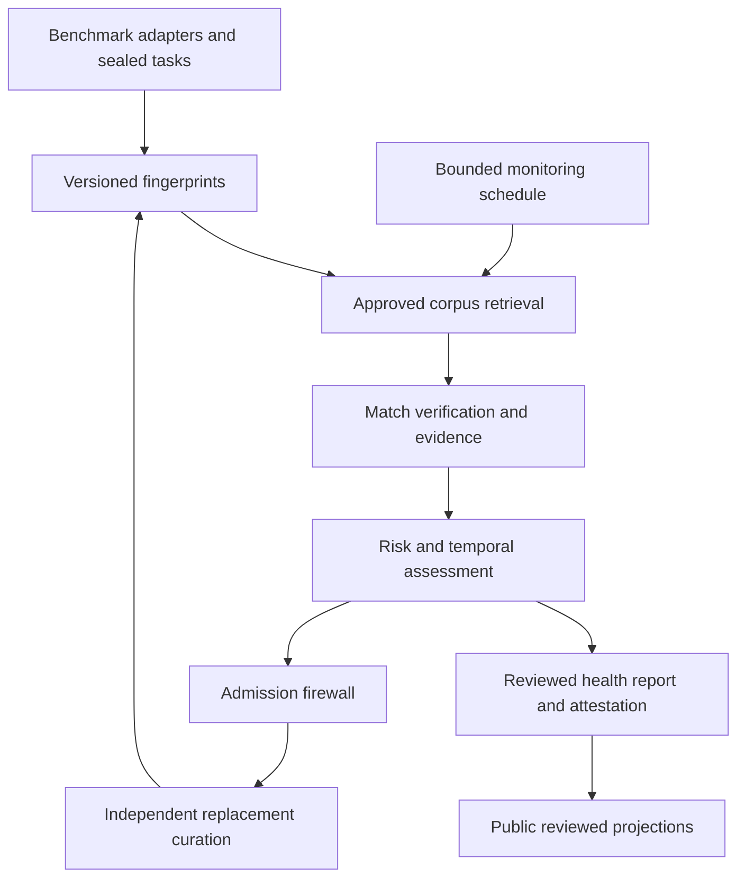

# PolyCodeBench — Benchmark Audit and Contamination Firewall Implementation Specification

Version: 1.0 · Prepared: 8 October 2026 · Asia/Karachi

Status: Proposed implementation addendum and copy-ready engineering instructions. This document does not claim implemented features, completed benchmark audits, live model tests, calibration, human approvals or published attestations.

## 1. Purpose, integration and source precedence

Add **Benchmark Audit**, a module that evaluates the exposure, duplication, temporal eligibility and contamination-resistance evidence of external benchmarks and owner-created tasks. Add **Contamination Firewall**, a policy gate that screens task candidates before admission and helps create independently validated replacement sets. The core unit is a versioned evidence-backed audit, not a claim of access to undisclosed model training data.

The module supports all eight requested capabilities: contamination risk signals, task fingerprinting, temporal holdouts, adversarial replacements, prior-exposure evidence queries, sealed/private evaluations and canaries, ongoing monitoring, and benchmark health dashboards. Reviewed signed attestations bind the claims to an exact benchmark/model context/scan scope. External benchmark auditing and ordinary model benchmarking are separate product workflows.

### 1.1 Exact source bridge

These five current documents were read when preparing the addendum; preserve them and their historical releases.

| Source MD | Exact-byte SHA-256 |
|---|---|
| PolyCodeBench-Architecture-v1.md | `6dfee84b9787f315d7d5aa7afd9b1de29760aac16b5d3ac887b7ecd76d899d69` |
| PolyCodeBench-Technical-Implementation-Spec-v1.md | `2dbfd0f00c561b9348419a2659794913658fb47d15090e09a3e905a89cdea7bd` |
| PolyCodeBench-Codex-End-to-End-Prompt-Pack-v1.md | `0687c2e1e6340fd3b0f69b553418c290aeb59aa7cdf3a88b9d2ef3159c7e1344` |
| 

Prompts continue **83–106**, following00–82. The earlier final handoff's “no Prompt83” meant no continuation existed then; this document supplies it. Preserve old REQ/WP/E2E, DREQ/DWP/DXE and AREQ/AWP/AE2E identifiers. New IDs: **BREQ-01–32**, **BWP-01–24**, **BX-01–60**, **BADR-01–20**, engineering tickets **BAT-01-A..D through BAT-24-A..D**.

Reuse the Python modular monolith, FastAPI/Typer, PostgreSQL, object storage, Next.js/TypeScript, durable fenced queue, approved model gateway, immutable artifacts and reviewed release process. Reuse curation lineage/exposure/similarity/admission services. If those are not implemented, Prompt83 establishes their minimum shared contracts; external audit must not depend on completing every hardware/language expansion. Applicable hardware/model/human gates still require real evidence. No source document or official benchmark is silently rewritten.

## 2. Claim boundaries and terminology

| Construct | What the system can establish | What it cannot infer automatically |
|---|---|---|
| Public overlap | A verified matching artifact existed in a searched public source by an evidenced date | That a particular model trained on it |
| Corpus overlap | A match in an identified corpus snapshot under a specified method | Use of that corpus by every model; retained membership after filtering |
| Model exposure | Disclosed training inclusion, recorded API/context delivery, retrieval or prior evaluation | Memorization, causal score inflation or unseen status from absence of evidence |
| Behavioral anomaly | A protocol-specific performance/confidence difference with uncertainty/controls | Conclusive item-level training membership |
| Timestamp commitment | Exact bytes existed no later than a verified timestamp | First invention date, originality or absence of earlier copies |
| Semantic relatedness | A retrieved candidate sharing topic/structure | Duplicate identity without adjudication |
| Low observed risk | Low index/evidence under completed declared scope and policy | Zero contamination, global web absence or model training absence |
| Attestation | Signed audited statements/coverage for immutable inputs | A guarantee, certification authority or timeless cleanliness |

Separate training, fine-tuning, benchmark-driven model selection, retrieval-time, prompt/session and publication exposures. “Pre-cutoff” requires a particular model revision, an evidenced cutoff and a matching source date. Unknown cutoffs/provider updates remain unknown. A common algorithm, short phrase or answer value alone is not duplicate evidence. An answer-only overlap can be meaningful only where sufficiently distinctive and supported by task context.

The desired0–100 risk index is a versioned **heuristic index**, not a calibrated probability of prior training. Probability-like estimates require independent ground truth and validated calibration for the exact scope/model access; otherwise forbid percent-probability language. Familiarity claims cannot be based only on high scores.

## 3. Product requirements

| ID | Required behavior |
|---|---|
| BREQ-01 | Import immutable exact benchmark versions/splits and item components without changing originals. |
| BREQ-02 | Registry of prominent code, knowledge, math, reasoning, agent and multimodal benchmarks with access/license/capability state. |
| BREQ-03 | Component-level fingerprints: lexical, semantic, code structure, entities, reasoning/answer features, provenance and history. |
| BREQ-04 | Approved source connectors for Common Crawl, GitHub, Hugging Face, arXiv, Stack Exchange, Wikipedia and benchmark/public dataset snapshots. |
| BREQ-05 | Bounded staged exact/near/semantic retrieval with versioned corpus and coverage evidence. |
| BREQ-06 | Trusted match verification distinguishes exact, transformed, semantic family, shared concept and unresolved results. |
| BREQ-07 | Explainable0–100 observed-risk index with versioned weights, applicability, missingness and coverage gating. |
| BREQ-08 | All eight user-proposed signals recorded with appropriate evidentiary strength and model context. |
| BREQ-09 | Model-specific temporal eligibility; earliest source date and timestamp provenance remain distinct. |
| BREQ-10 | Trusted artifact commitments and history with no originality guarantee. |
| BREQ-11 | Sealed encrypted tasks with access/disclosure logs, local-first screening and controlled evaluation. |
| BREQ-12 | Private canaries measure observed disclosure; separate them from ordinary task correctness. |
| BREQ-13 | Optional behavioral diagnostics using controls, reference models and calibrated detector applicability. |
| BREQ-14 | Frozen model diagnostic protocols/budgets, no answer-driven cherry-picking or public dispatch. |
| BREQ-15 | Firewall admit/review/reject based on scan evidence plus task validity/rights/family gates. |
| BREQ-16 | Independent adversarial replacement authoring, screening, executable/domain verification and actual human review. |
| BREQ-17 | Replacement families maintain ancestry; paraphrases cannot become untouched holdouts. |
| BREQ-18 | Derived benchmark versions report changed scope/difficulty and no automatic official-score comparability. |
| BREQ-19 | Continuous scheduled monitoring, incremental scans, deduped alerts and historical evidence. |
| BREQ-20 | Risk changes, stale scans, source outages and evidence disputes/corrections recorded without erasure. |
| BREQ-21 | Benchmark health aggregates include unknown/unscanned counts, denominators, coverage and trend comparability. |
| BREQ-22 | Private API/CLI/SDK and public reviewed evidence/report views. |
| BREQ-23 | Signed audit attestations bind scope/policy/versions/model context; revocation/successors supported. |
| BREQ-24 | Source query privacy, tenant separation, approved remote handling and no private task leakage in logs. |
| BREQ-25 | Durable audit jobs, six-scope queue integration, reservations, fencing and reproducible replay. |
| BREQ-26 | Calibrated controlled positive/negative match and model-exposure tests with false-positive/missingness evidence. |
| BREQ-27 | Actual initial public-benchmark pilot, independently validated replacements and sealed workflow evidence. |
| BREQ-28 | Native benchmark results and original code-quality/statistical contracts remain unchanged. |
| BREQ-29 | Scoped corpus indexing/resource planning, optional existing tools and no global-search claim. |
| BREQ-30 | Operations: outages, malicious imports, restore, cryptographic rotation, load and monitoring runbooks. |
| BREQ-31 | All prior-discussion features/signals/sources trace to tickets and acceptance evidence. |
| BREQ-32 | Eight phases,24 prompts,96 ticket DoDs,60 acceptance scenarios and five-part prompt/phase reports. |

## 4. Architecture and authority boundaries



The audit engine inventories evidence. It does not execute imported arbitrary code, change official benchmark answers, replace the trusted evaluator or inspect undocumented training sets. AI rerankers/judges produce proposals; trusted verifiers and reviewers establish accepted evidence. Importers/parsers/crawlers run as restricted workers and treat content as untrusted data.

| Component | Ownership/authority |
|---|---|
| Benchmark registry/adapters | Resolve a permitted version/split, manifest fields, components and upstream lineage. |
| Fingerprint service | Deterministic lexical/code/features plus pinned local embeddings; no novel-status approval. |
| Corpus registry/connectors | Approved scopes, credentials outside guests, bounded fetch/index/query, source evidence. |
| Retriever | Query allowed sources/indexes and record query coverage, costs, failures and candidates. |
| Match verifier/reviewer | Validate substantive overlap, source date/context and evidence class. |
| Risk engine | Pure versioned aggregation of accepted signals/missingness; no training-membership assertion. |
| Temporal service | Compare evidenced dates/cutoffs with uncertainty and revision confidence. |
| Sealed service | Encryption/access/commitments/disclosure records; cannot promise never exposed after delivery. |
| Firewall | Decide admit/review/reject under approved finite-scope policy and task-validity gates. |
| Replacement curation | Existing author/oracle/admission pipeline with explicit seed ancestry and new derived releases. |
| Monitoring | Approved scheduled scans; no unbounded crawls or automatic model spend. |
| Publication | Human-reviewed allowlist projections and signed attestations; public cannot trigger work. |

Suggested modules: `core/benchmark_audit`, `core/audit_risk`, `core/audit_temporal`, `core/sealed_tasks`, `plugins/benchmark_importers`, `plugins/corpus_connectors`, `plugins/match_verifiers`, `api/routes/benchmark_audit`, `web/app/benchmark-health`, `docs/benchmark-audit`. Adapt inspected repository conventions once; no gratuitous rewrites.

## 5. Benchmark registry and support matrix

Store benchmark slug, owner/official links, variant/version/commit or dataset revision, split/config, component schema, declared metric, upstream sources, access condition, rights evidence, modality, importer version and status. Statuses: `catalogued`, `metadata_only`, `importable`, `audit_conformant`, `blocked`, `retired`. Listing a benchmark is not a claim that a complete audit/evaluation adapter exists. Access-gated/hidden tests are never bypassed.

| Benchmark family | Official starting point | Audit unit/complication |
|---|---|---|
| HumanEval | https://github.com/openai/human-eval | Prompt/signature/canonical solution/tests; distinguish boilerplate. |
| MBPP | https://github.com/google-research/google-research/tree/master/mbpp | Task statement/code/tests; original and sanitized subsets are separate. |
| HumanEval+, MBPP+ | https://github.com/evalplus/evalplus | Same parent prompts/families with stronger tests; not new independent questions. |
| LiveCodeBench | https://github.com/LiveCodeBench/LiveCodeBench | Exact release/date window/source contest task and solutions. |
| SWE-bench, Lite, Verified | https://github.com/SWE-bench/SWE-bench | Repo snapshot, issue, gold patch and PR; upstream publication can predate dataset. |
| MMLU | https://github.com/hendrycks/test | Subject/split/choices/answers and original source provenance. |
| MMLU-Pro | https://github.com/TIGER-AI-Lab/MMLU-Pro | Variant relationships/exam-textbook sources; no inherited clean badge. |
| GPQA | https://github.com/idavidrein/gpqa | Gated/access conditions, question/answer/explanation disclosure. |
| GSM8K | https://github.com/openai/grade-school-math | Train/test separation, question/solution derivations and copies. |
| MATH | https://github.com/hendrycks/math | Problem/solution/source math competition lineage. |
| MGSM | https://github.com/google-research/url-nlp/tree/main/mgsm | Multilingual family linkage to source mathematics tasks. |
| AIME-derived task sets | Owner-specified official competition and exact dataset revision | Competition year/source versus third-party dataset; not one canonical AIME benchmark. |
| BIG-Bench Hard | https://github.com/suzgunmirac/BIG-Bench-Hard | Task type, template lineage and instances. |
| ARC | https://allenai.org/data/arc | Easy/Challenge and source science questions; disambiguate from ARC-AGI. |
| HellaSwag | https://github.com/rowanz/hellaswag | Source context/completion choices and overlap. |
| TruthfulQA | https://github.com/sylinrl/TruthfulQA | Question/answers/categories; common facts are not duplicates alone. |
| IFEval | https://github.com/google-research/google-research/tree/master/instruction_following_eval | Prompt constraints and checker; task structure matters. |
| Terminal-Bench | https://www.tbench.ai/ | Versioned task/environment/reference artifacts; hidden sets need authorization. |
| GAIA | https://huggingface.co/datasets/gaia-benchmark/GAIA | Public versus restricted answers/attachments and web retrieval exposure. |
| BFCL | https://gorilla.cs.berkeley.edu/leaderboard.html | Function schemas, dialogue/state/expected calls; template reuse. |
| MMMU | https://mmmu-benchmark.github.io/ | Image/text/source assets, OCR and perceptual matches; text-only scan incomplete. |
| Custom/private benchmarks | Owner-authorized manifest/upload | Strict schema, rights, private-source boundaries and sealed policies. |

Registry links are starting references checked against primary sources where retrieved, not promises about current API schemas. Prompt84/104 pins live metadata and records changes. Stage1 required implementation targets for actual audit adapters: HumanEval, MBPP and one exact permitted SWE-bench subset. Stage2: EvalPlus variants and LiveCodeBench plus text QA/math; Stage3: agents/multimodal. Specialized adapters receive `blocked` rather than fictitious complete status if inputs, rights, modality or compute are unavailable. Frameworks such as lm-evaluation-harness can help normalize tasks; do not execute unreviewed remote dataset code to import them.

## 6. Immutable import and component contracts

A benchmark snapshot contains original item IDs, exact upstream bytes/digests, all selected membership, source revision/split/config and importer version. A parsed normalized representation is a child artifact, not a replacement for original bytes. Keep decoding/line endings/order policy explicit. Represent prompt, answer, explanation, reference code, tests, attachments and repository state as separate components with visibility and rights metadata.

No global uniqueness by task text: identical items in two benchmark releases remain distinct membership records linked by a duplicate/family relation. Parent/variant/translations must not inflate independent counts. Import errors and missing components are item-level states with total selected counts. A sampled audit freezes the sample indices, seed and design; do not extrapolate exact benchmark percentages from a convenience sample.

Importers accept archive/object/dataset/git references under allowlisted fetch plans. Reject traversal, symlinks outside root, decompression bombs, oversized components, forbidden URL schemes/private network destinations and script execution requests. Network credentials remain in approved connectors. Source text and markdown/tool output cannot instruct the importer or model judge to change policy. Dynamic webpages are captured with acquisition timestamp/digest, not assigned an invented original date.

## 7. Canonical audit documents and state machines

Use strict `pcb-json-v1`, independent document `kind`, integer `schema_version=1`, strict `payload`, UUID row identities, SHA-256 immutable refs and operational metadata separate from semantic input. No floats, duplicate keys, unsafe JSON integers or unknown fields. Decimal scores/money/thresholds are fixed strings; 64-bit seeds string-serialized. Timestamps UTC with explicit precision; date-only sources carry precision/uncertainty instead of fabricated midnight.

| Kind | Required payload fields |
|---|---|
| `benchmark_snapshot` | Registry/version/split/membership/components/upstream rights and importer refs. |
| `task_fingerprint` | Task/component refs; normalization/tokenizer/code parser/embedding/features versions; exact/normalized/code digests, private vectors/features. |
| `corpus_snapshot` | Source/version/acquisition scope/content root/index digest/date coverage/rights/exclusions/extraction policy. |
| `audit_plan` | Benchmark/tasks/sample design/model context(optional)/source plan/methods/policy/limits/visibility/seed. |
| `query_manifest` | Audit/task/component/query type/private query artifact/connector snapshot/limits and disclosure authorization. |
| `coverage_manifest` | Planned/executed queries and eligible sources, counts/time windows/outages/unsupported modalities/truncation/freshness. |
| `match_evidence` | Task/source refs, matching spans/features, component relation, source-date evidence, verifier/confidence/review state. |
| `risk_policy` | Component mapping/weights/thresholds, required scope, applicability, missingness and claim wording. |
| `risk_assessment` | Plan/task/context/accepted evidence/policy refs, observed index/bounds/coverage/state/explanation. |
| `temporal_assessment` | Artifact/source chronology, model revision/cutoff evidence/uncertainty/exposure paths and status. |
| `sealed_manifest` | Private encrypted artifact refs, commitment, key/version/access/retention policy and disclosure state. |
| `canary_policy` | Marker-generation/detection/access/exposure rules, expected collision checks and interpretation limits. |
| `behavioral_audit_plan` | Method applicability, original/control sets/reference/target models, samples/seed/budgets/tests/decision rules. |
| `firewall_decision` | Exact task/audit/validity/rights/lineage/exposure refs, policy, result/reasons/reviewer. |
| `replacement_plan` | Seed ancestry/competency brief, authors/checkers/validity/difficulty/exposure/source quotas/budgets. |
| `monitor_policy` | Benchmarks/source schedule/caps/credential scope/alert routes/staleness/retry and stop rules. |
| `benchmark_health` | Membership/assessment/policy/context/coverage/unknown denominators/trend refs and descriptive metrics. |
| `audit_attestation` | Benchmark/scan/policy/coverage/claim digests, model context, issue/expiry/review/signature algorithm/key and revocation refs. |

Enums:

```text
AuditRun = draft | planned | queued | scanning | verifying | assessing |
           review_required | complete | partial | blocked | cancelled
SourceQuery = planned | queued | running | complete | truncated |
              failed | blocked | cancelled
MatchRelation = exact_component | near_exact_component | semantic_duplicate |
                shared_family | shared_concept | no_substantive_match | unresolved
EvidenceState = proposed | verified | review_required | accepted | rejected | disputed | superseded
RiskState = low_observed | medium_observed | high_observed | insufficient_evidence | not_applicable
TemporalState = post_declared_cutoff | pre_cutoff_exposure_detected |
                interval_overlap | unknown_cutoff | unknown_source_time | mutable_model_context
FirewallState = admit | review | reject
SealState = sealed | authorized_disclosure | public_exposed | compromised | retired
```

Run transitions: draft→planned after validation/reservations; planned→queued→scanning→verifying→assessing→review_required→complete if scope/reviews satisfied, or partial if incomplete. Active stages may block/cancel; recovery returns to recorded stage with same bounds/identity. New evidence/policy creates successor assessments, not edits. Source `truncated` is not complete coverage. Disputed accepted evidence remains in history while eligible current assessments are corrected by successor. Seal disclosure is monotonic history; resealing bytes cannot erase earlier delivery.

## 8. Database, scoped queue and migrations

Reuse existing task/config/artifact/family/exposure/review/call/budget/release tables. Add tables or equivalently constrained modules:

| Table | Critical invariants |
|---|---|
| `benchmark_registry`, `benchmark_snapshot`, `benchmark_item` | Unique registry/version/split and item membership; original bytes immutable. |
| `audit_component`, `fingerprint` | Immutable item/component/version identities; vectors private and extraction versioned. |
| `corpus_source`, `corpus_snapshot`, `corpus_document` | Rights/scope/date/index digest; source dedup does not erase provenance copies. |
| `audit_run`, `audit_query`, `audit_checkpoint` | Frozen plan, monotonic indices/CAS, reservations and query completion semantics. |
| `match_candidate`, `match_review` | Multiple candidates/evidence with versioned accepted relation and reviewers. |
| `risk_policy`, `risk_assessment`, `temporal_assessment` | Immutable policy/inputs/explanations, nullable missing scores, successor links. |
| `artifact_commitment`, `sealed_task`, `seal_access_event`, `canary_observation` | Key versions, private access and append-only commitment/disclosure evidence. |
| `behavioral_plan`, `behavioral_observation` | Original/control/family/sample pairing, method assumptions and budget refs. |
| `firewall_decision`, `replacement_membership` | Exact acceptance inputs, ancestry and derived version; no self-approval. |
| `monitor_policy`, `monitor_tick`, `audit_alert` | Unique scheduled slot/event identity, finite caps, recorded owner/in-app alert. |
| `benchmark_health`, `audit_attestation`, `attestation_revocation` | Exact projection inputs, reviewed publication/signatures and append-only corrections. |

Extend `stage_job` with nullable `audit_run_id`, adding one new authoritative scope to the prior curation addendum's five:

```sql
CHECK (num_nonnulls(attempt_id, evaluation_id, release_id,
                   curation_round_id, discovery_search_id, audit_run_id) = 1)
```

One job uses one direct scope; parent audit relationships live in FKs, not multiple queue fields. Replacement generation uses curation scope; candidate diagnostic solves use ordinary attempt scope. Add audit scope to existing call-intent/budget validation explicitly. Add `run.purpose=audit_diagnostic` for optional diagnostic target solves; default representative/challenge recommendations exclude these runs. Audit risk projections are their own documents, not ordinary code-quality scores or silently added language dimensions.

Uniqueness: `(audit_run_id, query_index)`, `(audit_run_id, checkpoint_seq)`, `(monitor_policy_id, scheduled_slot)`, logical model-call intent. Repeated query payloads can be recorded but cache reuse is scoped to corpus/version/exposure authorization; cache does not make an unexecuted source count covered. Index all FKs, source/state/time scan queues, benchmark+version+split, component+method version, family+partition, artifact+exposure time, task+assessment version and attestation+status. Postgres authoritative history; OpenSearch or existing approved lexical/vector index is derived and rebuildable.

Migration sequence: inspect actual schema, add nullable/new tables, backfill only supported historical facts, deploy compatible readers, drain incapable workers, enable new scope/purpose, validate constraints. Old tasks/releases preserve digests. Lossless downgrade of new records requires export/quiesce; never claim dropping audit columns retains history. Atomic enqueue/reservation, fenced commit, bounded recovery and cleanup-before-capacity-reuse remain mandatory.

## 9. Source connectors, corpus scope and bounded indexing

| Source | Practical connector | Coverage/interpretation |
|---|---|---|
| Common Crawl | Approved URL/WARC metadata discovery, bounded content extraction and local lexical index over selected snapshots | URL index is not full-text semantic search; missing snapshots/deletions/unseen pages remain unknown. |
| GitHub | Approved API/archive/git snapshot fetch; authorized code search where available | Indexing/access/rate limits; first commit metadata alone may be backdated or imported. |
| Hugging Face | Dataset/repo metadata and approved pinned snapshot/parquet/archive ingestion | Dataset version/access/license and train/test membership recorded; arbitrary loaders disabled. |
| arXiv | Metadata plus permitted PDF/source acquisition and trusted extraction | Paper date does not date every embedded task; OCR/source extraction limitations. |
| Stack Exchange | Approved API/data snapshot with post/revision timestamps | Edits, quoted answers and deleted posts; no universal stack-wide absence claim. |
| Wikipedia | Versioned dump or authorized revision API | Revision/content spans and translations; common facts not duplicate tasks. |
| Benchmark repositories | Exact approved commit/dataset snapshot | Original/derived benchmarks and official split lineage. |
| Other public datasets | Owner-approved catalog and pinned corpus manifests | Declare what is actually indexed and searchable, not all public data. |

Each connector implements capabilities, plan_fetch, fetch, extract, query and coverage_report. Return bounded pages, continuation tokens and explicit complete/truncated/failed status; all remote requests use time/byte/requests/host/rate limits and retry policy. Credentials remain private. Honor source access conditions and rights recorded by the owner; missing permission blocks ingestion/public reproduction. Minimize retained snippets/public excerpts; a dataset software license does not automatically grant all upstream content rights.

MVP indexes permitted benchmark snapshots plus bounded GitHub/Hugging Face corpora. Broader Common Crawl/Stack Exchange/Wikipedia/arXiv scans are capability stages with measured storage/latency and excluded-source counts. A connector implementation alone is not a completed live scan. All adapter/source combinations have a capability matrix and conformance fixtures.

Optional Data Portraits adapter records the exact sketch/corpus and method; approximate membership candidates need interpretation under the tool's error model, not a declaration of exact training inclusion. Optional infini-gram adapter records indexed corpus/revision/query/result positions; verified corpus documents can substantiate overlap. Neither reveals undocumented closed-model training sets. No dependency on a public endpoint's permanent availability or unchanged pricing; pin adapters and allow local tools. Queries to external tools are disclosures and require authorization for private content.

## 10. Fingerprints, normalization and structural features

Store component exact hash; conservative normalized lexical hash; token shingles/MinHash or equivalent retrieval sketch; pinned semantic embedding; entities/numbers/units; answer type/pattern; task format; code AST/symbol/control/data-flow features where supported; extracted reasoning/constraint structure; source/creation/commitment/version refs. AI-derived reasoning structure is a hypothesis with extractor confidence, not authoritative hidden chain-of-thought.

Maintain multiple normalization views. An exact-byte match is distinct from whitespace/comment normalization or identifier abstraction. Never remove numerical constants, negation, types, API versions, constraints or answer options and then call the normalized match exact. AST similarity that erases identifiers/literals must be labeled accordingly. Python/Java first with explicit parser versions; other languages return unsupported structural features rather than false zero similarity.

Embed locally for private/sealed tasks. Fixed model revision/tokenizer/pooling/dimension/normalization are fingerprint identity; index rebuild on changes. Approximate-nearest-neighbor results are candidates with retrieval limitations. Entities and answer patterns help verify task identity but “answer42” or “capital city” cannot alone trigger contamination. For multimodal tasks retain asset hashes, approved perceptual/OCR features and component dates; missing image checks prevents complete multimodal scope claims.

Public fingerprints can be sensitive: unsalted hashes of predictable tasks support guessing; vectors can leak content. Keep detailed fingerprints/embeddings private by default. Public commitment for sealed artifacts uses an approved hiding commitment over canonical manifest plus high-entropy secret nonce; private exact digest remains internal. Nonce stays secret while sealed. Content-addressing does not override visibility controls.

## 11. Retrieval and evidence verification

The imported official benchmark artifact is the audit subject, not an independent duplicate discovery. Record its public release as exposure E; exclude identical self-source/reimport hits from duplicate M and independent-copy counts. Mirrors/derived copies retain provenance relationships, and corpus inclusion remains separately relevant.

Stage1 exact/normalized and distinctive-span retrieval; Stage2 lexical/code fingerprints; Stage3 semantic candidate retrieval; Stage4 code/constraint/answer/reasoning comparison; Stage5 trusted source/context/date verification and independent review. Order prioritizes cheap high-specificity evidence. Record per-stage query/corpus/method/version/limits/coverage/candidates and selection rules. Do not create a second model call loop with unaccounted cost.

Proposed bounded pilot retrieval: at most20 candidates per task per declared source group and at most100 candidates per task total; oversubscription has a frozen selection rule. Source document fetches, rerankers and retries have explicit caps. Candidate limits mean recall is limited; report truncation and validate recall on controlled tests. Source search result snippets alone cannot support verified exact matches—fetch permitted artifact bytes or mark unverified metadata evidence.

Match evidence contains source artifact/revision/date evidence, matching spans/offsets, component relation, normalizer/parser/extractor versions, answer relationship, upstream identity, reviewer and counterevidence. Relations:

- Exact substantive component: bytes or precisely declared conservative normalization match beyond boilerplate.
- Near exact: small edits/renaming; retain differing constraints and whether semantics changed.
- Semantic duplicate: verified same underlying task/requirements/solution structure under an explicit rubric, not embedding score alone.
- Shared family: lineage/template relationship; important for splits, not automatic exact leakage.
- Shared concept: common algorithm/topic only; zero substantive duplicate contribution.
- Unresolved: inadequate evidence; review/missingness, never automatic clean/admit.

Default auto-accept only deterministic high-specificity exact matches with verified provenance and calibrated boilerplate exclusions; all semantic matches affecting admission need human review until validated automation policy exists. AI judge sees minimum authorized source/task context in fresh sessions; source instructions remain untrusted. Judge cannot approve its own authored replacement or publish. Review disagreements retain both opinions and adjudication. Preserve source takedown/dispute history with lawful retention policy; correction uses successor findings.

## 12. Risk signals and observed-risk policy

Implement all requested signals but separate evidence strength:

| Requested signal | Operational definition | Use |
|---|---|---|
| Publication age | Time since earliest evidenced substantive public artifact; uncertain intervals retained | Exposure opportunity; not independently proof of training. |
| Web exposure | Accepted substantive copies across declared sources; counts deduped by source lineage | Concrete public overlap; index absence has bounded interpretation. |
| Duplication | Exact/near/semantic duplicate evidence under §11 | Main overlap signal; family/concept labels distinct. |
| Training-data likelihood | Verified corpus overlap plus documented model/source relationships where available | Rename display to corpus/source overlap evidence; no guessed closed-model membership probability. |
| Popularity | Timestamped stars/downloads/citations/discussions if available | Context/exposure proxy; bot/manipulation/missing data explicit, not repeated independent votes. |
| Synthetic similarity | Verified resemblance/lineage to benchmark/synthetic training items | Part of substantive overlap; paraphrase ancestry preserved. |
| Model familiarity | Controlled behavioral diagnostics versus validated comparison tasks/reference models | Separate diagnostic, not automatically added to public-overlap score. |
| Leakage history | Task/model-specific credible reports with exact evidence and scope | Corroboration; benchmark-wide allegation not inherited as item fact. |

### 12.1 Proposed v1 index

Default policy is a proposed starting heuristic requiring independent validation of its match detectors, reviewer rubric, thresholds and coverage policy before externally labeling low/medium/high. This validates the audit policy; it does not calibrate a probability of closed-model training inclusion. Four correlated evidence groups avoid counting publication age/stars/downloads as separate proof:

`ObservedRiskIndex = 50*M + 25*C + 15*E + 10*L`.

All components lie0..1 as exact Decimal strings:

- **M substantive overlap:** max accepted strength: question+contextual solution exact/verified semantic duplicate1.000000; substantive question alone0.600000; distinctive solution alone linked to task0.800000; verified shared task family0.300000; concept/boilerplate0.000000. This is strength mapping, not probability.
- **C corpus overlap:** verified substantive artifact in a declared corpus1.000000; approximate membership hit with unresolved verification has no accepted component and stays pending, not0.500000 guess. No accepted match after complete required finite-scope queries gives observed0.000000 with coverage caveat.
- **E exposure opportunity:** confirmed substantive public task/answer artifact1.000000; only public task metadata/no verified substantive bytes0.300000; verified private handling with no detected public event under declared complete scope0.000000. Age/popularity are contextual descriptors within E and cannot add more points.
- **L leakage report:** corroborated task-specific/model-context report with reproducible evidence1.000000; broad benchmark mention, weak allegation or unresolved source has no accepted contribution and is pending/unknown.

Never present0 for unavailable/not-run applicable evidence. For incomplete components show nullable index and computable bounds: lower bound=sum observed available contributions; upper bound=lower+weights of unresolved/unavailable groups, capped100. Bounds reflect policy missingness, **not statistical confidence intervals**. Complete required queries can yield observed zeros without proving global absence. Nonapplicable components need a separately frozen policy variant, not ad hoc denominator renormalization.

Proposed tiers: low<25, medium25..<60, high≥60. Apply only under calibrated policy and completed required finite scan scope/reviews. Known evidence with lower bound≥60 may display “high observed risk; coverage partial” with bounds; incomplete scope otherwise displays `insufficient_evidence`, never green low. A fully computed high score is not a probability that a model trained on the item. Risk engine emits evidence refs, per-group values/unknowns, bounds, coverage, policy digest and model context.

Goldens: all four1→`100.000000`; M1/C0/E1/L0→`65.000000`; M0.6/C0/E1/L0→`45.000000`; M0/C0/E0/L0 with completed scope→`0.000000` observed; M1/Cunknown/E1/L0→score null, lower`65.000000`, upper`90.000000`, high observed/partial; only M0 measured→lower0/upper50 and insufficient evidence. At25 medium; at60 high. Concept-only/boilerplate matched text gives M0 and no duplicated-evidence amplification.

## 13. Temporal provenance and model contexts

A `model_context` identifies provider/model revision or weight digest, revision confidence, declared training cutoff/source evidence, updates, retrieval/tool policy, prior task deliveries/evaluations and time of audit. Unknown cutoff stays unknown. A dated model alias that may change cannot support an immutable-model claim.

Use chronology intervals: artifact creation claim, trusted commitment upper bound, earliest accepted upstream public exposure, corpus inclusion and publication/disclosure/evaluation times. Do not replace earlier source dates with newer benchmark release dates. If the artifact/source-date interval lies wholly after a credible cutoff and revision is pinned, display `post_declared_cutoff` with qualifications. Interval overlapping cutoff→`interval_overlap`. Earlier source copy→`pre_cutoff_exposure_detected`. Unknown source time/model pin/cutoff returns corresponding non-green state. Post-cutoff generation may still share older source semantics or enter later fine-tuning/retrieval; disclose both.

Owner timestamp claim, git date, downloaded metadata, archive capture and trusted timestamp receipt have separate evidence strengths. A commitment receipt proves existence by receipt time only. Provide a replaceable trusted timestamp adapter and locally signed receipt for development; local receipt alone is not independently trusted chronology. Store signed receipt/token, certificate/verification evidence, timestamp precision and content commitment. A later proof cannot retroactively establish no earlier copy.

## 14. Sealed evaluations and canaries

Sealed tasks use envelope encryption with per-artifact data keys, approved authenticated encryption, unique nonces and master key via existing approved KMS/secret system. Pin crypto library/configuration; do not invent cryptography. Store ciphertext/key-wrapping refs, key version, integrity evidence, hiding commitment, access policy, retention and append-only access events. Separate commitments from encrypted storage locations. Rotation rewraps keys or creates new encryption versions without rewriting task identity/history; restore includes key recovery policy without backing up plaintext secrets into audit reports.

Private tasks default to local fingerprinting/index screening. Any remote query, author/attacker/judge/model context delivery is explicitly authorized and creates an exposure event with exact recipient/payload digest. Decrypt only in scoped worker memory or staged ephemeral volume; cleanup and no generic payload logging. Evaluation discloses task requirements to the candidate, so status becomes authorized disclosure for that recipient even if hidden tests remain sealed. Encryption protects storage, not exposure after decryption.

Canaries are high-entropy owner-generated private markers/dummy task elements with collision checks and explicit placement. They must not encode real secrets, alter correctness unfairly or become score shortcuts. Monitor authorized sources for exact distinctive marker appearance; verify source/date and prior deliberate publication. A detected marker indicates observed disclosure/copying in that context, not proof that a model trained on every task. Failure to find a canary does not establish absence of leakage. Canary queries themselves can leak a marker; local monitoring first, external disclosure records mandatory. Raw private markers excluded from public reports/logs.

## 15. Optional behavioral and model familiarity diagnostics

External audits can run without target model calls. Diagnostic methods are opt-in frozen campaigns; choose applicability based on logits/likelihood access, model stability, reference models and ground truth. ConStat is an optional registered method that compares primary/reference performance; do not reimplement a vague “suspiciously high accuracy” detector and call it ConStat. Pin upstream method/version, assumptions and controls. Incompatible methods return unsupported, not a fabricated contamination score.

Plan original/control task sets, family-disjoint calibration/validation/test, semantic validity/difficulty checks, target/reference configurations, exact prompts/tools/decoding/token budgets, planned samples, statistical tests, multiplicity/decision rules and exposure policy before responses. Paraphrases may change difficulty or retain memorized family lineage; use matched controls and report limitations. Do not ask the evaluated model whether it remembers and treat its statement as evidence.

Use identical permitted conditions across model cohorts; compare all planned results, not selected surprising cases. Candidate failures remain ordinary diagnostic observations, infrastructure missingness blocks valid inference. Store confidence/likelihood only when actually available; do not infer hidden logits from generated prose. Retain zero/negative findings and power limitations. Keep performance, source/corpus overlap and documented model exposure as separate report panels.

Controlled known-training experiments require owned/authorized small models, documented training manifests and matched exposed/unexposed families. Account for training/finetuning compute under separate approved caps. Without these, detector correctness/calibration is blocked for that claim; retrieval match goldens still run. A calibrated classifier for one synthetic experiment cannot become a universal probability for closed models.

## 16. Contamination Firewall and replacement pipeline

Firewall inputs: exact task/components/family, immutable audit assessment/coverage/policy, rights/provenance, temporal context where required, existing oracle/fidelity/admission evidence and exposure status. Outputs:

- **Admit:** all mandatory finite-scope checks/reviews and task-validity gates satisfied under declared policy; wording remains scoped.
- **Review:** missing corpus/modality/cutoff evidence, unresolved match, uncertain lineage, disputed source or incomplete validity.
- **Reject:** confirmed prohibited overlap/partition conflict, invalid task/oracle, denied rights or compromised required secrecy.

No auto-admit because web search returns zero hits or an AI says novel. Operator cannot change thresholds after seeing target responses. Review/override requires authorized reviewer reason and successor decision; overrides cannot manufacture complete evidence or erased exposure.

Replacement pipeline: seed/competency brief→approved author draft→independent adversarial alternative/test generation→fingerprinting/retrieval→match verification→independent oracle/rights/lineage/difficulty checks→human admission→derived benchmark version. Generator and checker configurations are distinct with declared family relationship; unknown independence remains unknown. Attacker is bounded under curation contracts. Maximum draft rounds/proposals/cost/wall limits predeclared; no infinite regenerate-until-pass.

Two modes: (1) transformed seed-family tasks, useful for robustness but still linked to original family; (2) new independent competency families, audited for template/source lineage, suitable for prospective use only after split/exposure gates. Pass abstract requirements to independent authors rather than original solutions/private witnesses when feasible. Algorithm familiarity is expected; not every shared concept is contamination. Validate semantic change and solvability, not superficial wording novelty. Generated question difficulty should be reviewed/calibrated independently of the scored target; never select replacement tasks based on desired model rankings.

Preserve original benchmark. Derived version manifest links originals/replacements, exclusions/reasons, family mapping, component/oracle revisions, changed competencies/difficulty, sampling/distribution and validation evidence. Public reports separate original and derived metrics; filtered risk-selected subsets are selected populations, not automatically comparable official leaderboards.

## 17. Continuous monitoring and evidence history

The product implements monitoring; creating this specification does not schedule any external automation. Owner-approved `monitor_policy` fixes benchmark versions/task selection, source/corpus scope, interval/timezone, query/cost/storage caps, rate limits, stale threshold and in-app alert recipients. Remote email/Slack notifications require explicitly authorized recipients/channel. Public visitors cannot enable scans/spend.

Default proposed pilot cadence weekly, daily only for explicitly approved high-priority subsets. Use `(policy_id, scheduled_slot)` idempotency and durable audit jobs. New corpus snapshots/source metadata drive incremental queries for relevant task fingerprints. Monthly or owner-requested complete finite-scope refresh prevents incremental omissions; freeze actual cadence/budgets before live work. A missed tick is recorded and can be bounded catch-up, not unbounded backlog replay.

New matching artifact→verified source/date/relation→successor evidence/assessment→deduped in-app alert. Alerts distinguish new exposure, score increase, staleness/source outage, dispute/correction and broken seal. Policy/corpus/method changes have trend discontinuity markers. Deleted public copy does not erase historical exposure; erroneous match correction can lower current observed risk via a reviewed successor while old evidence remains disputed/superseded. No score is “permanently clean.”

## 18. Benchmark health metrics and numerical contracts

Count selected task membership and independent families separately. Every distribution includes assessed complete/partial/unknown/unscanned/blocked counts. A task can have high detected evidence with partial coverage; retain both axes. Freeze benchmark version/model context/policy/corpus scope/time window for comparisons. Risk trajectories compare same policy scope or display a break/recomputed fixed-policy series, never imply real deterioration from a changed scoring formula.

| Metric | Definition/constraint |
|---|---|
| Low/medium/high/insufficient counts | Current eligible per-task assessments under one policy/context; unscanned separately; totals reconcile. |
| Exact/semantic duplicate prevalence | Distinct tasks with accepted relation / all selected tasks, with assessed-count and coverage disclosed; lower-bound description when incomplete. |
| Pre-cutoff exposure | Distinct selected tasks with accepted before-cutoff source evidence / all selected tasks for explicit model context; unknown temporal counts separate. |
| Coverage | Completed mandatory query/task/component/source units / planned eligible units; truncation/failure not success. Scope manifest required. |
| Provenance completeness | Tasks with all mandatory provenance evidence / selected tasks; evidence of completeness, not independent proof of originality. |
| Freshness | Tasks meeting frozen scan-age/corpus-date policy / selected tasks; thresholds versioned. Not a universal freshness intelligence score. |
| Mean observed-risk index | Descriptive mean among complete index-eligible tasks; show count and missing tasks; never use this alone as benchmark cleanliness. |
| Match detector quality | Precision/recall/FPR/FNR on labeled finite controlled sets, separately by relation/language/modality/source; intervals and unknowns. |

Use Decimal precision28/half-even and six-place output, no binary float score aggregation. Embedding calculations may use pinned numerical libraries but are retrieval features, not canonical score numbers; store outputs/digests/config appropriately. Risk0–100 does not inherit code-quality weights30/20/15/15/10/10. Health statistics do not override base30-family/three-sample ranking gates. Behavior/model comparisons use existing2000-resample95% paired family bootstrap where applicable; do not bootstrap deterministic exact full-census counts to imply contamination certainty.

Goldens: total10,000 tasks:8,921 low+731 medium+348 high=10,000 only if all eligible assessed; with200 unscanned, assessed categories must sum9,800 and unknown/unscanned explicitly200.21 confirmed pre-cutoff tasks out of1,000→`2.100000` percent, with temporal unknown count separately. Three exact-duplicate tasks out of1,000→`0.300000`;17 semantic→`1.700000`; overlap between exact/semantic unions deduped.40 completed mandatory units/50 planned→`80.000000` coverage; failed/truncated10 cannot be reclassified complete. Empty denominator→null reason. One family with five translations remains one independent family.

## 19. API, CLI and SDK contracts

Private authenticated `/v1/benchmark-audit` routes: `/registry`, `/snapshots`, `/corpora`, `/plans`, `/runs`, `/queries`, `/matches`, `/assessments`, `/temporal`, `/sealed`, `/firewall`, `/replacements`, `/monitors`, `/health`, `/attestations`. Reuse existing task/artifact/model/release APIs for shared entities. Mutation endpoints require idempotency key, tenant/role, ETag/row version, legal transition and approved reservations. Schema-generated clients preserve Decimal strings/enums/null reasons.

Example transitions: plans `:validate`/`:start`; matches `:review`; sealed items `:commit`/`:authorize-disclosure`/`:retire`; firewall decisions `:review`; monitors `:enable`/`:pause`; attestations `:review`/`:sign`/`:revoke`. Source URL inputs are allowlisted and SSRF checked. Uploaded benchmark/imported text cannot dispatch code/model work merely by being imported. Public `/v1/public/benchmark-health`/`audit-reports` read reviewed projections; no mutation or unrestricted URL scanning.

Proposed CLI (implement, map commands before claiming working):

```bash
pcb audit registry list
pcb audit import --benchmark humaneval --revision PINNED_REV --dry-run
pcb audit plan --snapshot SNAPSHOT_ID --policy POLICY_ID --sources SOURCE_PLAN --dry-run
pcb audit run AUDIT_PLAN_ID
pcb audit status AUDIT_RUN_ID
pcb audit matches review MATCH_ID --decision DECISION_FILE
pcb audit temporal assess TASK_ID --model-context CONTEXT_ID
pcb audit sealed create --manifest PRIVATE_MANIFEST --policy SEAL_POLICY --dry-run
pcb audit firewall evaluate TASK_ID --policy FIREWALL_POLICY
pcb audit replacements plan --snapshot SNAPSHOT_ID --policy REPLACEMENT_POLICY --dry-run
pcb audit monitor plan --snapshot SNAPSHOT_ID --policy MONITOR_POLICY --dry-run
pcb audit health SNAPSHOT_ID --context CONTEXT_ID --format json
pcb audit attest report REPORT_ID --dry-run
pcb audit verify-attestation ATTESTATION_FILE
```

IDs/revisions/files above are placeholders, not production-valid commands. Dry-run performs validation/finite cost planning and zero remote queries/model calls/guest dispatch/signing/publication. Exit codes distinguish invalid, blocked, incomplete, failed and success with stable safe errors/correlation IDs. SDK exposes typed plan/run/report APIs with same auth; no alternate bypass gateway. Actual external scans spend only existing approved caps/configurations; missing inputs have concrete blocked ledger entries.

## 20. UI journeys, evidence cards and private/public boundaries

Private: import/version/split wizard; source/corpus capability and budget planner; fingerprint/match side-by-side review; chronology with date-evidence strengths; score breakdown with unknown/bounds; sealed access/disclosure console; firewall decisions; replacement validity/lineage review; monitor cadence/cap/alerts; report/attestation approval.

Public: benchmark catalog, exact version/split audit page, model-context selector (or model-agnostic public exposure view), coverage/unknown badges, risk distribution, source timelines, reviewed redacted match examples, limitations, last successful scan/staleness, comparable trends, derived-version links and correction/revocation notices. Search results are evidence-backed, never unsupported accusation headlines such as “modelX cheated.” Model-specific claims require exact evidence/context and review.

Prominent “Could this model have been exposed?” panel shows accepted matches/no match **within searched sources**, unresolved sources/modalities, chronology, declared cutoff/pin confidence, recorded retrieval/API disclosures and inference limits. Model-agnostic view cannot display model-specific green post-cutoff status. Private item text, answer/tests, vectors, canaries, reviewer personal details, nonce/keys/provider secrets/raw remote queries excluded from public allowlist. Owner opts in to publishing permitted task examples; publication creates exposure event. Accessibility/browser checks cover mobile, keyboard, loading, empty, unsupported, partial, insufficient and revoked states.

## 21. Reviewed attestations, signatures and corrections

Primary label: **Benchmark Audit Attestation**. “Contamination Resistance Certificate” may be explanatory marketing only if the interface makes its scoped audit meaning explicit; avoid any claim of an independent certification authority or unseen-data guarantee.

Payload binds benchmark/version/split/membership digest, selection/sample design, creation/source chronology, corpus snapshots/time windows, methods/indexes/extractors, risk policy, model context or explicit model-agnostic status, complete/partial/unscanned counts, accepted exposure/duplicate/provenance findings, exceptions/disputes, last successful scan, freshness expiry and reviewers. All numeric fields derive from reproducible projections, never hand-edited badges.

Sign canonical attestation bytes with a versioned approved signing-key system, explicit algorithm/key ID and signature encoding. Signatures authenticate issuer/payload integrity; timestamp proof is separately verified. Store private/public projections separately; only public allowlist signed public payload is downloadable without private evidence. Third-party verification validates signature, hashes, policy identity, expiry and available revocation state. Offline signature validity without fresh revocation check is reported as such, not current endorsement.

Release states: draft→review_required→approved→signed→published; expired/revoked/superseded are append-only status events. Owner approval/signing follows existing reviewed publication authority; AI cannot self-sign or publish. Publishing a report is separate from publishing task text. Evidence error/leakage creates corrected successor; prior report remains with prominent correction/revocation link. Key compromise revokes affected signatures; rotate keys and reissue reviewed successors. No expiry renewal without a qualifying new scan/review.

## 22. Privacy, operations, storage and resource planning

Source acquisition uses allowlisted trusted connector egress; untrusted candidate execution stays offline in disposable VMs. Untrusted parsers run restricted with size/CPU/time limits and no credentials. Scanned content, repository scripts and model outputs are untrusted; prevent source prompt injection, SSRF/private-network access, archive traversal, browser injection and unsafe artifact previews. Private evidence and sealed vectors are tenant/role scoped; public IDs alone cannot grant object access. Audit decisions protect original scoring/evaluation authority.

Observability: selected/imported/failed items; per-source planned/completed/truncated/failed queries; accepted/rejected/disputed matches; unresolved components; cost/reservations/ambiguous usage; queue lease age; index/corpus lag; scan coverage/staleness; encryption accesses; canary observations; replacement rejection/family counts; alert/signature/restore failures. Payload-sensitive data logged only in authorized evidence artifacts, not metric labels or generic logs. Monitor alert itself contains safe metadata; no secret canary or sealed answer.

Storage plan per corpus freezes expected document/byte/token/vector/index counts, ingestion/extraction disk budget, retention, source refresh and rebuild strategy. Estimate cost from actual pilot measurements and approved provider quotes/config, not invented fixed dollar totals. Query/retrieval/reranker/model/verification/storage budgets distinct; invalid inputs/retries charge appropriate attempted-work allowances. Stop and record partial if bounds exceeded. Cloud/offline large corpora are not “free” because an API exists.

Backup database+object manifests+index configuration+key-recovery references; restore from consistent snapshots, verify digests, commitments, source scopes, seals, exposures, reservations, monitor slots and attestation statuses. Indexes rebuild from canonical sources; live remote evidence unavailable on replay uses stored authorized artifacts or reports missing, never silently requeries changed web content. Guest/parser cleanup precedes reservation/capacity reuse. Test provider/source outages, transient retry and stale leases. Retention/deletion follows versioned owner policy; deletion does not invent clean state or erase historical incurred usage/exposure facts. Preserve allowed audit digests/tombstones and disclose unavailable supporting bytes.

## 23. Calibration, live pilot and rollout

### 23.1 Detector and claim calibration

Develop controlled retrieval corpus containing original tasks, exact substantive duplicates, mirrored self-sources, paraphrases, code renaming, translations, task-family siblings, concept-only neighbors, boilerplate, answer-only collisions, date uncertainty and malicious documents. Labels distinguish public/corpus match truth from model training inclusion. Keep family-separated development/calibration/held-out test sets; separate language/modality strata. Independent human labels with disagreements/adjudication establish semantic ground truth.

Proposed semantic held-out pilot at least100 labeled pairs across at least30 distinct families; record actual relation counts and source diversity. Freeze the interval method and independence assumptions; account for related pairs by family rather than treating correlated variants as independent evidence. This is a starting validation set, not universal calibration. Auto-accept substantive semantic matches remains disabled unless an approved policy's independently measured precision lower 95% bound meets its chosen threshold (proposed 0.950000) and recall/FPR/missingness meet scope-specific declared gates. If inadequate samples, keep human review; do not relax thresholds after observing results. Exact-match controls must reject common boilerplate/self-import hits. Index labels remain heuristic even when match detectors are calibrated; cannot translate match precision into probability a closed model trained on a task.

Behavioral calibration is separate, using authorized controlled trained/untrained manifests and reference models if actually available. Existing endpoint accuracy is not ground truth. Multiple detector comparisons require preregistered multiplicity/selection rules. Report failure/power cases and method applicability. Missing resources leave behavioral inference gate blocked without blocking ordinary exposure auditing.

### 23.2 Initial public-benchmark pilot

| Item | Fixed proposed pilot design |
|---|---|
| Inputs | Pinned HumanEval, MBPP and one permitted SWE-bench subset; exact split/revisions/rights confirmed. |
| Sample |100 original task IDs per benchmark,300 total; frozen seeded membership before search, no replacement of difficult/unmatched tasks. |
| Sources | At least approved benchmark-reference snapshots plus bounded GitHub/Hugging Face snapshots; broader sources individually live/blocked, never claimed complete web. |
| Retrieval ceiling |100 retained candidates per task total, at most20 per source group;300×100=30,000 candidate ceiling, not mandatory fetch/call count. |
| Review | Substantive semantic matches actual human review; exact auto-path only under validated policy. |
| Model scope | Public exposure audit first; optional model contexts with actual declared cutoffs; no target calls needed for source audit. |
| Outputs | Three sampled audit reports with coverage/missingness/evidence; no full-dataset census percentages implied. |
| Replacement slice |12 reviewed replacement candidates:4 per benchmark competency slice; transformed-family versus independent-family labels explicit. |
| Sealed slice |6 owner-authored/new independent private tasks with local screening, commitment, authorized mock or live disclosure modes distinguished. |
| Monitoring | One approved policy/tick against new controlled source snapshot, plus one actual approved live rescan if source/budget permits. |
| Attestation | Real cryptographic development attestation and verification; actual public publication requires existing reviewed approval. |

If a source benchmark subset has fewer100 accessible eligible items, block/change the plan **before** execution with recorded successor, not fabricate100 or sample with duplicates. Counts are audit development/pilot evidence, not30-family ranked performance claims. Source requests, model diagnostics, authoring/checking, corpus indexing and review effort use actual approved limits separately from candidate ceiling.

Prompt101 executes actual permitted imports/scans/calibration. Prompt102 runs replacements/sealed workflows with independent validity/review; optional target diagnostics only with approved endpoint/caps. A simulated source/AI response is useful fixture evidence but never counts as live source/model/Human review. Avoid repeated permission for existing approvals. Prepare dry-run inputs and concrete blockers where needed.

### 23.3 Expansion and acceptance scope

Prompt104 establishes metadata and scoped audit conformance for all §5 families. Text-only import cannot complete agent environment/image audit. Per-adapter/source/model/modality capability matrix records complete/pending/blocked. Deferred platforms need exact original workload owners. Product can ship an approved narrower audit scope; global/addendum completeness remains partial until all mandatory claimed gates pass. Do not silently convert planned broad scope into finished support.

## 24. Architecture decision register

| ID | Binding decision |
|---|---|
| BADR-01 | Extend the modular monolith/shared evidence services; no duplicate evaluator or scoring authority. |
| BADR-02 | External benchmark snapshot immutable; normalized parses/derived sets are children. |
| BADR-03 | Component-level fingerprints preserve exact/normalized/semantic/code/modality distinctions. |
| BADR-04 | Finite corpus/source coverage required; no global search or zero-hit unseen guarantee. |
| BADR-05 | Model-agnostic exposure separate from model-specific temporal/training/retrieval context. |
| BADR-06 | Versioned heuristic index with correlated groups, missingness/bounds and no probability claim. |
| BADR-07 | Self-import hits excluded from independent duplicate counts; official publication remains exposure. |
| BADR-08 | Approximate sketch/embedding results are candidates; trusted verification/rubric determines evidence. |
| BADR-09 | Independent semantic review and human calibration; AI cannot self-admit/sign. |
| BADR-10 | Provenance intervals and commitments prove bounded existence, not originality. |
| BADR-11 | Local-first sealed screening, envelope encryption and append-only recipient disclosures. |
| BADR-12 | Canary detection identifies observed marker disclosure, not universal training membership. |
| BADR-13 | Optional preregistered behavioral diagnostics preserve reference/control assumptions and unknowns. |
| BADR-14 | Admit/review/reject firewall combines contamination resistance with validity/rights/fidelity. |
| BADR-15 | Replacement ancestry and family partitions retained; derived metrics not official comparability. |
| BADR-16 | Six exclusive queue scopes, existing fenced/accounted gateway and audit-diagnostic exclusion. |
| BADR-17 | Monitoring bounded/idempotent, in-app alerts default and evidence history append-only. |
| BADR-18 | Health proportions expose unknowns/sample design/policy breaks and all denominators. |
| BADR-19 | Signed reviewed attestations authenticate scope; revocation/expiry/successors explicit. |
| BADR-20 | CPU/text-first measured rollout; live/rights/human/modality missing gates remain blocked. |

## 25. Phase map and execution contract

| Phase | Prompts | Deliverables | Completion gate |
|---|---|---|---|
| BA0 Integration |83–85| Source/gap/registry/contract/queue ledgers | Historical contracts retained; immutable scope/job identities |
| BA1 Inputs and search |86–88| Importers, fingerprints and scoped source/index connectors | Actual supported inputs/corpus metadata with protected parsing |
| BA2 Evidence and risk |89–91| Retrieval, verification and explainable score engine | Match/coverage/missingness goldens and accepted evidence |
| BA3 Temporal and privacy |92–94| Timestamp/model context, seals/canaries, optional behavioral protocols | Honest chronology, protected disclosures and method applicability |
| BA4 Task lifecycle |95–97| Firewall/replacements, monitoring and health metrics | Family/validity gates, finite monitoring and exact denominators |
| BA5 Product and attestation |98–100| API/CLI/SDK, UI, signed reports | Roles/privacy, browser states and verified signed scope |
| BA6 Actual validation |101–103| Calibration/public pilot, replacements/seals and operations | Actual live/human evidence plus restore/budget/isolation outcomes |
| BA7 Breadth and handoff |104–106| Adapter matrix, integratedE2E, final fixes/runbook | Scope-complete evidence or precise pending/blocked limitations |

Proposed repository ledgers: `docs/benchmark-audit/implementation-ledger.md`, `decisions.md`, `acceptance.md`, `commands.md`, `campaigns/`, `reports/prompt-NN.md`, `reports/phase-BAN.md`. These are targets to implement, not files asserted to exist. Prompt83 maps actual paths/commands and current source identities. All prompts read this addendum plus five source MDs/repository instructions, preserve completed work, implement requested capability with meaningful checks, update requirements/tickets/gates/evidence and record BADR/spec discrepancies. Do not add tests that simply restate constants without behavior coverage; substantive fixtures/migrations/privacy/recovery checks are required.

Every prompt and phase ends with these exact five brief fields, saved and presented:

1. **Implemented functionality and changed files.** Name actual code/docs/evidence artifacts.
2. **Tests/commands actually run and results.** Distinguish fixture, real source, model, human, browser, cryptographic and hardware evidence; unrun commands are pending.
3. **Acceptance gates satisfied, pending and blocked.** IDs, missing prerequisite and owner/unblock action.
4. **Decisions or specification discrepancies recorded.** Decision ledger and behavior consequences.
5. **Exact next command or numbered prompt.** Next executable action; if blocked, precise independent/unblock action. Prompt106 ends with actual verified repository read-only audit command or concrete blocker action; there is no new Prompt107 in this pack.

Status `complete|partial|blocked`; phase partial if mandatory live/source/human/modality gates unresolved. A complete development slice is not overall live completion. Continue independent authorized work around blockers, never invent approvals/evidence or bypass caps. Publication/notifications use existing explicit authorization; no additional permission solely because an action is reversible or a prior authorized workflow names it. New paid resources without existing approval are concretely planned and blocked.

## 26. Sixty end-to-end acceptance gates

| ID | First owner | Required behavior/evidence |
|---|---|---|
| BX-01 |83| Five source hashes/prior contract IDs retained; current repository inventory without invented implementation. |
| BX-02 |84| All §5 families have version/access/rights/capability state; catalogued not conflated with supported. |
| BX-03 |85| Strict canonical schema rejects floats/unknown keys/unsafe integers/bad refs; Python/TS vectors agree. |
| BX-04 |85| Existing five scope jobs migrate; exactly one of six accepted; duplicate intent/fence/reservation recovery correct. |
| BX-05 |85| audit_diagnostic calls/runs excluded from ordinary recommendations/results; old purposes/history preserved. |
| BX-06 |86| Exact pinned source/split100-ID sampling recorded; original bytes/membership retained across retries. |
| BX-07 |86| Missing/gated inputs block; archive traversal/bomb/script execution/SSRF cannot escape parser/fetch policy. |
| BX-08 |86| Imported official/source self-hit not independent duplicate; component/variant/family ancestry retained. |
| BX-09 |87| Conservative versus identifier/literal normalization distinguished; changed constraints not declared exact. |
| BX-10 |87| Local embedding/model/parser versions deterministic under pinned config; unsupported modality not zero similarity. |
| BX-11 |87| Entity/answer/concept/boilerplate collisions do not create duplicate evidence; vectors private. |
| BX-12 |88| All eight source groups implement scoped contracts/conformance with explicit live/blocked states. |
| BX-13 |88| Common Crawl URL metadata versus extracted indexed content distinguished; snapshot limits recorded. |
| BX-14 |88| Private query remote submission denied without policy; permitted delivery creates exposure. |
| BX-15 |89| Bounded staged retrieval respects20/source100/task limits and records truncation/recall constraints. |
| BX-16 |89| Failed/truncated/unavailable source cannot become no-match/complete coverage; resume/cache scope correct. |
| BX-17 |89| Stored corpus/index/query digests replay same candidates or report missing artifacts, never silently changed web. |
| BX-18 |90| Fetched source/span/answer/date evidence verifies exact relation; snippets alone remain proposed. |
| BX-19 |90| Embedding similarity needs identity rubric; concept/family/semantic duplicates distinguished with real review. |
| BX-20 |90| Source prompt injection cannot change verdict/policy/tools; generator cannot self-approve. |
| BX-21 |90| Disputes/corrections retain evidence history and successor mapping; no erased accepted exposure. |
| BX-22 |91| All §12 score/bound/tier goldens; correlated proxies cannot multiply contribution. |
| BX-23 |91| Missing/unmeasured signals null/bounded; insufficient scope never green low; no probability phrasing. |
| BX-24 |91| Eight requested signal descriptors present; behavior/corpus/training/public exposure claims separate. |
| BX-25 |92| Earlier upstream task/PR date outranks later benchmark release for source chronology. |
| BX-26 |92| Unknown cutoff/mutable alias/date interval overlap blocks unqualified post-training status. |
| BX-27 |92| Timestamp signature/commitment verification binds bytes; receipt proves by-time only, not originality. |
| BX-28 |93| Envelope encryption, unique nonces, tenant access, hiding commitments and key rotation preserve seal. |
| BX-29 |93| Authorized decrypt/model/remote query creates exposure; resealing cannot reset unseen status. |
| BX-30 |93| Synthetic canary collision/detection/external-query disclosure correct; no real secrets or training-proof claim. |
| BX-31 |94| Unsupported behavioral method/logit access produces blocked/not-applicable, not guessed diagnostic. |
| BX-32 |94| Preregistered original/control/reference/sample/budget/multiplicity plan and family separation immutable. |
| BX-33 |94| High accuracy/model self-report alone not contamination; selected failures/missingness cannot fabricate inference. |
| BX-34 |95| Firewall admits only complete validity/rights/lineage/finite-scope evidence; unresolved review and prohibited reject. |
| BX-35 |95| Distinct authors/checkers, bounded regeneration and independent oracle/review; invalid novel task cannot pass. |
| BX-36 |95| Paraphrase/sibling remains original family; independent prospective template audit required. |
| BX-37 |95| Derived benchmark keeps original immutable with changed scope/difficulty and separate metric labels. |
| BX-38 |96| Unique scheduled tick/durable retry; budgets/source rates prevent unbounded monitoring/catch-up. |
| BX-39 |96| New verified copy yields one in-app alert/successor assessment; old exposure survives source deletion. |
| BX-40 |96| Source outage/staleness/policy break differentiated; unauthorized external notification never sent. |
| BX-41 |97| §18 count/percent/coverage/null/family goldens and unknown/unscanned total reconciliation. |
| BX-42 |97| Sampled audit not census estimate; incomplete mean index not benchmark-cleanliness claim. |
| BX-43 |97| Trend fixes cohort/policy or labels discontinuity; no implicit cross-policy risk deterioration. |
| BX-44 |98| Role/tenant/object authorization and idempotency/ETag checks; public cannot dispatch scans/model calls. |
| BX-45 |98| API/CLI/SDK Decimal/null/enums/error schemas agree; dry-run zero remote work/signing/publication. |
| BX-46 |99| Real browser verifies catalog/context/coverage/matches/temporal/derived/alert journeys and keyboard/mobile states. |
| BX-47 |99| Private payloads/vectors/canaries/nonce/keys/credentials absent from public HTML/API/cache/logs. |
| BX-48 |100| Reviewed canonical attestation signs/verifies exact scope; tampered bytes/bad key/digest rejected. |
| BX-49 |100| Expiry/revocation/key compromise/correction/offline freshness handled without silent renewal. |
| BX-50 |100| Certificate/report has exceptions/corpus/missingness/context; no unseen guarantee or unsupported issuer claim. |
| BX-51 |101| Actual300 sampled items/three source revisions and bounded scan evidence; missing access/caps blocked. |
| BX-52 |101| Independent labeled match calibration/family holdout and actual precision/recall/FPR; inadequate auto-review stays disabled. |
| BX-53 |101| Controlled model training-exposure ground truth or explicit behavioral-calibration block; source match truth not mislabeled. |
| BX-54 |102| Actual12 replacement/6 sealed workflow evidence with human/oracle/lineage/disclosure states; simulated calls labeled. |
| BX-55 |102| Approved live monitoring rescan and optional diagnostic calls reconcile usage; unavailable paid/live gates explicit. |
| BX-56 |103| Backup/restore verifies seals/key refs/manifests/evidence/calls/attestations/index rebuild. |
| BX-57 |103| Source outage/object failure/stale lease/cancel cleanup preserves bounds/exposure before capacity reuse. |
| BX-58 |103| Malicious import/privacy/security and bounded load measured with actual applicable base/workload regressions. |
| BX-59 |104–105| All catalog adapter conformance/capability evidence and integrated import→audit→firewall→report→monitor flow; blocked modalities honest. |
| BX-60 |106| Full requirements/tickets/gates/evidence/reports/source traceability, defects resolved or explicit blockers and verified next command. |

## 27. Copy-ready Codex prompts83–106

Supply this addendum and the five source MDs to Codex. Start Prompt83; follow capability dependencies and current implementation ledger. Each block contains four engineering tickets with individual DoD plus report/next-action contract. These prompts implement the module; no features are claimed built by this document.

### Prompt83 — Reconcile existing product and establish audit ledgers

```text
Implement Prompt83 / BWP-01: Reconcile existing product and establish audit ledgers. Phase: BA0.
Read this Benchmark Audit and Contamination Firewall specification and the five source MDs in §1. Inspect repository instructions/current ledger; preserve existing contracts/completed work. Apply §25 execution/report rules.
Dependencies: Existing five MDs and repository access.
Specification sections: 1–4,25–26. Requirements: BREQ-01–32. Acceptance gates: BX-01.

Scope: Inspect actual implementation and repository instructions. Map shared curation/exposure/queue/gateway contracts; determine minimum audit prerequisites without waiting for every language/hardware expansion.

Engineering tickets and individual definition of done:
BAT-01-A — Source/contract bridge.
DoD: Record five exact source hashes and prior REQ/DREQ/AREQ mappings; existing features/history are inspected, not assumed implemented.
BAT-01-B — Scope and command registry.
DoD: Map actual modules/migrations/tests and verified commands; named platform/source/model/human blockers and independent work recorded.
BAT-01-C — Execution and decision ledgers.
DoD: Create BREQ/BWP/BX/BAT status/evidence ownership plus BADR discrepancies; preserve old source files and releases.
BAT-01-D — Baseline checks/report templates.
DoD: Run actual applicable baseline checks and create five-field prompt/phase templates; current failures separate from changes, next action Prompt84.

Shared DoD: code fits inspected repository paths; meaningful scope checks actually run; immutable history, privacy, source/compute budgets and prior scoring intact; decisions/discrepancies/ticket and gate evidence updated. Missing live/source/human/calibration/modality resources mean partial/blocked, never complete by fixture substitution.
Save docs/benchmark-audit/reports/prompt-83.md and briefly report: (1) Implemented functionality and changed files; (2) Tests/commands actually run and results; (3) Acceptance gates satisfied, pending and blocked; (4) Decisions or specification discrepancies recorded; (5) Exact next command or numbered prompt.
Next when capability prerequisites permit: Prompt84. If blocked, name exact unblock action and continue only independent authorized work.
```

### Prompt84 — Benchmark catalog, source policies and capability planning

```text
Implement Prompt84 / BWP-02: Benchmark catalog, source policies and capability planning. Phase: BA0.
Read this Benchmark Audit and Contamination Firewall specification and the five source MDs in §1. Inspect repository instructions/current ledger; preserve existing contracts/completed work. Apply §25 execution/report rules.
Dependencies: 83 gap ledger.
Specification sections: 5–6,9,23. Requirements: BREQ-01,02,04,29. Acceptance gates: BX-02.

Scope: Catalog every §5 benchmark family and source group with exact version/access/license/modality capability states. Build an approved finite source/cost planner rather than claiming all benchmarks are fully supported.

Engineering tickets and individual definition of done:
BAT-02-A — Benchmark registry.
DoD: Official metadata/version/split/upstream lineage/rights/access fields validate; catalogued/metadata-only/importable/conformant/blocked statuses distinct.
BAT-02-B — Source and rights registry.
DoD: All eight source groups have declared scope/access/retention/query handling; absent permission or gated data blocks relevant fetch.
BAT-02-C — Capability/dependency matrix.
DoD: Map importer×component×source×modality/runtime conformance and original workload owners; no text-only claim of image/environment coverage.
BAT-02-D — Bounded resource planner.
DoD: Plan selected snapshots/tasks/queries/storage/call caps with declared assumptions; actual missing corpus/provider costs remain inputs, dry-run dispatches nothing.

Shared DoD: code fits inspected repository paths; meaningful scope checks actually run; immutable history, privacy, source/compute budgets and prior scoring intact; decisions/discrepancies/ticket and gate evidence updated. Missing live/source/human/calibration/modality resources mean partial/blocked, never complete by fixture substitution.
Save docs/benchmark-audit/reports/prompt-84.md and briefly report: (1) Implemented functionality and changed files; (2) Tests/commands actually run and results; (3) Acceptance gates satisfied, pending and blocked; (4) Decisions or specification discrepancies recorded; (5) Exact next command or numbered prompt.
Next when capability prerequisites permit: Prompt85. If blocked, name exact unblock action and continue only independent authorized work.
```

### Prompt85 — Audit schemas, persistence and six-scope queue migration

```text
Implement Prompt85 / BWP-03: Audit schemas, persistence and six-scope queue migration. Phase: BA0.
Read this Benchmark Audit and Contamination Firewall specification and the five source MDs in §1. Inspect repository instructions/current ledger; preserve existing contracts/completed work. Apply §25 execution/report rules.
Dependencies: 83 inventory;84 registry;existing canonical/gateway/queue contracts.
Specification sections: 7–8,12,18. Requirements: BREQ-07,24,25,28. Acceptance gates: BX-03–05.

Scope: Implement strict audit document kinds/state machines and migrations. Extend the existing queue/purpose validation while retaining all historical identities and budgets.

Engineering tickets and individual definition of done:
BAT-03-A — Canonical schemas.
DoD: Every §7 kind/enum/ref/Decimal/null/timestamp-precision contract validates with shared Python/TS vectors; unknown keys and floats rejected.
BAT-03-B — Relational constraints/migrations.
DoD: §8 tables/indexes/immutable successor refs and logical uniqueness implemented; staged upgrade/backfill/rollback policy tested on old rows.
BAT-03-C — Exclusive audit queue scope.
DoD: Exactly one of six scope FKs accepted; enqueue/reservation atomic, CAS/fences/duplicate dispatch tested and old workers drained before audit claiming.
BAT-03-D — Diagnostic purpose and accounting.
DoD: audit_diagnostic target calls use ordinary attempt identities plus approved audit metadata; shared call scopes extended explicitly; default language recommendations exclude diagnostics.

Shared DoD: code fits inspected repository paths; meaningful scope checks actually run; immutable history, privacy, source/compute budgets and prior scoring intact; decisions/discrepancies/ticket and gate evidence updated. Missing live/source/human/calibration/modality resources mean partial/blocked, never complete by fixture substitution.
Save docs/benchmark-audit/reports/prompt-85.md and briefly report: (1) Implemented functionality and changed files; (2) Tests/commands actually run and results; (3) Acceptance gates satisfied, pending and blocked; (4) Decisions or specification discrepancies recorded; (5) Exact next command or numbered prompt.
Also save phase-BA0.md with those same five fields and aggregate all phase gate evidence.
Next when capability prerequisites permit: Prompt86. If blocked, name exact unblock action and continue only independent authorized work.
```

### Prompt86 — Immutable benchmark imports and initial code adapters

```text
Implement Prompt86 / BWP-04: Immutable benchmark imports and initial code adapters. Phase: BA1.
Read this Benchmark Audit and Contamination Firewall specification and the five source MDs in §1. Inspect repository instructions/current ledger; preserve existing contracts/completed work. Apply §25 execution/report rules.
Dependencies: 84 approved inputs;85 schemas/storage.
Specification sections: 5–6,11,23. Requirements: BREQ-01,02,18,24. Acceptance gates: BX-06–08.

Scope: Implement HumanEval, MBPP and one pinned permitted SWE-bench-subset audit importer. Import for evidence auditing without executing their official harness or untrusted dataset scripts.

Engineering tickets and individual definition of done:
BAT-04-A — Pinned importer protocol.
DoD: Revision/split/config/membership100-ID sampling and importer version fixed; source bytes and parsed children survive idempotent retry.
BAT-04-B — Component extraction/adapters.
DoD: Statements/answers/code/tests/repo issue/patch refs separately preserved; source dates and variant/family links captured without altering original benchmark.
BAT-04-C — Malicious/gated import defenses.
DoD: Traversal, symlink/bomb/size/script/SSRF cases rejected in scoped parser workers; unavailable access/source components have explicit blocked states.
BAT-04-D — Self-source and import completeness.
DoD: Imported official artifact not independent duplicate evidence; missing items/errors remain in total selected membership and source/public exposure still recorded.

Shared DoD: code fits inspected repository paths; meaningful scope checks actually run; immutable history, privacy, source/compute budgets and prior scoring intact; decisions/discrepancies/ticket and gate evidence updated. Missing live/source/human/calibration/modality resources mean partial/blocked, never complete by fixture substitution.
Save docs/benchmark-audit/reports/prompt-86.md and briefly report: (1) Implemented functionality and changed files; (2) Tests/commands actually run and results; (3) Acceptance gates satisfied, pending and blocked; (4) Decisions or specification discrepancies recorded; (5) Exact next command or numbered prompt.
Next when capability prerequisites permit: Prompt87. If blocked, name exact unblock action and continue only independent authorized work.
```

### Prompt87 — Task fingerprints and private structural/semantic features

```text
Implement Prompt87 / BWP-05: Task fingerprints and private structural/semantic features. Phase: BA1.
Read this Benchmark Audit and Contamination Firewall specification and the five source MDs in §1. Inspect repository instructions/current ledger; preserve existing contracts/completed work. Apply §25 execution/report rules.
Dependencies: 86 components;85 storage;approved local embedding/parser config.
Specification sections: 10,14. Requirements: BREQ-03,24. Acceptance gates: BX-09–11.

Scope: Build component fingerprints with conservative normalization and pinned extractors. Private vectors and sealed commitments must not appear in public indexes.

Engineering tickets and individual definition of done:
BAT-05-A — Exact/lexical fingerprints.
DoD: Exact/normalized/shingle views retain differing constants/types/negation/constraints; identifier-abstract matches never labeled byte-exact.
BAT-05-B — Code/semantic extractors.
DoD: Python/Java AST and pinned local embedding/tokenizer features stored with config/digest; unsupported languages/modalities return unsupported, not zero.
BAT-05-C — Entities/reasoning/answer features.
DoD: Versioned extracted entities/structure/answer pattern aid verification with hypothesis confidence; shared concept/boilerplate/value collisions cannot alone flag duplicates.
BAT-05-D — Privacy/rebuild contract.
DoD: Private fingerprints/vectors/hiding commitments separated from public projections; index rebuild on extractor version preserves immutable task history.

Shared DoD: code fits inspected repository paths; meaningful scope checks actually run; immutable history, privacy, source/compute budgets and prior scoring intact; decisions/discrepancies/ticket and gate evidence updated. Missing live/source/human/calibration/modality resources mean partial/blocked, never complete by fixture substitution.
Save docs/benchmark-audit/reports/prompt-87.md and briefly report: (1) Implemented functionality and changed files; (2) Tests/commands actually run and results; (3) Acceptance gates satisfied, pending and blocked; (4) Decisions or specification discrepancies recorded; (5) Exact next command or numbered prompt.
Next when capability prerequisites permit: Prompt88. If blocked, name exact unblock action and continue only independent authorized work.
```

### Prompt88 — Corpus connectors, scoped indexing and optional existing tools

```text
Implement Prompt88 / BWP-06: Corpus connectors, scoped indexing and optional existing tools. Phase: BA1.
Read this Benchmark Audit and Contamination Firewall specification and the five source MDs in §1. Inspect repository instructions/current ledger; preserve existing contracts/completed work. Apply §25 execution/report rules.
Dependencies: 84 source approvals;85 artifacts;87 fingerprints.
Specification sections: 9,22. Requirements: BREQ-04,05,24,29. Acceptance gates: BX-12–14.

Scope: Implement conformance for all source groups, with actual initial benchmark/GitHub/HuggingFace scope and capability-scoped broader connectors. Do not equate connector code with a live full-corpus scan.

Engineering tickets and individual definition of done:
BAT-06-A — Connector protocol and egress.
DoD: Capabilities/plan/fetch/extract/query/coverage contract enforces host/access/rate/byte/time caps and approved credentials; private remote query requires authorization/exposure event.
BAT-06-B — Corpus snapshots/indexing.
DoD: Source docs/extraction/index/date/rights manifests immutable; lexical/vector indexes derived and rebuildable with measured resource plan.
BAT-06-C — Broad-source conformance.
DoD: Common Crawl URL/WARC versus full text, arXiv PDF/OCR, Stack Exchange revisions and Wikipedia dumps tested; unavailable source/modality marked blocked.
BAT-06-D — Optional tool adapters.
DoD: Data Portraits sketch and infini-gram corpus/version/error/query metadata captured; approximate membership remains candidate, no closed-model training claim; phaseBA1 report.

Shared DoD: code fits inspected repository paths; meaningful scope checks actually run; immutable history, privacy, source/compute budgets and prior scoring intact; decisions/discrepancies/ticket and gate evidence updated. Missing live/source/human/calibration/modality resources mean partial/blocked, never complete by fixture substitution.
Save docs/benchmark-audit/reports/prompt-88.md and briefly report: (1) Implemented functionality and changed files; (2) Tests/commands actually run and results; (3) Acceptance gates satisfied, pending and blocked; (4) Decisions or specification discrepancies recorded; (5) Exact next command or numbered prompt.
Also save phase-BA1.md with those same five fields and aggregate all phase gate evidence.
Next when capability prerequisites permit: Prompt89. If blocked, name exact unblock action and continue only independent authorized work.
```

### Prompt89 — Bounded staged retrieval and coverage-aware replay

```text
Implement Prompt89 / BWP-07: Bounded staged retrieval and coverage-aware replay. Phase: BA2.
Read this Benchmark Audit and Contamination Firewall specification and the five source MDs in §1. Inspect repository instructions/current ledger; preserve existing contracts/completed work. Apply §25 execution/report rules.
Dependencies: 87 fingerprints;88 approved corpus snapshots;85 queue.
Specification sections: 9,11. Requirements: BREQ-05,25,29. Acceptance gates: BX-15–17.

Scope: Implement staged candidate retrieval with fixed selection rules and explicit query coverage. Pilot caps20 candidates/source group and100 total/task; source errors never become clean findings.

Engineering tickets and individual definition of done:
BAT-07-A — Retrieval planner.
DoD: Exact/normalized→lexical/code→semantic candidate stages freeze methods/indexes/seed/limits; total/source cap enforcement retains truncation evidence.
BAT-07-B — Coverage manifest.
DoD: Planned eligible query/component/source units reconcile executed/failed/truncated/unsupported status; no-match means completed finite search only.
BAT-07-C — Durable query recovery/cache.
DoD: Intent/reservation/checkpoint/results fenced; cache bound to corpus/method/task/privacy permissions and cannot imply an unqueried source covered.
BAT-07-D — Deterministic replay.
DoD: Stored snapshots/artifacts reproduce retrieval candidates/limits or report missing evidence; never silently fetch changed web and call it historical replay.

Shared DoD: code fits inspected repository paths; meaningful scope checks actually run; immutable history, privacy, source/compute budgets and prior scoring intact; decisions/discrepancies/ticket and gate evidence updated. Missing live/source/human/calibration/modality resources mean partial/blocked, never complete by fixture substitution.
Save docs/benchmark-audit/reports/prompt-89.md and briefly report: (1) Implemented functionality and changed files; (2) Tests/commands actually run and results; (3) Acceptance gates satisfied, pending and blocked; (4) Decisions or specification discrepancies recorded; (5) Exact next command or numbered prompt.
Next when capability prerequisites permit: Prompt90. If blocked, name exact unblock action and continue only independent authorized work.
```

### Prompt90 — Trusted match verification, review and disputes

```text
Implement Prompt90 / BWP-08: Trusted match verification, review and disputes. Phase: BA2.
Read this Benchmark Audit and Contamination Firewall specification and the five source MDs in §1. Inspect repository instructions/current ledger; preserve existing contracts/completed work. Apply §25 execution/report rules.
Dependencies: 89 candidates;86 component provenance;existing human reviews.
Specification sections: 11,20. Requirements: BREQ-06,24. Acceptance gates: BX-18–21.

Scope: Establish accepted match evidence from permitted source bytes/context/date. AI rerankers propose; trusted verifiers/reviewers determine duplicate identity and maintain correction history.

Engineering tickets and individual definition of done:
BAT-08-A — Evidence verification.
DoD: Source digest/revision/matching spans/component/answer/date context required; snippets alone unverified and self-import/boilerplate excluded.
BAT-08-B — Semantic relation rubric.
DoD: Exact/near/semantic/family/concept/unresolved labeled under versioned rubric; ambiguous differences retain review and actual human semantic adjudication.
BAT-08-C — Judge authority boundary.
DoD: Untrusted source instructions cannot modify verdict/tools/policy; fresh minimum-context judge sessions/exposures logged, author cannot self-approve.
BAT-08-D — Dispute/correction lifecycle.
DoD: Conflicting opinions/evidence retained with adjudication; corrected successor supersedes eligible finding without erasing old exposure/history.

Shared DoD: code fits inspected repository paths; meaningful scope checks actually run; immutable history, privacy, source/compute budgets and prior scoring intact; decisions/discrepancies/ticket and gate evidence updated. Missing live/source/human/calibration/modality resources mean partial/blocked, never complete by fixture substitution.
Save docs/benchmark-audit/reports/prompt-90.md and briefly report: (1) Implemented functionality and changed files; (2) Tests/commands actually run and results; (3) Acceptance gates satisfied, pending and blocked; (4) Decisions or specification discrepancies recorded; (5) Exact next command or numbered prompt.
Next when capability prerequisites permit: Prompt91. If blocked, name exact unblock action and continue only independent authorized work.
```

### Prompt91 — Explainable index, eight signals and missingness gates

```text
Implement Prompt91 / BWP-09: Explainable index, eight signals and missingness gates. Phase: BA2.
Read this Benchmark Audit and Contamination Firewall specification and the five source MDs in §1. Inspect repository instructions/current ledger; preserve existing contracts/completed work. Apply §25 execution/report rules.
Dependencies: 90 accepted evidence;89 coverage;85 canonical policies.
Specification sections: 2,12. Requirements: BREQ-07,08. Acceptance gates: BX-22–24.

Scope: Implement pure versioned risk policy with §12 exact formula, tiers/bounds and explanatory signals. Treat0–100 as heuristic observed index; no probability or unqualified cleanliness label.

Engineering tickets and individual definition of done:
BAT-09-A — Signal descriptors.
DoD: All eight proposed signals include evidence/config/time/unknowns; popularity/age grouped context, behavioral anomalies separate from public/corpus/training evidence.
BAT-09-B — Decimal score and goldens.
DoD: 50M+25C+15E+10L and all §12 test cases exact six-place strings; shared/concept/self-source contributions and correlated-proxy caps correct.
BAT-09-C — Coverage/missingness gating.
DoD: Unmeasured components null/bounded, incomplete query scope cannot green low; lower-bound high evidence may display partial with bounds, calibrated-policy requirement enforced.
BAT-09-D — Assessment projection/explanations.
DoD: Immutable evidence/policy/context/component values/reasons stored; unsupported claims rejected in API/report templates; phaseBA2 report includes actual golden results.

Shared DoD: code fits inspected repository paths; meaningful scope checks actually run; immutable history, privacy, source/compute budgets and prior scoring intact; decisions/discrepancies/ticket and gate evidence updated. Missing live/source/human/calibration/modality resources mean partial/blocked, never complete by fixture substitution.
Save docs/benchmark-audit/reports/prompt-91.md and briefly report: (1) Implemented functionality and changed files; (2) Tests/commands actually run and results; (3) Acceptance gates satisfied, pending and blocked; (4) Decisions or specification discrepancies recorded; (5) Exact next command or numbered prompt.
Also save phase-BA2.md with those same five fields and aggregate all phase gate evidence.
Next when capability prerequisites permit: Prompt92. If blocked, name exact unblock action and continue only independent authorized work.
```

### Prompt92 — Temporal holdouts, model contexts and timestamp commitments

```text
Implement Prompt92 / BWP-10: Temporal holdouts, model contexts and timestamp commitments. Phase: BA3.
Read this Benchmark Audit and Contamination Firewall specification and the five source MDs in §1. Inspect repository instructions/current ledger; preserve existing contracts/completed work. Apply §25 execution/report rules.
Dependencies: 86 provenance;91 evidence policy;existing model identities.
Specification sections: 2,13. Requirements: BREQ-09,10. Acceptance gates: BX-25–27.

Scope: Implement chronology intervals and model-specific temporal eligibility. Evidence-backed date comparisons must not claim originality or immutable models from mutable API aliases.

Engineering tickets and individual definition of done:
BAT-10-A — Chronology source precedence.
DoD: Owner claims/commit dates/archives/trusted receipts stored separately; earlier upstream issue/question/solution evidence retained despite later benchmark publication.
BAT-10-B — Model context/cutoff records.
DoD: Exact revision/weight fingerprint, pin confidence/declared cutoff/source/retrieval/prior disclosures recorded; unknown context cannot yield post-training badge.
BAT-10-C — Interval temporal evaluator.
DoD: Pre-cutoff/after-declared-cutoff/overlap/unknown/mutable statuses with qualified claims; date precision and derivation semantics preserved.
BAT-10-D — Timestamp provider verification.
DoD: Versioned approved receipt adapter and real cryptographic verify bind hiding commitment; local dev receipt labeled non-independent, by-time proof not invention guarantee.

Shared DoD: code fits inspected repository paths; meaningful scope checks actually run; immutable history, privacy, source/compute budgets and prior scoring intact; decisions/discrepancies/ticket and gate evidence updated. Missing live/source/human/calibration/modality resources mean partial/blocked, never complete by fixture substitution.
Save docs/benchmark-audit/reports/prompt-92.md and briefly report: (1) Implemented functionality and changed files; (2) Tests/commands actually run and results; (3) Acceptance gates satisfied, pending and blocked; (4) Decisions or specification discrepancies recorded; (5) Exact next command or numbered prompt.
Next when capability prerequisites permit: Prompt93. If blocked, name exact unblock action and continue only independent authorized work.
```

### Prompt93 — Sealed evaluations, encryption, access and canaries

```text
Implement Prompt93 / BWP-11: Sealed evaluations, encryption, access and canaries. Phase: BA3.
Read this Benchmark Audit and Contamination Firewall specification and the five source MDs in §1. Inspect repository instructions/current ledger; preserve existing contracts/completed work. Apply §25 execution/report rules.
Dependencies: 87 private fingerprints;92 commitments;approved key system.
Specification sections: 14,22. Requirements: BREQ-11,12,24. Acceptance gates: BX-28–30.

Scope: Implement local-first sealed artifact workflows with approved envelope encryption and monotonic exposure history. Synthetic canaries detect disclosure, not definitive training inclusion.

Engineering tickets and individual definition of done:
BAT-11-A — Envelope encryption/rotation.
DoD: Per-artifact authenticated encryption/unique nonces/wrapped keys/version and recovery refs validate; tamper/tenant/rotation checks pass, no private key in reports.
BAT-11-B — Sealed disclosure/access policy.
DoD: Scoped decrypt/local screening and exact recipient/payload logs; remote/model delivery authorized then recorded; resealing cannot erase previous exposure.
BAT-11-C — Hiding commitments/private vectors.
DoD: High-entropy nonce commitments and exact private digests separated; public guessed-content hashes/vectors/storage URLs cannot reveal sealed inputs.
BAT-11-D — Canary policy/detection.
DoD: High-entropy synthetic markers collision checked and verified source/date observations; external queries create exposure, logs/public omit marker; no absent-hit clean guarantee.

Shared DoD: code fits inspected repository paths; meaningful scope checks actually run; immutable history, privacy, source/compute budgets and prior scoring intact; decisions/discrepancies/ticket and gate evidence updated. Missing live/source/human/calibration/modality resources mean partial/blocked, never complete by fixture substitution.
Save docs/benchmark-audit/reports/prompt-93.md and briefly report: (1) Implemented functionality and changed files; (2) Tests/commands actually run and results; (3) Acceptance gates satisfied, pending and blocked; (4) Decisions or specification discrepancies recorded; (5) Exact next command or numbered prompt.
Next when capability prerequisites permit: Prompt94. If blocked, name exact unblock action and continue only independent authorized work.
```

### Prompt94 — Optional behavioral diagnostic protocols and applicability

```text
Implement Prompt94 / BWP-12: Optional behavioral diagnostic protocols and applicability. Phase: BA3.
Read this Benchmark Audit and Contamination Firewall specification and the five source MDs in §1. Inspect repository instructions/current ledger; preserve existing contracts/completed work. Apply §25 execution/report rules.
Dependencies: 91 separated risk;92 model context;85 accounted gateway;reference/control access.
Specification sections: 15,23. Requirements: BREQ-13,14,26. Acceptance gates: BX-31–33.

Scope: Implement opt-in registered behavioral methods with frozen controls/assumptions. Existing source audits must work without model calls; do not fabricate unavailable logits or ground truth.

Engineering tickets and individual definition of done:
BAT-12-A — Method registry/integration.
DoD: Optional pinned ConStat or approved diagnostic adapters expose required logits/reference/access/validity assumptions; unsupported configurations block only affected diagnostic.
BAT-12-B — Preregistered experiment plans.
DoD: Original/control/family-separated calibration/held-out tasks, target/reference samples/budgets/decoding/multiplicity freeze before responses; semantic/difficulty validity required.
BAT-12-C — Durable observation/statistics.
DoD: All planned paired outcomes/exposures/cost/missingness retained under original gateway rules; high accuracy/self-reported memory not training proof.
BAT-12-D — Ground-truth calibration boundary.
DoD: Owned authorized training manifests distinguish exposed/unexposed controls if available; otherwise inference calibration explicitly blocked and negative/power limits reported; phaseBA3 report.

Shared DoD: code fits inspected repository paths; meaningful scope checks actually run; immutable history, privacy, source/compute budgets and prior scoring intact; decisions/discrepancies/ticket and gate evidence updated. Missing live/source/human/calibration/modality resources mean partial/blocked, never complete by fixture substitution.
Save docs/benchmark-audit/reports/prompt-94.md and briefly report: (1) Implemented functionality and changed files; (2) Tests/commands actually run and results; (3) Acceptance gates satisfied, pending and blocked; (4) Decisions or specification discrepancies recorded; (5) Exact next command or numbered prompt.
Also save phase-BA3.md with those same five fields and aggregate all phase gate evidence.
Next when capability prerequisites permit: Prompt95. If blocked, name exact unblock action and continue only independent authorized work.
```

### Prompt95 — Firewall admission and independently validated replacements

```text
Implement Prompt95 / BWP-13: Firewall admission and independently validated replacements. Phase: BA4.
Read this Benchmark Audit and Contamination Firewall specification and the five source MDs in §1. Inspect repository instructions/current ledger; preserve existing contracts/completed work. Apply §25 execution/report rules.
Dependencies: 91 risk;92 temporal;93 seals;existing author/oracle/admission/splits.
Specification sections: 16,23. Requirements: BREQ-15–18. Acceptance gates: BX-34–37.

Scope: Implement admit/review/reject and bounded replacements while preserving official benchmark versions. Novel-looking tasks still require correctness/rights/fidelity/family review.

Engineering tickets and individual definition of done:
BAT-13-A — Firewall state/policy engine.
DoD: Complete finite-scope evidence plus validity/rights/lineage/context gates admit; unresolved review, prohibited overlap/invalid task reject; no zero-hit/AI novelty bypass.
BAT-13-B — Bounded independent authors/checkers.
DoD: Approved source-family metadata, budgets/max drafts and independent test/oracle verification used; author cannot approve own novelty/validity and difficulty selection frozen.
BAT-13-C — Family/split ancestry.
DoD: Transformed seed/siblings/paraphrases stay source family; independent prospective competency tasks require actual template/lineage review and exposure gates.
BAT-13-D — Derived benchmark manifest.
DoD: Original immutable; replacement/exclusion/changed difficulty/distribution/oracle mapping recorded; official and derived scores never silently comparable.

Shared DoD: code fits inspected repository paths; meaningful scope checks actually run; immutable history, privacy, source/compute budgets and prior scoring intact; decisions/discrepancies/ticket and gate evidence updated. Missing live/source/human/calibration/modality resources mean partial/blocked, never complete by fixture substitution.
Save docs/benchmark-audit/reports/prompt-95.md and briefly report: (1) Implemented functionality and changed files; (2) Tests/commands actually run and results; (3) Acceptance gates satisfied, pending and blocked; (4) Decisions or specification discrepancies recorded; (5) Exact next command or numbered prompt.
Next when capability prerequisites permit: Prompt96. If blocked, name exact unblock action and continue only independent authorized work.
```

### Prompt96 — Continuous monitoring, risk changes and owner alerts

```text
Implement Prompt96 / BWP-14: Continuous monitoring, risk changes and owner alerts. Phase: BA4.
Read this Benchmark Audit and Contamination Firewall specification and the five source MDs in §1. Inspect repository instructions/current ledger; preserve existing contracts/completed work. Apply §25 execution/report rules.
Dependencies: 89 replay;90 evidence;91 assessment;approved monitor policy.
Specification sections: 17,22. Requirements: BREQ-19,20. Acceptance gates: BX-38–40.

Scope: Implement bounded product scheduling and in-app alerts. This task does not authorize arbitrary email/Slack messages, unbounded crawls or paid target-model diagnostics.

Engineering tickets and individual definition of done:
BAT-14-A — Monitor schedule/reservations.
DoD: Owner timezone/cadence/source selection/caps/stale threshold and unique slot persisted; retry/catch-up bounded, public cannot enable.
BAT-14-B — Incremental/full refresh.
DoD: Changed corpus snapshots trigger permitted targeted queries; scheduled finite full refresh tracked, failed ticks/outages never counted complete.
BAT-14-C — Verified change alerts.
DoD: New accepted evidence creates successor and deduped in-app alert; deletion of web copy does not erase historical exposure; correction/review history retained.
BAT-14-D — Staleness/dispute/notification policy.
DoD: Source outage, stale scan, policy discontinuity and compromised seal distinct; external routes only explicit authorized recipients/channels and safe redacted payloads.

Shared DoD: code fits inspected repository paths; meaningful scope checks actually run; immutable history, privacy, source/compute budgets and prior scoring intact; decisions/discrepancies/ticket and gate evidence updated. Missing live/source/human/calibration/modality resources mean partial/blocked, never complete by fixture substitution.
Save docs/benchmark-audit/reports/prompt-96.md and briefly report: (1) Implemented functionality and changed files; (2) Tests/commands actually run and results; (3) Acceptance gates satisfied, pending and blocked; (4) Decisions or specification discrepancies recorded; (5) Exact next command or numbered prompt.
Next when capability prerequisites permit: Prompt97. If blocked, name exact unblock action and continue only independent authorized work.
```

### Prompt97 — Benchmark health aggregation and comparable trends

```text
Implement Prompt97 / BWP-15: Benchmark health aggregation and comparable trends. Phase: BA4.
Read this Benchmark Audit and Contamination Firewall specification and the five source MDs in §1. Inspect repository instructions/current ledger; preserve existing contracts/completed work. Apply §25 execution/report rules.
Dependencies: 91 risk;92 temporal;96 monitoring;85 snapshots.
Specification sections: 18,20. Requirements: BREQ-21,28. Acceptance gates: BX-41–43.

Scope: Implement descriptive health metrics with complete planned denominators and policy/scope comparison rules. Audit health is not a new code-quality dimension or inferred model ability rank.

Engineering tickets and individual definition of done:
BAT-15-A — Counts/percentages goldens.
DoD: All §18 distribution/duplicate/pre-cutoff/coverage/null/family goldens pass with Decimal; overlap unions deduped and totals reconcile unknown/unscanned.
BAT-15-B — Sample/missingness contracts.
DoD: Frozen sampling design versus census clear; index means among eligible tasks show denominator, unknowns and no full-benchmark cleanliness claim.
BAT-15-C — Health/trend projections.
DoD: Exact membership/policy/context/source window fixed or marked discontinuity; freshness/provenance definitions versioned and source failure visible.
BAT-15-D — Original-statistics preservation.
DoD: Native benchmark/codequality/ranking gates unchanged; applicable behavior comparisons use original paired family uncertainty, not misleading census intervals; phaseBA4 report.

Shared DoD: code fits inspected repository paths; meaningful scope checks actually run; immutable history, privacy, source/compute budgets and prior scoring intact; decisions/discrepancies/ticket and gate evidence updated. Missing live/source/human/calibration/modality resources mean partial/blocked, never complete by fixture substitution.
Save docs/benchmark-audit/reports/prompt-97.md and briefly report: (1) Implemented functionality and changed files; (2) Tests/commands actually run and results; (3) Acceptance gates satisfied, pending and blocked; (4) Decisions or specification discrepancies recorded; (5) Exact next command or numbered prompt.
Also save phase-BA4.md with those same five fields and aggregate all phase gate evidence.
Next when capability prerequisites permit: Prompt98. If blocked, name exact unblock action and continue only independent authorized work.
```

### Prompt98 — Private API, CLI, SDK and permission contracts

```text
Implement Prompt98 / BWP-16: Private API, CLI, SDK and permission contracts. Phase: BA5.
Read this Benchmark Audit and Contamination Firewall specification and the five source MDs in §1. Inspect repository instructions/current ledger; preserve existing contracts/completed work. Apply §25 execution/report rules.
Dependencies: 85 schemas;91–97 services;existing authentication.
Specification sections: 19,22. Requirements: BREQ-22,24,25. Acceptance gates: BX-44–45.

Scope: Implement §19 routes/commands and generated SDK using existing service/auth conventions. No public URL-scanning endpoint or alternate unaccounted model gateway.

Engineering tickets and individual definition of done:
BAT-16-A — Private transition APIs.
DoD: Pagination/idempotency/ETag/tenant/role/legal state/resource checks and safe error/correlation envelopes implemented; private artifact authorization scoped.
BAT-16-B — CLI planning/operations.
DoD: Registry/import/plan/run/status/review/temporal/seal/firewall/replacements/monitor/health/attest commands mapped with real exit codes and help.
BAT-16-C — Generated SDK contracts.
DoD: Schema-derived client preserves Decimal strings/null reasons/enums/capabilities; no direct bypass of service budget/gateway/release authority.
BAT-16-D — Public/dry-run isolation.
DoD: Reviewed public read-only projections; dry-run zero source/model/guest/signing/publication/notification work, role/SSRF/object checks meaningful and executed.

Shared DoD: code fits inspected repository paths; meaningful scope checks actually run; immutable history, privacy, source/compute budgets and prior scoring intact; decisions/discrepancies/ticket and gate evidence updated. Missing live/source/human/calibration/modality resources mean partial/blocked, never complete by fixture substitution.
Save docs/benchmark-audit/reports/prompt-98.md and briefly report: (1) Implemented functionality and changed files; (2) Tests/commands actually run and results; (3) Acceptance gates satisfied, pending and blocked; (4) Decisions or specification discrepancies recorded; (5) Exact next command or numbered prompt.
Next when capability prerequisites permit: Prompt99. If blocked, name exact unblock action and continue only independent authorized work.
```

### Prompt99 — Benchmark health dashboard and evidence journeys

```text
Implement Prompt99 / BWP-17: Benchmark health dashboard and evidence journeys. Phase: BA5.
Read this Benchmark Audit and Contamination Firewall specification and the five source MDs in §1. Inspect repository instructions/current ledger; preserve existing contracts/completed work. Apply §25 execution/report rules.
Dependencies: 98 clients;97 reviewed health;92/93 context/seals.
Specification sections: 20. Requirements: BREQ-22,24. Acceptance gates: BX-46–47.

Scope: Build private curator console and public audited benchmark views in existing frontend. Scope/coverage/unknown status must remain prominent; no unsupported cheating accusation or clean badge.

Engineering tickets and individual definition of done:
BAT-17-A — Private import/review workflow.
DoD: Source/cost/capability planner, match comparison/date strengths, firewall/derived task/seal/monitor controls backed by real authorized transitions.
BAT-17-B — Public evidence/model-context pages.
DoD: Version/split/coverage/distributions/temporal qualified badges and prior-exposure evidence panel; model-agnostic view cannot imply model-specific cutoff eligibility.
BAT-17-C — Trends/corrections/derived views.
DoD: Comparable-policy trends with breaks, source staleness, missingness, disputes/attestation status and separate official/derived sets visible.
BAT-17-D — Browser/privacy/accessibility checks.
DoD: Actual keyboard/mobile/loading/empty/blocked/partial/revoked journeys run; public HTML/API/cache/logs exclude private tasks/answers/vectors/canary/nonce/keys/secrets.

Shared DoD: code fits inspected repository paths; meaningful scope checks actually run; immutable history, privacy, source/compute budgets and prior scoring intact; decisions/discrepancies/ticket and gate evidence updated. Missing live/source/human/calibration/modality resources mean partial/blocked, never complete by fixture substitution.
Save docs/benchmark-audit/reports/prompt-99.md and briefly report: (1) Implemented functionality and changed files; (2) Tests/commands actually run and results; (3) Acceptance gates satisfied, pending and blocked; (4) Decisions or specification discrepancies recorded; (5) Exact next command or numbered prompt.
Next when capability prerequisites permit: Prompt100. If blocked, name exact unblock action and continue only independent authorized work.
```

### Prompt100 — Signed audit attestations and public verification

```text
Implement Prompt100 / BWP-18: Signed audit attestations and public verification. Phase: BA5.
Read this Benchmark Audit and Contamination Firewall specification and the five source MDs in §1. Inspect repository instructions/current ledger; preserve existing contracts/completed work. Apply §25 execution/report rules.
Dependencies: 97 health;98/99 projections;approved reviewers/signing keys.
Specification sections: 21,13. Requirements: BREQ-23,24. Acceptance gates: BX-48–50.

Scope: Implement reviewed attestation documents and verification, including expiry/revocation/corrections. Signature confirms issuer/payload integrity, not universal unseen-data status.

Engineering tickets and individual definition of done:
BAT-18-A — Canonical attestation payload.
DoD: Exact benchmark membership/scan/corpus/method/policy/context/missingness/exceptions/dates bind bytes; public allowlist separately reviewed.
BAT-18-B — Signing and verifier.
DoD: Approved versioned algorithm/key/encoding and real development signing/verification; bad key/tamper/digest rejected, signing credentials inaccessible to AI/public.
BAT-18-C — Lifecycle/revocation/rotation.
DoD: Draft/review/approval/sign/publication gates, expiry/offline revocation caveat/key compromise and corrected successor implemented without silent renewal.
BAT-18-D — Claim/report protection.
DoD: Certificate-like UI discloses scoped audit authority/limitations, no unseen guarantee; publishing report distinct from publishing task text; phaseBA5 report.

Shared DoD: code fits inspected repository paths; meaningful scope checks actually run; immutable history, privacy, source/compute budgets and prior scoring intact; decisions/discrepancies/ticket and gate evidence updated. Missing live/source/human/calibration/modality resources mean partial/blocked, never complete by fixture substitution.
Save docs/benchmark-audit/reports/prompt-100.md and briefly report: (1) Implemented functionality and changed files; (2) Tests/commands actually run and results; (3) Acceptance gates satisfied, pending and blocked; (4) Decisions or specification discrepancies recorded; (5) Exact next command or numbered prompt.
Also save phase-BA5.md with those same five fields and aggregate all phase gate evidence.
Next when capability prerequisites permit: Prompt101. If blocked, name exact unblock action and continue only independent authorized work.
```

### Prompt101 — Actual benchmark pilot and detector calibration

```text
Implement Prompt101 / BWP-19: Actual benchmark pilot and detector calibration. Phase: BA6.
Read this Benchmark Audit and Contamination Firewall specification and the five source MDs in §1. Inspect repository instructions/current ledger; preserve existing contracts/completed work. Apply §25 execution/report rules.
Dependencies: 86–100 implemented subset;approved public inputs/source/index caps and actual reviewers.
Specification sections: 23,12,15. Requirements: BREQ-26,27,29. Acceptance gates: BX-51–53.

Scope: Execute the frozen300-item three-benchmark sampled audit and independent detector validation where inputs exist. Use actual source bytes/queries; fixtures never satisfy live gate.

Engineering tickets and individual definition of done:
BAT-19-A — Pilot freeze/dry-run.
DoD: 100 IDs each pinned HumanEval/MBPP/permitted SWE subset and sources/caps/review/sample design frozen; unavailable counts/rights require plan revision before execution.
BAT-19-B — Actual source audits.
DoD: 300 membership records and bounded retrieval/evidence/coverage/cost reports generated; source outages retained and broad-source absence never global claim.
BAT-19-C — Match detector calibration.
DoD: At least100 labeled held-out pairs/30 families proposed plan with actual independent labels, precision/recall/FPR/intervals; inadequate precision bound keeps semantic auto-admit disabled.
BAT-19-D — Behavioral ground-truth readiness.
DoD: Controlled authorized trained/untrained manifest experiment if approved; otherwise exact inference-calibration gate blocked, not substituted by source overlap or high accuracy.

Shared DoD: code fits inspected repository paths; meaningful scope checks actually run; immutable history, privacy, source/compute budgets and prior scoring intact; decisions/discrepancies/ticket and gate evidence updated. Missing live/source/human/calibration/modality resources mean partial/blocked, never complete by fixture substitution.
Save docs/benchmark-audit/reports/prompt-101.md and briefly report: (1) Implemented functionality and changed files; (2) Tests/commands actually run and results; (3) Acceptance gates satisfied, pending and blocked; (4) Decisions or specification discrepancies recorded; (5) Exact next command or numbered prompt.
Next when capability prerequisites permit: Prompt102. If blocked, name exact unblock action and continue only independent authorized work.
```

### Prompt102 — Live replacements, sealed workflow and monitoring evidence

```text
Implement Prompt102 / BWP-20: Live replacements, sealed workflow and monitoring evidence. Phase: BA6.
Read this Benchmark Audit and Contamination Firewall specification and the five source MDs in §1. Inspect repository instructions/current ledger; preserve existing contracts/completed work. Apply §25 execution/report rules.
Dependencies: 101 actual evidence;95 replacements;93 seals;96 monitor;approved author/model/review resources.
Specification sections: 14,16–17,23. Requirements: BREQ-11,12,16,17,19,27. Acceptance gates: BX-54–55.

Scope: Demonstrate12 reviewed replacements and6 private sealed tasks with actual independent validity/lineage/access evidence. Optional live target diagnostics require existing approved configuration/caps.

Engineering tickets and individual definition of done:
BAT-20-A — Replacement campaign.
DoD: Four candidates per benchmark competency slice, bounded actual author/checker calls or genuine human authors with independent oracle/review; failures/rights/ancestry recorded.
BAT-20-B — Sealed task campaign.
DoD: Six independent private tasks local screened/encrypted/committed then authorized disclosure tested; development versus actual source/model timestamp-provider modes explicit.
BAT-20-C — Actual monitor/rescan.
DoD: One controlled changed-source tick plus actual approved source rescan; deduped safe owner alerts/history and actual query usage reconcile.
BAT-20-D — Campaign report/accounting.
DoD: Live source/model/human/crypto evidence and deficits separate; no fixtures as completed calibration or private-unseen promise; phaseBA6 live slice results saved for Prompt103 aggregate.

Shared DoD: code fits inspected repository paths; meaningful scope checks actually run; immutable history, privacy, source/compute budgets and prior scoring intact; decisions/discrepancies/ticket and gate evidence updated. Missing live/source/human/calibration/modality resources mean partial/blocked, never complete by fixture substitution.
Save docs/benchmark-audit/reports/prompt-102.md and briefly report: (1) Implemented functionality and changed files; (2) Tests/commands actually run and results; (3) Acceptance gates satisfied, pending and blocked; (4) Decisions or specification discrepancies recorded; (5) Exact next command or numbered prompt.
Next when capability prerequisites permit: Prompt103. If blocked, name exact unblock action and continue only independent authorized work.
```

### Prompt103 — Operations, malicious-input defenses and recovery/load

```text
Implement Prompt103 / BWP-21: Operations, malicious-input defenses and recovery/load. Phase: BA6.
Read this Benchmark Audit and Contamination Firewall specification and the five source MDs in §1. Inspect repository instructions/current ledger; preserve existing contracts/completed work. Apply §25 execution/report rules.
Dependencies: 85 queue;88 sources;93 keys;96 monitor;100 attestations;pilot evidence if available.
Specification sections: 22. Requirements: BREQ-24,25,30. Acceptance gates: BX-56–58.

Scope: Run meaningful failure injection/restore/load/privacy checks using approved environments. Preserve all existing isolation/base/workload contracts; cleanup before capacity reuse.

Engineering tickets and individual definition of done:
BAT-21-A — Consistent restore/rebuild.
DoD: Database/object/key recovery refs/index configuration restored; seals/digests/commitments/evidence/exposures/calls/reservations/attestations/ticks reconcile.
BAT-21-B — Outage/fence/cancel recovery.
DoD: Source/provider ambiguity/object upload failure/stale lease/guest/parser cancellation bounded; persisted responses reused and usage/history never reset.
BAT-21-C — Security/privacy containment.
DoD: Malicious archives/SSRF/source injection/unsafe previews/tenant leaks/key/canary logging checks plus applicable existing sandbox/supply-chain regressions executed.
BAT-21-D — Measured load/runbooks.
DoD: Bounded representative corpus/search/monitor load measured latency/storage/cost; alerts/retention/key rotation/incident procedures documented and phaseBA6 complete/partial honestly.

Shared DoD: code fits inspected repository paths; meaningful scope checks actually run; immutable history, privacy, source/compute budgets and prior scoring intact; decisions/discrepancies/ticket and gate evidence updated. Missing live/source/human/calibration/modality resources mean partial/blocked, never complete by fixture substitution.
Save docs/benchmark-audit/reports/prompt-103.md and briefly report: (1) Implemented functionality and changed files; (2) Tests/commands actually run and results; (3) Acceptance gates satisfied, pending and blocked; (4) Decisions or specification discrepancies recorded; (5) Exact next command or numbered prompt.
Also save phase-BA6.md with those same five fields and aggregate all phase gate evidence.
Next when capability prerequisites permit: Prompt104. If blocked, name exact unblock action and continue only independent authorized work.
```

### Prompt104 — Broader benchmark adapters and scope conformance

```text
Implement Prompt104 / BWP-22: Broader benchmark adapters and scope conformance. Phase: BA7.
Read this Benchmark Audit and Contamination Firewall specification and the five source MDs in §1. Inspect repository instructions/current ledger; preserve existing contracts/completed work. Apply §25 execution/report rules.
Dependencies: 84 complete catalog;86 importer protocol;88 sources;87 modality support.
Specification sections: 5,9,23. Requirements: BREQ-02,04,29. Acceptance gates: BX-59.

Scope: Extend audit adapters/capability evidence across all catalogued families in §5. This is evidence auditing, not a promise to run every native model benchmark.

Engineering tickets and individual definition of done:
BAT-22-A — Code/knowledge/math breadth.
DoD: EvalPlus/LiveCodeBench/MMLU/MMLU-Pro/GPQA/GSM8K/MATH/MGSM/AIME-derived exact import policies and ancestry/conformance or access blockers documented.
BAT-22-B — Reasoning/truth/instruction breadth.
DoD: BBH/ARC/HellaSwag/TruthfulQA/IFEval components/template/checker/date/rights normalized with actual pinned metadata and fixtures.
BAT-22-C — Agent/multimodal scope.
DoD: TerminalBench/GAIA/BFCL/MMMU/custom attachments/environment/image/OCR audit capabilities validated; hidden/gated/modality omissions explicit, no text-only full claim.
BAT-22-D — Registry evidence closure.
DoD: Every §5 row maps version/access/component/source/runtime tests and live state; real unavailable inputs stay blocked, original model-scoring adapters unaffected.

Shared DoD: code fits inspected repository paths; meaningful scope checks actually run; immutable history, privacy, source/compute budgets and prior scoring intact; decisions/discrepancies/ticket and gate evidence updated. Missing live/source/human/calibration/modality resources mean partial/blocked, never complete by fixture substitution.
Save docs/benchmark-audit/reports/prompt-104.md and briefly report: (1) Implemented functionality and changed files; (2) Tests/commands actually run and results; (3) Acceptance gates satisfied, pending and blocked; (4) Decisions or specification discrepancies recorded; (5) Exact next command or numbered prompt.
Next when capability prerequisites permit: Prompt105. If blocked, name exact unblock action and continue only independent authorized work.
```

### Prompt105 — Integrated end-to-end demonstration and reviewed projections

```text
Implement Prompt105 / BWP-23: Integrated end-to-end demonstration and reviewed projections. Phase: BA7.
Read this Benchmark Audit and Contamination Firewall specification and the five source MDs in §1. Inspect repository instructions/current ledger; preserve existing contracts/completed work. Apply §25 execution/report rules.
Dependencies: Implemented83–104 capabilities;actual live/human evidence where available.
Specification sections: 4–23,26. Requirements: BREQ-01–31. Acceptance gates: BX-59.

Scope: Demonstrate complete supported audit lifecycle and test cross-service boundaries. Prepare concrete reviewed public reports; publication only within existing explicit authorization.

Engineering tickets and individual definition of done:
BAT-23-A — Audit lifecycle demonstration.
DoD: Import→fingerprint→bounded search→verify→score/temporal→review→health→attestation runs with immutable evidence; no source error disguised as low risk.
BAT-23-B — Firewall/seal/monitor integration.
DoD: Admit/review/reject and independent derived family plus sealed disclosure/monitor new-copy/correction alert verified across actual API/CLI/UI.
BAT-23-C — Regression/privacy/publication checks.
DoD: Applicable historical scoring/migrations/recommendations/base/workload/curation checks and actual browser journeys pass; public projections exclude private evidence/dispatch.
BAT-23-D — Scope readiness dossier.
DoD: Supported subset and pending/blocked broad/live/human/calibration gates explicit; approved report preview/evidence/cost/check commands concrete for final handoff.

Shared DoD: code fits inspected repository paths; meaningful scope checks actually run; immutable history, privacy, source/compute budgets and prior scoring intact; decisions/discrepancies/ticket and gate evidence updated. Missing live/source/human/calibration/modality resources mean partial/blocked, never complete by fixture substitution.
Save docs/benchmark-audit/reports/prompt-105.md and briefly report: (1) Implemented functionality and changed files; (2) Tests/commands actually run and results; (3) Acceptance gates satisfied, pending and blocked; (4) Decisions or specification discrepancies recorded; (5) Exact next command or numbered prompt.
Next when capability prerequisites permit: Prompt106. If blocked, name exact unblock action and continue only independent authorized work.
```

### Prompt106 — Final traceability audit, fixes and operator handoff

```text
Implement Prompt106 / BWP-24: Final traceability audit, fixes and operator handoff. Phase: BA7.
Read this Benchmark Audit and Contamination Firewall specification and the five source MDs in §1. Inspect repository instructions/current ledger; preserve existing contracts/completed work. Apply §25 execution/report rules.
Dependencies: All capability/evidence ledgers;remaining blockers explicit.
Specification sections: 1–30. Requirements: BREQ-01–32. Acceptance gates: BX-60.

Scope: Audit every requirement/work package/ticket/gate, fix in-scope defects and rerun affected meaningful checks. No full completion claim with missing required evidence or invented next prompt.

Engineering tickets and individual definition of done:
BAT-24-A — Traceability closure.
DoD: 32 BREQ/24 BWP/96 BAT/60 BX and eight phase reports map actual code/tests/evidence or precise blocker/owner; retained source contracts remain mapped.
BAT-24-B — Acceptance fixes/rechecks.
DoD: Observed integration/privacy/canonical/metric/recovery defects fixed and relevant checks actually rerun; fixture/live/human/source/crypto/modality evidence distinguished.
BAT-24-C — Operations/delivery runbook.
DoD: Repository-specific configuration/deploy/cost/source/rights/key/monitor/restore/correction/verifier procedures documented without secrets; measured limits explicit.
BAT-24-D — Final review and next command.
DoD: Final scope/gate report and phaseBA7 report saved; end with actual verified repository read-only audit command or exact prerequisite-unblock action, not Prompt107.

Shared DoD: code fits inspected repository paths; meaningful scope checks actually run; immutable history, privacy, source/compute budgets and prior scoring intact; decisions/discrepancies/ticket and gate evidence updated. Missing live/source/human/calibration/modality resources mean partial/blocked, never complete by fixture substitution.
Save docs/benchmark-audit/reports/prompt-106.md and briefly report: (1) Implemented functionality and changed files; (2) Tests/commands actually run and results; (3) Acceptance gates satisfied, pending and blocked; (4) Decisions or specification discrepancies recorded; (5) Exact next command or numbered prompt.
Also save phase-BA7.md with those same five fields and aggregate all phase gate evidence.
Next when capability prerequisites permit: the actual verified repository read-only audit command or precise recorded prerequisite-unblock action; there is no Prompt107 in this pack. If blocked, name exact unblock action and continue only independent authorized work.
```

## 28. Contract supplements, traceability and feature coverage

### 28.1 Authorization and review matrix

| Role | Allowed authority | Restricted authority |
|---|---|---|
| Import operator | Approved registry/version/source acquisition and plans | Hidden/gated data bypass, code execution from uploads |
| Corpus operator | Approved finite snapshots/index rebuild/query limits | Unrestricted web crawler or private remote content submission |
| Match verifier | Trusted source/span/relationship evidence | Change task/oracle/index policy to obtain desired verdict |
| Reviewer | Assigned match/rights/lineage/firewall/report decisions | Sole self-approval of own generated task or conflicted evidence |
| Curator | Approved plans/source allocations/replacements/seal access | Retroactively edit frozen cohorts or erase disclosures |
| Publisher | Sign/publish reviewed allowlist payloads within approved scope | Publish private evidence/task text automatically |
| Auditor/read-only owner | Authorized private evidence/history/runbook | Dispatch beyond declared role/caps |
| Public visitor | Reviewed catalog/health/attestation verification | Launch source/model scans, retrieve secrets/private vectors |

Tenant IDs derived from authenticated context, never trusted from uploaded manifest alone. Resource IDs/digests are necessary identity, not authorization. Each immutable decision records actor, role, input digests, outcome, reason and supersedes ref. Publication route verifies approved exact projection digest; changed bytes invalidate approval. Unresolved role conflict or missing review blocks gate. AI-authored checker suggestions never populate human reviewer identity fields.

### 28.2 Required implementation interfaces

```python
class BenchmarkAuditImporter(Protocol):
    def capabilities(self) -> ImportCapabilities: ...
    def plan(self, source: ApprovedBenchmarkSource) -> ImportPlan: ...
    def import_snapshot(self, plan: ImportPlan) -> BenchmarkSnapshot: ...

class CorpusConnector(Protocol):
    def capabilities(self) -> CorpusCapabilities: ...
    def plan(self, scope: ApprovedSourceScope) -> SourcePlan: ...
    def query(self, query: AuthorizedQuery, budget: ReservedBudget) -> QueryResult: ...
    def coverage(self, result: QueryResult) -> CoverageRecord: ...

class MatchVerifier(Protocol):
    def verify(self, candidate: MatchCandidate, context: VerificationContext) -> EvidenceProposal: ...

class AuditRiskEngine(Protocol):
    def assess(self, evidence: AcceptedEvidenceSet, coverage: CoverageManifest,
               policy: FrozenRiskPolicy, context: ModelContext | None) -> RiskAssessment: ...

class FirewallService(Protocol):
    def decide(self, inputs: FrozenFirewallInputs) -> FirewallDecision: ...
```

All interfaces use registered typed documents and approved refs; no arbitrary serialized shell or remote code in trusted plans. Risk assessment is pure/replayable given immutable accepted evidence. Connector query results alone cannot create accepted match review. Services expose capability/applicability before execution. Query/budget failures are structured outcomes; returning empty matches on exception is forbidden.

Normative record minima: `audit_plan` includes selected task IDs/digest, corpus/source versions, required query-unit design, methods/candidate limits, optional context, risk/firewall refs, privacy/exposure handling and separately approved budget caps. `match_evidence` includes exact subject/source components, source hash/date-evidence precision, offsets or structural alignment, substantive/boilerplate/self-source classification, relation, method/config, independent-copy lineage and reviewer. `risk_assessment` includes per-group availability/value/evidence, complete mandatory scope boolean, eligible index or null reason, missingness bounds, tier/coverage qualifier and calibration-policy status. `health` includes total membership, assessed-category counts, high-partial count, unscanned/blocked/disputed temporal/source counts and all denominator/sample/policy links. Internal and public projection schema must be distinct, with unknown private payload fields excluded by default.

### 28.3 Requirement ownership

| Requirement | Primary prompts | Acceptance |
|---|---|---|
| BREQ-01 |84–86|BX-02,06–08|
| BREQ-02 |84,86,104|BX-02,59|
| BREQ-03 |87|BX-09–11|
| BREQ-04 |84,88|BX-12–14|
| BREQ-05 |88–89|BX-13,15–17|
| BREQ-06 |90|BX-18–21|
| BREQ-07 |91|BX-22–23|
| BREQ-08 |91,94|BX-24,31–33|
| BREQ-09 |92|BX-25–26|
| BREQ-10 |92–93|BX-27–28|
| BREQ-11 |93,102|BX-28–29,54|
| BREQ-12 |93,102|BX-30,54|
| BREQ-13 |94,101|BX-31–33,53|
| BREQ-14 |85,94|BX-05,32–33|
| BREQ-15 |95|BX-34|
| BREQ-16 |95,102|BX-35,54|
| BREQ-17 |95,102|BX-36,54|
| BREQ-18 |86,95,97|BX-08,37,42|
| BREQ-19 |96,102|BX-38–40,55|
| BREQ-20 |90,96,100|BX-21,39–40,49|
| BREQ-21 |97,99|BX-41–43,46|
| BREQ-22 |98–99|BX-44–47|
| BREQ-23 |100|BX-48–50|
| BREQ-24 |86–90,93,98–99,103|BX-07,11,14,20,28–30,44,47,58|
| BREQ-25 |85,89,96,103|BX-04–05,16–17,38,56–57|
| BREQ-26 |94,101|BX-31–33,52–53|
| BREQ-27 |101–102|BX-51–55|
| BREQ-28 |85,97,103,105|BX-05,42,58–59|
| BREQ-29 |84,88–89,101|BX-12–17,51|
| BREQ-30 |103,106|BX-56–58,60|
| BREQ-31 |83,104–106|BX-01,59–60|
| BREQ-32 |83 and every prompt,106|BX-01,60; all96 ticket DoDs|

### 28.4 Complete mapping of the supplied module idea

| Supplied feature/signal | Binding implementation |
|---|---|
| Risk78/100 with low/medium/high labels | §12 versioned heuristic index; example score not an actual measurement; missingness/coverage and validation gates. |
| Publication age/web exposure/duplication/training-data likelihood/popularity/synthetic similarity/model familiarity/leakage history | §12 all eight descriptors, accepted match/corpus evidence and separate behavior/context; no inferred closed-model membership. |
| TaskID/semantic embedding/lexical/entities/reasoning structure/answer pattern/provenance/creation/version fingerprint | §6–10 component identities/features, private versions and date-evidence strength. |
| Search Common Crawl/GitHub/HuggingFace/arXiv/StackExchange/Wikipedia/benchmark repos/public datasets | §9 all eight source connectors and finite coverage/capabilities; permitted snapshots, not universal web scan. |
| Exact and semantic leakage | §11 exact/substantive versus semantic/family/concept relations and source adjudication. |
| Post-cutoff task sets/trusted timestamp | §13 context-specific interval chronology/verified receipts; by-time proof not originality guarantee. |
| Independent adversarial alternatives and contamination screening | §16 bounded independent author/checker plus validity/rights/lineage/fidelity review. |
| “Can the Model Have Seen This?” finding table | §20 prior-exposure panel with no-match scope, unknown sources/cutoffs and recorded exposures. |
| Private/encrypted/never-public tasks | §14 encryption/seals/local screening and monotonic disclosure status; actual recipient events recorded. |
| Canary hidden tasks | §14 synthetic canary marker observation distinct from task correctness/unseen guarantee. |
| Continuous new GitHub/HF/StackOverflow matches and alerts | §17 verified change events/history/approved schedules and owner in-app alerts. |
| Health10,000 tasks, proportions, freshness/provenance and trends | §18 exact denominators/unknowns/sample design/versioned definitions; illustrative counts not results. |
| Firewall Publish/Regenerate | §16 admit/review/reject, separate approved publication and bounded regeneration. |
| Provenance+temporal+exposure+semantic+adversarial+monitoring chain | §4–18 evidence pipeline with independent validation and replayable artifacts. |
| Contamination Resistance Certificate | §21 reviewed signed Audit Attestation, scoped claims/coverage/model context/exceptions/expiry/revocation. |
| Researcher-maintained trustworthy benchmark infrastructure | §19–23 private operations/public evidence, actual validation and scope-specific rollout. |

### 28.5 Resume/unblock instructions

If interrupted, read current prompt report/ledger and inspect actual git/workspace state; reuse persisted source/model results and reservations. Reconcile ambiguous delivery before further paid calls. Resume only missing work under same frozen semantic identity; changed scope/config/policy requires successor plan. Run affected checks and regenerate the five report fields; do not restart campaigns to obtain more favorable findings.

For missing rights/source access/corpus snapshots/reviewer/calibration/model/key resources: prepare validated dry-run manifest, exact required input/approval and budget/capability reason; continue independent implemented contracts. Do not ask the owner for credentials in report text or send private task payloads to unapproved endpoints to unblock. The owner receives a concrete reviewable plan, not vague “please configure everything.”

## 29. Definition of done and demonstration

This **specification document** is complete when source bridge, contracts, features, phase/prompt/ticket/acceptance IDs and traceability are consistent and the reusable MD is delivered. It is not evidence the application module has been implemented.

The **claimed implemented scope** is complete only when:

- External original benchmark/version/split/component artifacts are immutable, licensed/authorized, and linked to actual importer/corpus capability evidence.
- Fingerprint/retrieval/verifier services distinguish self-hits, boilerplate, concepts, families, duplicates, missingness and unsupported modality; all accepted findings have source evidence/review.
- Risk policy exact goldens pass; claim templates preserve public/corpus/model distinctions and no incomplete scan obtains green low.
- Temporal contexts/commitments, sealed encryption/access/rotation/canaries and private remote-query policies work with actual evidence and honest limitations.
- Optional behavior diagnostics have declared applicability/control assumptions and real calibration or explicit blocked inference claims.
- Firewall, independent replacements, family partitions/validity/admission and derived metrics preserve original benchmarks and prospective integrity.
- Monitoring schedules/rescans/alerts and health denominators/history/trends use bounded durable jobs and cannot erase old exposure.
- API/CLI/SDK/UI/attestation workflows preserve tenant/role/privacy/dry-run/public-no-dispatch, signed scope and expiry/revocation/corrections.
- Actual pilot/human/source/key/optional-model gates for advertised scope are evidenced; unsupported broad modalities remain blocked, not complete.
- Restore/outage/lease/security/load/applicable base/workload/curation regressions and operator runbooks have actual results.
- All32 requirements/24 work packages/96 tickets/60 gates/eight phases link evidence or precise remaining blockers, with five-field reports and a verified next action.

Owner demonstration: inspect pinned benchmark100-ID membership and unchanged source bytes; view task fingerprints; search a bounded corpus and a deliberately unavailable source; verify a real substantive copy and a concept-only false positive; compare risk/coverage/temporal claims; review sealed local screening/commitment/disclosure; reject a paraphrase as an independent holdout; admit a valid independently reviewed replacement into a derived version; view complete/unknown health counts and policy trend break; verify/tamper/revoke a development attestation; run controlled monitoring after a new matching source; recover stopped worker and restored evidence. Label each step fixture/live source/model/human/cryptographic/modality accurately.

Final handoff: inspected repository commands and configuration without secrets, source rights/access/scope manifest, supported/blocked adapter matrix, policy/calibration/method versions, actual campaign costs and limitations, key/retention/restore/incident/revocation procedures, report index and precise remaining gate owners. Do not deploy/publish/send external messages solely because documentation is finished; follow existing explicit authorized workflow.

## 30. Primary references and implementation handoff

Research motivates selected techniques; the overall risk policy/architecture and numeric defaults are proposed PolyCodeBench design. No cited paper validates this exact composite index or certifies closed-model unseen data. Sources below were checked or referenced through their official repositories during this module discussion; implementers re-pin actual revisions/access schemas during83–104.

| Source | Relevance and limit |
|---|---|
| [Data Portraits](https://dataportraits.org/) / [paper](https://arxiv.org/abs/2303.03919) | Approximate membership sketches for identified corpora; not closed-model training inventories. |
| [infini-gram](https://infini-gram.io/) / [paper](https://arxiv.org/abs/2401.17377) | N-gram querying of indexed corpora; record exact corpus coverage/version. |
| [ConStat paper](https://arxiv.org/abs/2405.16281) / [code](https://github.com/eth-sri/ConStat) | Performance/reference comparison approach; separate from direct training-membership proof. |
| [On the Fragility of Benchmark Contamination Detection in Reasoning Models](https://arxiv.org/abs/2510.02386) | Motivates caution about behavioral detectors and method applicability. |
| [On Leakage of Code Generation Evaluation Datasets](https://arxiv.org/abs/2407.07565) | Direct/indirect synthetic leakage and benchmark overfitting considerations. |
| [Common Crawl URL/WARC columnar index](https://commoncrawl.org/blog/index-to-warc-files-and-urls-in-columnar-format) | Source location/indexing infrastructure; not a turnkey complete semantic search. |
| [lm-evaluation-harness](https://github.com/EleutherAI/lm-evaluation-harness) | Task normalization/benchmark inventory reference; audit import need not execute harness. |
| [EvalPlus](https://github.com/evalplus/evalplus) | Parent task versus stronger-test variant lineage. |
| [LiveCodeBench](https://github.com/LiveCodeBench/LiveCodeBench) | Dated code task collection; pin exact release/window. |
| [SWE-bench](https://github.com/SWE-bench/SWE-bench) | Repository issue/patch source lineage and exact subset metadata. |
| [MMLU-Pro](https://github.com/TIGER-AI-Lab/MMLU-Pro) | Reasoning/knowledge variant and upstream source audit. |
| [GSM8K](https://github.com/openai/grade-school-math) | Problem/solution train/test components. |
| [BIG-Bench Hard](https://github.com/suzgunmirac/BIG-Bench-Hard) | Template/task-family reasoning provenance. |
| [TruthfulQA](https://github.com/sylinrl/TruthfulQA) | Question/answer evidence distinct from common factual overlap. |
| [Terminal-Bench](https://www.tbench.ai/) | Versioned agent environment audit scope. |
| [GAIA](https://huggingface.co/datasets/gaia-benchmark/GAIA) | Assistant tasks/attachments/access and retrieval exposure. |
| [BFCL paper](https://proceedings.mlr.press/v267/patil25a.html) | Tool/function schema/trajectory audit components. |
| [MMMU](https://mmmu-benchmark.github.io/) | Multimodal source assets and image coverage requirements. |

**Start Prompt83 with this addendum plus the five source MDs.** Codex maps real repository state and missing prerequisites first, then continues83–106 by capability gates. Preserve prior completed work. The final next step is a real read-only audit command or concrete unblock action; this pack contains no Prompt107.
