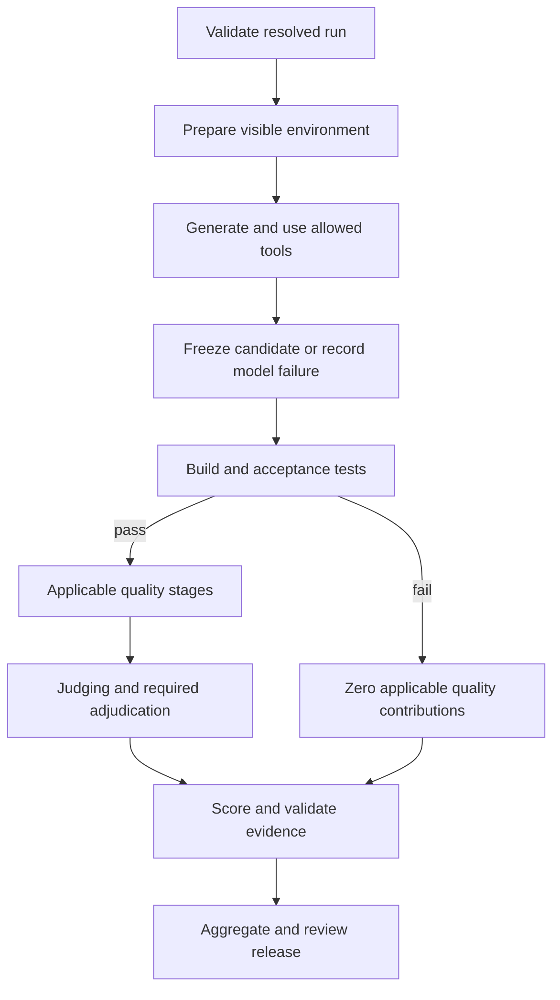
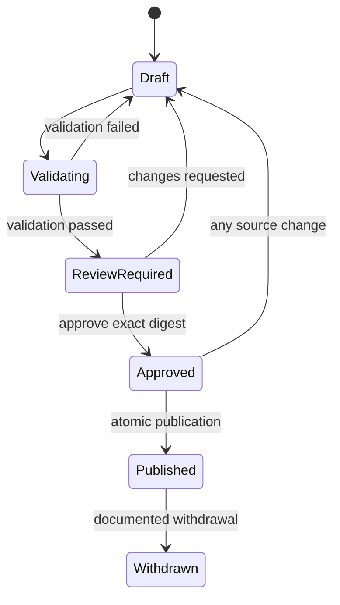

# PolyCodeBench — End-to-End Technical Implementation Specification

Version: 1.0 · Date: 30 September 2026 · Status: implementation specification

Companion architecture: `PolyCodeBench-Architecture-v1.md`, version 1.0. Original requirements: the supplied `Pasted markdown(5).md`.

This document specifies the system to build. Examples, commands, SQL, interfaces, and acceptance tests describe intended implementation, not an existing working repository. No model results or production deployment are claimed. Pilot scoring parameters are fixed here so engineers can implement consistently; promotion to a public ranked release requires calibration.

## 1. Scope, precedence, and completion contract

### 1.1 Normative language

**MUST** is a release-blocking requirement. **SHOULD** may be changed only with a documented reason and acceptance evidence. **MAY** is optional. Identifiers such as `REQ-01`, `WP-01`, and `E2E-01` are stable traceability references.

The architecture establishes boundaries and product intent. This specification supplies implementable contracts. If the two disagree, record a discrepancy and resolve it explicitly; do not silently choose whichever is easier. Narrow refinements introduced here are listed in §1.4. Code may not weaken a MUST requirement without a versioned specification amendment.

### 1.2 Required outcomes

| Requirement | Implementation obligation |
|---|---|
| REQ-01 | Python/Rust pilot, followed by Python, JavaScript, TypeScript, C, C++, Rust, Go, and Java support. |
| REQ-02 | Track A: historical, disclosed-security, and injected bugs; detection, localization, explanation, severity, and patches. |
| REQ-03 | Track B: generation, repository repair, realistic repository tasks, self-repair, repository Q&A, execution prediction, test-output prediction. |
| REQ-04 | Six-dimensional code evaluation with correctness gating and task-specific applicability. |
| REQ-05 | Versioned language profiles, anti-pattern rules, and evidence ownership. |
| REQ-06 | Single-shot and standard agent protocols; API and local-model adapters; budgets and complete available usage records. |
| REQ-07 | Offline isolated execution, separate solving/grading, resource limits, protected secrets. |
| REQ-08 | Durable parallel jobs; bounded infrastructure retries; no answer-shopping retries. |
| REQ-09 | Immutable task, config, evidence, scoring, and release versions; deterministic score replay. |
| REQ-10 | Public/date-based/private task splits; cutoff provenance; common-cohort contamination filters. |
| REQ-11 | All seven website pages, including reviewed model-submission requests. |
| REQ-12 | Exact score explanations, intervals, coverage, versioned corrections, and public/private evidence controls. |
| REQ-13 | Native-method documentation and clearly labeled adaptations for all four referenced benchmark families. |
| REQ-14 | Deployable infrastructure, observability, backup/restore, operator runbooks, and a verified end-to-end demonstration. |

### 1.3 Two completion levels

**Pilot complete:** Python/Rust code generation, two real model configurations, all applicable quality stages, both protocol implementations, CLI operations, isolated execution, score replay, and an internal report. It is acceptable for a particular pilot comparison to use only one protocol, provided both protocols have acceptance coverage.

**Product complete:** all requirements above, all languages and task families, public website, reviewed publication, held-out controls, operational recovery, and documented methodology. A pilot MUST NOT be described as the complete product.

### 1.4 Refinements made explicit here

- Separate generation attempts from evaluations, so a frozen candidate can be rescored without another model request.
- Separate job completion from model correctness: a job can complete successfully while the model fails.
- Declare invalid judge responses as evaluator failures requiring bounded recovery; never average only a convenient subset of votes.
- Keep clean Track A controls in detection metrics, but outside repair-score denominators unless the task explicitly requires a meaningful repair.
- Preserve original suite metrics separately from the stricter PolyCodeBench correctness gate.
- Fix a code-quality rubric and orthogonal idiom rubrics for the initial implementation, while preserving the original diagnostic language profiles.
- Use a reference AWS deployment driver for a concrete production target; retain a provider interface. No infrastructure is provisioned by this document.

## 2. Implementation stack and process model

### 2.1 Baseline

| Concern | Implementation choice |
|---|---|
| Backend runtime | Python 3.12; supported patch pinned in image and runtime lock. This is a compatibility target, not a claim of latest version. |
| Python dependencies | `uv` workspace, committed `uv.lock`, pinned build backend and tool versions. |
| Contracts | Pydantic model validation; generated JSON Schema checked into `schemas/v1/`. |
| API | FastAPI; generated OpenAPI; async I/O for database/provider transport. |
| Database | PostgreSQL 17, SQLAlchemy 2-style mappings, Alembic migrations. |
| CLI | Typer; calls API in deployed mode and the same service layer in local mode. |
| Frontend | TypeScript, Next.js, Tailwind, Apache ECharts; pnpm and Node version pinned at bootstrap. |
| Artifacts | S3-compatible API; immutable object manifests; SHA-256 content digests. |
| Trusted processes | API, scheduler, gateway, evaluator coordinator, judge gateway, scorer, publisher. |
| Untrusted execution | Approved OCI images in Docker inside disposable VMs; native guest lifecycle controlled externally. |
| Production reference | RDS PostgreSQL, S3, ECR, EC2 worker VMs, secrets manager, infrastructure-as-code. |
| Local development | Containerized PostgreSQL and an S3-compatible development store; local Docker driver marked development-only. |
| Telemetry | Structured JSON logs, OpenTelemetry trace propagation, Prometheus-compatible metrics. |

Resolve mutually compatible package versions in WP-01 and commit the exact lockfiles. A scored run records their digests. Floating image tags, unlocked installation, and opportunistic package updates are prohibited in evaluation workers.

### 2.2 Process responsibilities

| Process | Authoritative writes | Access restrictions |
|---|---|---|
| `pcb-api` | Requests, immutable config registration, approvals, audit events | Cannot execute candidate code. |
| `pcb-scheduler` | Jobs, leases, attempt/evaluation transitions | Cannot read provider secrets or hidden source bodies. |
| `pcb-model-gateway` | Call ledger, reservations, response references | Can read approved model credentials; cannot read hidden grading bundles. |
| `pcb-solve-supervisor` | Tool events, generation checkpoints, candidate artifacts | Visible task bundles only. |
| `pcb-eval-supervisor` | Test/analyzer/performance evidence | Hidden task inputs as needed; no provider keys. |
| `pcb-judge-gateway` | Judge calls/votes | Bounded evidence packets; approved judge credentials; no shell tools. |
| `pcb-scorer` | Scorecards and aggregates | Reads validated evidence; no guest execution or network model calls. |
| `pcb-publisher` | Public projections, signed release manifest, current pointer | Explicit declassification rights; cannot change frozen source evidence. |
| `pcb-web` | No operational writes | Published projection only; submission requests use a narrow API. |

Roles may share a deployment image, but MUST use different service identities. Shared source code does not imply shared permissions.

### 2.3 Module boundaries

`packages/core` contains immutable types, serialization, errors, and contracts. `packages/services` contains use cases. `packages/persistence` contains repositories/migrations. `packages/orchestration`, `runner`, `evaluation`, `scoring`, and `publication` implement their respective processes. Plugins live under `plugins/{languages,suites,models,sandboxes,analyzers}`. `apps/{api,web,cli}` adapt interfaces.

Dependency rule: core imports no framework/plugin implementation; scoring imports no provider client; web imports no hidden-task schema. Enforce these rules with dependency-boundary checks in CI.

## 3. Identifiers, serialization, and common contracts

### 3.1 Primitive types

| Type | Contract |
|---|---|
| Entity ID | UUIDv4 generated by application; stable across retries; never doubles as authorization. |
| Digest | Lowercase `sha256:` followed by 64 hex characters. Hash exact bytes or the canonical document described below. |
| Timestamp | RFC 3339 UTC string ending `Z`; database `timestamptz`; duration measured with a monotonic clock. |
| Money | Signed 64-bit integer micro-USD in PostgreSQL; JSON decimal integer string to avoid JavaScript precision loss. Values/reservations nonnegative except explicit adjustment ledger entries. |
| Score | Decimal `[0,100]`, persisted to six fractional digits; compute using decimal precision 28; round half-even once at scorecard serialization. |
| Weight | Integer basis points `[0,10000]` or a canonical decimal string for derived values; input weights MUST have an exact declared sum. |
| Missing value | JSON `null` plus an explicit reason. Zero is a measured value, not a missing-data marker. |
| Path | UTF-8 relative POSIX path; reject absolute paths, NUL, `..`, drive prefixes, and extraction outside root. |
| Source span | Inclusive 1-based start/end line, optional columns, relative path, base or candidate digest. |

### 3.2 Canonical document format `pcb-json-v1`

Canonical hashed documents allow null, Boolean, safe integers, strings, lists, and objects. Object keys MUST be ASCII and sorted lexicographically. JSON numeric integers are restricted to the exact JavaScript-safe range `[-9007199254740991,9007199254740991]`; schema-defined 64-bit values such as money and derived seeds use canonical decimal integer strings. Decimal values MUST be normalized fixed-point strings with their schema-specified scale; floating-point JSON numbers, NaN, and infinity are forbidden. Encode UTF-8, no BOM, no insignificant whitespace and preserve list order. Reject lone Unicode surrogates. The Python reference serializer is `json.dumps(value, ensure_ascii=False, sort_keys=True, separators=(",", ":"), allow_nan=False)` after recursive type/range validation. TypeScript MUST match its exact bytes through an explicit sorted-key serializer and shared escaping golden vectors.

Use the canonical envelope `{"kind":...,"schema_version":1,"payload":...}`. The digest excludes database IDs, creation timestamps, signatures, and the digest field itself unless those are explicitly semantic payload fields. Do not normalize source-code bytes or provider text while hashing them.

Filesystem bundles use a sorted file manifest containing path, byte digest, size, file type, executable bit, and validated symlink target if allowed. Bundle identity hashes this manifest; archive timestamps and compression differences do not alter logical bundle identity. Exact original archive bytes may be stored as an additional artifact.

Golden serialization vectors MUST include Unicode strings, escaped control characters, decimal strings, empty lists, nested maps, and reordered keys. Reject duplicate JSON keys at import before schema validation.

### 3.3 Schema behavior

Every public/plugin document has `schema_version`. Validation rejects unknown keys for canonical configurations. Forward-compatible event consumers may ignore newly documented optional event fields only after an API minor-version change. Validation MUST NOT silently coerce invalid numeric strings or substitute defaults for missing required budgets.

All examples in this document are schema sketches; implementation MUST generate complete schemas and cross-language fixtures from the authoritative Python models.

### 3.4 Status vocabularies

```text
AttemptState = planned | preparing | solving | frozen | model_failed |
               infra_blocked | cancelled
EvaluationState = pending | evaluating | needs_review | ready |
                  infra_blocked | quarantined | cancelled
JobState = blocked | queued | leased | succeeded | retry_wait |
           dead | cancelled | skipped
Gate = pass | fail | unknown | not_applicable
MeasurementStatus = measured | gated | not_applicable | missing |
                    needs_review | invalidated
Visibility = hidden | internal | public
FailureClass = model | candidate_runtime | infrastructure | evaluator |
               task_defect | policy_violation | cancelled
ReleaseState = draft | validating | review_required | approved |
               published | withdrawn
```

Publication status is not an attempt state. A frozen attempt can be included in several evaluation versions and release snapshots. `ready` means the evaluation is complete, including legitimate zero scores; it does not mean the model succeeded.

## 4. Domain documents

### 4.1 Task version

Required fields:

| Field | Type / validation |
|---|---|
| `task_id`, `version` | Stable slug plus positive integer; immutable pair. |
| `track` | `A` or `B`. |
| `family` | `bug_hunt`, `codegen`, `repo_repair`, `repo_task`, `self_repair`, `repo_qa`, `output_prediction`, `test_prediction`. |
| `primary_language`, `secondary_languages` | Plugin language IDs; JS and TS distinct. |
| `source` | Source kind, immutable repo revision, issue/CVE if applicable, rights record, first-public/curated dates with confidence. |
| `cluster_id`, `difficulty`, `stratum_id` | Frozen statistical cluster, author difficulty, and sampling stratum. |
| `visible_bundle`, `hidden_bundle` | Artifact IDs plus digests; different visibility/access classes. |
| `output_contract` | Submission schema, allowed file set, maximum artifact sizes, findings limit if applicable. |
| `runtime` | OCI digest, language-plugin version, build/test recipe digests, resource class. |
| `acceptance` | Required test group IDs, hard conditions, required outputs, protected paths. |
| `quality_plan` | Applicable dimensions/items, evidence owners, required analyzers, performance policy, judge items. |
| `oracle` | Test/ground-truth/reference version; public projection MUST omit private fields. |
| `protocol_constraints` | Allowed tools, allowed feedback, network policy, dependency inventory, maximum budgets. |
| `admission_report` | Reference, faulty and alternative-solution checks; flakiness check; reviewer record. |

Task freezing validates that every applicable item has exactly one evaluator method, every required analyzer has a compatible image, every score dimension has an applicable item/workload, and all referenced artifacts exist and match digest/visibility.

### 4.2 Run configuration

```yaml
schema_version: 1
kind: run_config
task_set_digest: "sha256:<64-hex>"
model_config_digest: "sha256:<64-hex>"
harness_digest: "sha256:<64-hex>"
protocol_id: standard-agent-v1
sampling:
  samples_per_task: 3
  master_seed: 4096
  temperature: "0.000000"
  provider_seed_policy: pass_if_supported
budget_profile: agent-small-v1
evaluation_policy_digest: "sha256:<64-hex>"
hardware_class: cpu-perf-x86-v1
judge_panel_digest: "sha256:<64-hex>"
split: public_scored
```

The strings containing angle brackets are explanatory placeholders and MUST fail real validation. Resolve every reference, parameter default, capability exception, and task-specific budget before hashing. Persist the fully resolved configuration alongside the original user input. A replay references the original run; a new stochastic campaign uses a new explicit seed/config when intended to be independent.

Task sample seed is the first unsigned 64 bits, interpreted big-endian, of SHA-256 over the canonical tuple `(master_seed, task_version_digest, sample_index)`. Persist it as `numeric(20,0)` constrained to `[0,18446744073709551615]` and serialize as a decimal integer string. Respect each provider’s documented seed range via a recorded deterministic mapping. Unsupported provider seeds are recorded as unsupported; fixed seeds do not imply deterministic generation.

### 4.3 Submission contracts

| Family | Required payload |
|---|---|
| Code generation | Bundle of declared source files plus entrypoint; no free-text parsing beyond the protocol’s deterministic extraction rule. |
| Repository tasks | Unified diff or final workspace snapshot according to frozen protocol; base commit/digest required. |
| Bug hunt | `findings[]`, final patch, optional finding→patch association. |
| Repository Q&A | `answer`, `citations[]` with file spans tied to base digest. |
| Prediction | Typed JSON value, exact text, or specified output format; oracle defines normalization. |
| Self-repair | Ordered candidate rounds and final selected round; selection follows protocol, never hidden-score best-of. |

A finding has `local_id`, `path`, `start_line`, `end_line`, optional symbol, root-cause text, reproducible evidence, severity label, and optional confidence. Default maximum findings is 20 and maximum claimed span is 50 lines. A task may override these before runs; larger causal regions use a symbol plus a bounded supporting span. Excess findings yield a contract-invalid detection submission; do not silently keep the best 20. A separately valid patch may still be evaluated.

### 4.4 Standard observation

```json
{
  "schema_version": 1,
  "kind": "observation",
  "check_id": "python.mutable-default.v1",
  "tool_digest": "sha256:<64-hex>",
  "candidate_digest": "sha256:<64-hex>",
  "status": "measured",
  "value": "fail",
  "severity": "medium",
  "confidence": "confirmed",
  "location": {"path": "solution.py", "start_line": 12, "end_line": 12},
  "baseline_relation": "introduced",
  "issue_key": "canonical-issue-id",
  "primary_owner": "robustness",
  "raw_artifact_ids": ["artifact-uuid"],
  "explanation": "Repeated calls share mutable state under the recorded probe."
}
```

A static warning alone may use `confidence=unreviewed`; “confirmed” requires an approved high-specificity rule, independent dynamic evidence, or adjudication under the policy. The example is synthetic and not a claimed tool result.

## 5. Relational schema and persistence invariants

### 5.1 Database conventions

All tables have UUID primary keys unless an explicit composite key is stated. All foreign keys use `ON DELETE RESTRICT` for benchmark evidence. Deletion of published provenance is forbidden through ordinary application roles. Mutable status rows have `row_version bigint` for optimistic updates. Immutable document/evidence rows have insert-only privileges; corrections insert successors.

`jsonb` is used for validated extensible documents, not as a substitute for relational keys. Store the canonical document bytes as an artifact where byte identity matters; PostgreSQL JSON representation is not the canonical byte source.

### 5.2 Core tables

Notation: `UQ` means unique constraint; `FK` means foreign key; `?` means nullable. Enumerated values are checked text fields, allowing controlled migration.

| Table | Required columns beyond ID | Constraints / indexes |
|---|---|---|
| `task` | slug, family, source_identity | UQ(slug). |
| `task_version` | task_id FK, version, digest, manifest_artifact_id FK, visible_artifact_id FK, hidden_artifact_id FK, language, cluster_id, stratum_id, first_public_at?, frozen_at | UQ(task_id,version), UQ(digest); index(language,family via task). |
| `task_set` | name, version, digest, split, status, manifest_artifact_id FK | UQ(name,version); frozen membership immutable. |
| `task_set_member` | task_set_id FK, task_version_id FK, stratum_id, sampling_weight_bp | Composite PK(set,task); positive weights. |
| `config_document` | kind, version_label, digest, canonical_artifact_id FK, schema_version | UQ(kind,digest). Contains scoring, language, protocol, hardware, judge, model and harness configs. |
| `model_revision` | provider, name, immutable_revision?, endpoint_registration_id FK, cutoff_at?, cutoff_source?, capabilities_config_id FK | No secret values; null cutoff permitted. |
| `endpoint_registration` | provider_kind, base_url_ref, secret_ref, network_policy_id, approval_status, capabilities_digest | Admin-only; address validation before activation. |
| `campaign` | name, status, owner_subject, budget_account_id FK, created_at | Mutable operational grouping. |
| `run` | campaign_id FK, config_document_id FK, task_set_id FK, model_revision_id FK, status, created_at | UQ(campaign_id,config_document_id); independent replicate uses explicit new config/campaign. |
| `attempt` | run_id FK, task_version_id FK, sample_index, seed, state, failure_class?, checkpoint_artifact_id?, candidate_artifact_id?, created_at, row_version | UQ(run_id,task_version_id,sample_index); sample_index≥0. |
| `evaluation` | attempt_id FK, policy_config_id FK, oracle_digest, state, gate, evidence_manifest_id?, supersedes_id? | UQ(attempt_id,policy_config_id,oracle_digest); cannot mutate evidence after ready. |
| `stage_job` | Scope FKs, stage, shard_key, input_digest, state, required, queue_class, priority, available_at, lease_until?, owner_id?, fence, deliveries, max_deliveries, output_artifact_id?, error_code?, row_version | See §5.4; indexes for queue/expired leases. |
| `stage_dependency` | job_id FK, prerequisite_job_id FK | Composite PK; DAG validated on insertion. |
| `stage_execution` | job_id FK, fence, worker_id, started_at, finished_at?, result, failure_class?, environment_artifact_id?, output_manifest_id? | UQ(job_id,fence); every delivery retained. |
| `worker_registration` | workload_identity, lane, hardware_class, allowed_queue_classes, status, last_heartbeat_at | UQ(workload_identity); provisioned capacity and driver identity independently attested by control plane. |
| `capacity_slot` | worker_id FK, resource_spec_config_id FK, state, job_id FK?, fence?, guest_id?, updated_at | One active assignment per slot; static slot allocations must fit actual worker capacity. |
| `artifact` | visibility, content_digest, size_bytes, media_type, storage_key, encryption_domain, status, producer_execution_id?, created_at | UQ(visibility,encryption_domain,content_digest); immutable bytes after verified. |
| `artifact_edge` | parent_artifact_id FK, child_artifact_id FK, relation | Composite PK; manifests retain complete dependency closure. |
| `observation` | evaluation_id FK, stage_execution_id FK, canonical_artifact_id FK, check_id, issue_key?, status, primary_owner?, baseline_relation? | UQ(evaluation_id,check_id,canonical_artifact_id). |
| `judge_packet` | evaluation_id FK, packet_digest, rubric_digest, panel_digest, required_votes | UQ(evaluation_id,packet_digest,panel_digest); votes≥3. |
| `judge_vote` | packet_id FK, vote_index, call_id FK, normalized_artifact_id?, status | UQ(packet_id,vote_index); retain invalid response artifacts. |
| `adjudication` | evaluation_id FK, target_kind, target_id, resolution_artifact_id FK, reviewer, reason, supersedes_id?, created_at | Insert-only; unresolved items block readiness. |
| `bug_annotation` | task_version_id FK, oracle_digest, bug_key, private_artifact_id FK | UQ(task_version_id,oracle_digest,bug_key). |
| `bug_match` | evaluation_id FK, submitted_finding_id, bug_annotation_id?, decision, evidence_id, adjudication_id? | Accepted positive matches one-to-one; rejected/unverified retained. |
| `scorecard` | evaluation_id FK, scorer_digest, evidence_digest, artifact_id FK, gate, composite?, created_at | UQ(evaluation_id,scorer_digest,evidence_digest); composite null iff not defined. |
| `score_item` | scorecard_id FK, dimension, item_id, status, raw_value?, effective_weight?, contribution?, reason?, evidence_refs | UQ(scorecard_id,dimension,item_id); bounds validated. |
| `release` | slug, version, state, policy_config_id FK, membership_digest?, validation_digest?, approval_digest?, public_manifest_id?, supersedes_id?, row_version | UQ(slug,version); edits after approval invalidate approval. |
| `release_entry` | release_id FK, model_config_id FK, scorecard_id FK | Composite PK(release,model_config,scorecard). |
| `publication_pointer` | board_slug, release_id FK, generation, updated_at | UQ(board_slug); compare-and-swap update. |
| `model_submission` | requester, metadata_artifact_id, status, reviewer?, rejection_reason?, resulting_run_id? | State transition audit; no endpoint becomes active automatically. |
| `audit_event` | actor, action, resource_type, resource_id, before_digest?, after_digest?, request_id, created_at | Insert-only; append privilege separated from delete/admin privilege. |
| `idempotency_record` | subject, route, key, request_digest, response_code?, response_artifact_id?, state, expires_at | UQ(subject,route,key); different digest returns conflict. |

Additional ledger/event tables are specified in §8 and §9. All document references MUST validate expected config kind at service boundaries; do not accept a language profile where a scoring policy ID is required.

### 5.3 Integrity checks outside simple foreign keys

Freezing a task set/run/release is one service transaction that validates cross-record constraints and records the validation digest. A database transaction alone cannot atomically upload object-store bytes; verified artifacts must exist before authoritative references are committed. Objects uploaded without a committed reference remain provisional and are garbage-collected after a retention interval.

A scorecard MUST reference the same candidate, policy, oracle and evidence digests as its evaluation. An evaluation with gate `unknown` cannot become `ready`. A completed failure may have gated quality items without analyzer runs, but every gated item must reference the authoritative failure evidence.

### 5.4 Queue table DDL core

The following DDL is the normative shape of queue fields; migrations add scope foreign keys to the tables above after their creation.

```sql
CREATE TABLE stage_job (
  id uuid PRIMARY KEY,
  attempt_id uuid REFERENCES attempt(id),
  evaluation_id uuid REFERENCES evaluation(id),
  release_id uuid REFERENCES release(id),
  stage text NOT NULL,
  shard_key text NOT NULL DEFAULT '',
  input_digest text NOT NULL,
  logical_key text NOT NULL UNIQUE,
  state text NOT NULL CHECK (state IN
    ('blocked','queued','leased','succeeded','retry_wait','dead','cancelled','skipped')),
  required boolean NOT NULL DEFAULT true,
  queue_class text NOT NULL,
  priority integer NOT NULL DEFAULT 0,
  available_at timestamptz NOT NULL DEFAULT now(),
  lease_until timestamptz,
  owner_id text,
  fence bigint NOT NULL DEFAULT 0 CHECK (fence >= 0),
  deliveries integer NOT NULL DEFAULT 0 CHECK (deliveries >= 0),
  max_deliveries integer NOT NULL DEFAULT 3 CHECK (max_deliveries >= 1),
  output_artifact_id uuid REFERENCES artifact(id),
  error_code text,
  row_version bigint NOT NULL DEFAULT 0,
  CHECK (num_nonnulls(attempt_id,evaluation_id,release_id) = 1),
  CHECK (
    (state = 'leased' AND lease_until IS NOT NULL AND owner_id IS NOT NULL)
    OR
    (state <> 'leased' AND lease_until IS NULL AND owner_id IS NULL)
  )
);
CREATE INDEX stage_job_ready ON stage_job
  (queue_class, priority DESC, available_at, id)
  WHERE state IN ('queued','retry_wait');
CREATE INDEX stage_job_expired ON stage_job (lease_until)
  WHERE state = 'leased';
```

`logical_key = H(scope type/id, stage, shard key, input digest)`. A stage with different inputs is a different job; infrastructure retries retain the same logical job and receive a new fence/execution row. Gate-failing output is a successful job result, not a reason to mark the job `dead`.

## 6. Artifact storage and visibility

### 6.1 Storage layout

Use separate production buckets or equivalently separate enforced policies for `hidden`, `internal`, and `public`. Object keys are `{kind}/{digest-prefix}/{digest}`. Artifact records hold the complete storage key. Never derive authorization from a guessed digest or accept an arbitrary storage URL from a candidate.

Deduplicate within a visibility/encryption domain, not across hidden and public classes. Publishing creates a reviewed projection object; it never changes a private object’s bucket ACL in place. Score explanations may cite private evidence internally and a separately authored redacted explanation publicly.

### 6.2 Upload protocol

1. Trusted supervisor requests a stage-scoped upload slot with media type, expected size and digest.
2. Control service checks lease/fence, scope, byte quota and allowed artifact kind.
3. Upload under a provisional key with short-lived permission for that one object.
4. Finalizer verifies byte count and SHA-256 independently; object-store ETag is not assumed to be the content hash.
5. Insert/resolve the immutable verified artifact and return its ID.
6. Worker commits its stage result with the same lease/fence and referenced artifact IDs.

A stale worker may leave orphaned provisional bytes but cannot bind them to authoritative results. No guest receives a bucket listing credential. Hidden artifacts can be read only by roles and stages whose frozen plan requires them.

### 6.3 Export controls

Logs and traces are internal by default. Redact secrets before durable logging. Publication uses an allowlist of fields and artifact types; HTML, source code, Markdown and tool output render as inert/sanitized content. Enforce `Content-Disposition: attachment` for unsafe downloadable types and a separate static artifact origin.

Private tasks do not publish full candidates if they reveal the task. Public per-number explanations provide formulas, coverage and redacted evidence; exact hidden inputs remain available only to authorized reviewers. Record every declassification event.

## 7. Scheduler, stage graph, and recovery

### 7.1 Stage graph



Task-family plugins modify the evaluation subgraph, not core lease semantics. Q&A and prediction bypass code-quality stages. Bug detection evaluation runs independently of whether the repair passes. Expensive quality jobs exist as `blocked` until the acceptance gate is known; an explicit failed gate skips them with recorded reasons.

Stages are `prepare`, `solve`, `freeze`, `build`, `acceptance`, `analyze:<tool>`, `robustness`, `performance`, `judge:<packet>`, `bug_match`, `answer_grade`, `score`, `aggregate`, `release_validate`, and `publish`. Shards identify analyzers, packets, or performance groups. Freeze and score may be trusted in-process operations but still produce stage evidence.

### 7.2 Claim algorithm

Run claim/lease updates at `READ COMMITTED` using short transactions. PostgreSQL row locks with `SKIP LOCKED` support concurrent queue consumers [T1]. Do not keep a row lock while running a model call or sandbox.

```sql
WITH eligible AS (
  SELECT j.id
  FROM stage_job j
  WHERE j.state IN ('queued','retry_wait')
    AND j.queue_class = :queue_class
    AND j.available_at <= now()
    AND j.deliveries < j.max_deliveries
    AND NOT EXISTS (
      SELECT 1 FROM stage_dependency d
      JOIN stage_job p ON p.id = d.prerequisite_job_id
      WHERE d.job_id = j.id AND p.state NOT IN ('succeeded','skipped')
    )
  ORDER BY j.priority DESC, j.available_at, j.id
  FOR UPDATE OF j SKIP LOCKED
  LIMIT 1
)
UPDATE stage_job j
SET state='leased', owner_id=:worker_id,
    lease_until=now() + interval '120 seconds',
    fence=j.fence+1, deliveries=j.deliveries+1,
    row_version=j.row_version+1
FROM eligible e
WHERE j.id=e.id
RETURNING j.*;
```

In the same claim transaction, first lock an eligible idle `capacity_slot` using `FOR UPDATE SKIP LOCKED`, then claim a matching job with requirements that fit that slot, bind slot to job/fence, and insert `stage_execution(job_id,fence,worker_id,started_at)`. Roll back the slot reservation if no job is available. Validate the scope is not cancelled before claim; cancellation races are resolved by the fencing/cancel check at every external dispatch and commit. Slot states are `idle`, `reserved`, `running`, `cleanup`, and `disabled`; an expired job's slot enters cleanup and cannot be reused until guest termination/resource reclamation is confirmed. Workers cannot increase their declared capacity through a claim request.

Only scheduler-created skips count as a satisfied dependency, and the skip reason must be valid for the consumer’s branch. A skipped required input does not automatically authorize a downstream quality calculation.

### 7.3 Heartbeat and completion

Heartbeat every 30 seconds, using `WHERE id, owner_id, fence, state='leased', lease_until>now()`. Extend by 120 seconds using database time. If zero rows update, the worker loses authority and MUST stop dispatching calls, kill its guest, and stop trying to commit.

Completion transaction:

1. Lock the job and check active lease, fence, owner, non-cancelled scope.
2. Validate output artifact existence/digests and stage result schema.
3. Finalize the execution record.
4. Update job to `succeeded`, clear owner/lease, assign output artifact.
5. Transition attempt/evaluation and enqueue/unblock dependent jobs atomically.
6. Insert audit/event records and commit.

Repeated completion with the same fence/output after an already committed result returns the recorded result. Different output for that completion key returns `409 RESULT_CONFLICT`. A stale fence returns `409 LEASE_LOST`.

### 7.4 Retry policy

Default maximum deliveries is three: initial delivery plus two infrastructure/evaluator retries. Delays are 10 and 60 seconds with deterministic bounded jitter for operational load spreading. Persist the delay decision. Do not use model correctness to decide whether to retry.

The reaper runs every 30 seconds. Expired jobs receive failure evidence and move to `retry_wait` or `dead`; revoke the old guest and capabilities. New stage execution must use a fresh VM. After maximum deliveries, evaluation becomes `infra_blocked`, not model-failed.

No automatic generation retry for refusals, invalid final artifacts, wrong code, candidate timeout, candidate memory exhaustion, or unauthorized output changes. These are legitimate failed attempts. Provider/API unavailability is infrastructure, but a transport retry still must preserve the same logical prompt, transcript state, sample identity, and available response records.

### 7.5 Recovery matrix

| Failure boundary | Required recovery |
|---|---|
| Before model request dispatch | Reuse reserved call intent or release unused reservation; no invented usage. |
| Response persisted, transcript not advanced | Consume the stored response once using unique turn ID; no new call. |
| Request possibly completed, response lost | Mark call delivery ambiguous, retain request ID/reservation, follow bounded transport policy; never choose between alternative answers. |
| Guest dies before command result/checkpoint commit | Restore last committed workspace/transcript pair, repeat only the uncommitted command under a new delivery; record repeated compute. |
| Candidate frozen, grading worker dies | Reuse exact candidate; rerun affected evaluation stage only. |
| Analyzer artifacts uploaded, DB commit fails | Resolve artifacts by verified digest and retry idempotent completion. |
| Scorer worker dies | Recompute from immutable evidence; resulting canonical scorecard must match. |
| Public projection uploaded, pointer swap fails | Retry compare-and-swap; unreferenced projection remains unpublished. |

Commands in the standard agent protocol are transient: background descendants MUST be terminated at command completion. This makes workspace checkpoints meaningful. Tasks needing persistent services run the service and tests within one supervised command or use a separately versioned protocol.

### 7.6 Cancellation and fairness

Cancel first updates the scope’s version/state and revokes future dispatch, then requests termination. Mark unfinished work `cancelled`; do not convert it to model failure. Persist already completed evidence and actual incurred usage. Publication rejects incomplete cancelled cohorts unless a consistently revised release excludes the affected scope.

Use bounded per-campaign/provider/language concurrency. Queue wait does not consume the model task’s active solve budget, but is reported separately. Infrastructure downtime is excluded from active solve time; candidate tool execution and model request time count. Keep both active and total elapsed time.

## 8. Model gateway, accounting, and budgets

### 8.1 Adapter contract

Each adapter implements:

```python
class ModelAdapter(Protocol):
    def capabilities(self) -> ModelCapabilities: ...
    def validate(self, config: ModelConfig, protocol: ProtocolConfig) -> None: ...
    async def generate(self, request: ModelRequest) -> ModelResponse: ...
    def classify_transport_error(self, error: Exception) -> TransportFailure: ...
```

`ModelCapabilities` declares native tools, structured output, seed, temperature, reasoning controls, streaming, context limit, and available usage counters. `ModelResponse` carries provider request ID, finish reason, content blocks, ordered tool calls, usage, provider revision/fingerprint if supplied, and raw response artifact reference. Unsupported requested controls cause plan rejection or a named capability exception in the cohort policy; no silent downgrade.

Implement an OpenAI-compatible adapter, an Anthropic adapter, a Google adapter, and a local endpoint adapter. Native providers keep provider-specific message conversions inside adapters. A nominally compatible endpoint must pass response/tool/usage conformance tests. A model without native tools may enter single-shot or an explicitly separate text-tool protocol, not silently masquerade as the standard native-tool cohort.

### 8.2 Accounting tables

| Table | Required content |
|---|---|
| `budget_account` | scope, hard_limit_micro_usd, spent_confirmed, reserved_open, uncertain_committed, row_version. |
| `budget_reservation` | account_id, call_intent_id, amount, state, created_at; UQ(account_id,call_intent_id). |
| `call_intent` | scope/attempt, logical turn/vote ID, request digest, model config, price snapshot, request artifact, state; UQ(scope,logical_call_key). |
| `call_delivery` | intent_id, delivery_index, dispatch time, response time?, provider_request_id?, status, failure code?, raw response artifact?; UQ(intent,delivery_index). |
| `usage_record` | delivery_id, token categories, availability flags, source, actual_cost?, estimated_cost?, settlement revision. |
| `accounting_entry` | account, call/delivery, reservation/charge/release/adjustment, amount, reason, timestamp; immutable ledger. |

Account balances are cached views of ledger effects validated periodically. All required account rows are locked in a stable order, from campaign to run to attempt, before reservation to avoid deadlocks. The service reserves against every applicable limit in one database transaction.

### 8.3 Dispatch protocol

1. Check active attempt state, lease/fence, provider concurrency, and remaining turns/tokens/time.
2. Persist canonical request and unique call intent before contacting the provider.
3. Compute a conservative maximum call cost using input tokens plus provider-specific upper bounds on output/reasoning tokens; persist the price snapshot.
4. Atomically verify `spent_confirmed + reserved_open + uncertain_committed + new_reservation ≤ hard_limit` for each account.
5. Create delivery record and dispatch from the gateway.
6. Persist response bytes before notifying the agent controller.
7. Settle from reported usage/cost. Release excess reservation only when usage is known. Reconcile delayed provider usage through append-only adjustments.

If no enforceable upper cost bound exists, the provider cannot be used under a claimed strict money cap; require an explicit conservative policy or block that configuration. Token limits and monetary limits are separate. A provider reporting no usage results in `unknown` with a labeled estimate, never free usage.

For ambiguous delivered requests, do not release the reserved exposure prematurely. Retrying may incur another charge, so reserve again while retaining uncertain committed cost for the prior delivery. Exactly-once billing cannot be guaranteed by a local database.

### 8.4 Default pilot budget profiles

| Limit | `single-shot-small-v1` | `agent-small-v1` |
|---|---:|---:|
| Model turns | 1 | 30 |
| Tool calls | 0 | 100 |
| Active solve time | 180 seconds | 600 seconds |
| Per command | N/A | 60 seconds |
| Cumulative input tokens | 32,000 | 250,000 |
| Cumulative output tokens | 8,000 | 30,000 |
| Guest memory | 2 GiB | 2 GiB |
| Guest CPU allocation | 2 vCPU | 2 vCPU |
| Guest writable disk | 2 GiB | 2 GiB |
| Guest process count | 128 | 128 |

Dollar limits MUST be supplied in a run plan; this document does not invent a price-independent default. Task-specific limits can be lower and some repository tasks will need larger named profiles. Budgets in the resolved run are the minimum of campaign, protocol and task ceilings. A larger profile is a separate comparison cohort.

Initial context plus responses that exceed the selected model context cannot be silently truncated: the run planner rejects oversized single-shot tasks; the agent controller applies the frozen context policy in §9.3.

## 9. Standard agent and tool protocol

### 9.1 Agent loop

```text
restore committed transcript/workspace, or create initial visible workspace
while no terminal candidate and budget remains:
    construct prompt using frozen context policy
    reserve and call model, or consume persisted response for this turn
    append model response to tentative transcript
    if final response: extract/freeze submission using family contract; stop
    for tool call in provider order:
        validate schema, policy, budgets, and active fence
        execute tool with scoped supervisor
        stop all descendant processes for command tools
        snapshot changed workspace and bounded tool result
        commit transcript + workspace checkpoint + event sequence atomically
    commit a no-tool turn or finish condition explicitly
if budget exhausted:
    freeze current valid workspace where the protocol permits it
    otherwise record model failure with budget-exhausted evidence
```

A turn is one model request/response. Multiple tool calls in one response execute sequentially in provider order in v1. This prevents race-dependent filesystem edits. Invalid tool calls consume the declared tool-call attempt budget and return a typed error to the model if time remains. They do not give the model new permissions.

### 9.2 Tool contracts

| Tool | Arguments | Result / limits |
|---|---|---|
| `list_files` | relative directory, depth, cursor | Sorted paths, next cursor; max 1,000 entries/page, depth≤10. |
| `read_file` | path, start_line, max_lines | Text with line numbers and digest; max 400 lines/64 KiB per response; binary files return metadata. |
| `search` | literal/regex pattern, path glob, cursor | Bounded matches with spans; max 200 matches/64 KiB; invalid regex is a typed error. |
| `apply_patch` | unified diff | Atomic validated changes or no change; max 1 MiB diff by default. |
| `run_command` | shell text, relative working directory, timeout_seconds | Exit/signal, bounded stdout/stderr, elapsed time, resource usage; shell exists only inside guest. |
| `run_public_tests` | allowed public test group IDs | Public results only, same output/resource caps. |

Shell syntax is allowed inside the untrusted guest. The host supervisor never interpolates shell text into a host shell invocation; it sends an argument-safe request to the guest execution service. Path rules, protected files, output quota, and command lifecycle are enforced outside candidate code.

Results include `event_seq`, `tool_call_id`, `status`, `truncated`, `original_bytes`, `returned_bytes`, `artifact_id`, and `budget_remaining`. Raw internal output is archived subject to byte caps; only permitted bounded content enters the prompt. Artifact IDs returned to the model do not grant access to hidden artifacts or the public artifact API.

### 9.3 Context and checkpoints

For `standard-agent-v1`, always retain system/task instructions, output schema, current budget, and the latest eight completed turns within the model context ceiling. Older tool outputs become deterministic metadata summaries containing tool name, paths, status, and recorded artifact references; preserve earlier model messages when possible. No separate summarizer model is used in v1. If the required core context cannot fit, stop with a declared context-budget failure rather than silently dropping the task.

Store exactly what the provider receives, including truncation and compaction events. The config records maximum input context and token-counter implementation. Recount through provider usage when available and show discrepancies.

`attempt_event` has `(attempt_id, event_seq)` unique, event kind, payload artifact, and timestamp. A checkpoint references the last committed sequence, workspace manifest, transcript manifest, accumulated budgets, and pending logical call/tool IDs. Sequence allocation and checkpoint update use a row lock or compare-and-swap on the attempt.

### 9.4 Submission extraction

Single-shot source extraction accepts only the declared structured envelope, or exactly one language-fenced block when that protocol explicitly permits it. Ambiguous multiple candidate blocks are invalid; an LLM extractor must not choose a better answer. Agentic code tasks freeze the declared workspace files. Prediction tasks read only the declared final field. Preserve the entire original response as internal evidence.

## 10. Sandbox implementation

### 10.1 Provider interface

```python
class SandboxProvider(Protocol):
    async def create(self, spec: SandboxSpec) -> SandboxHandle: ...
    async def stage_inputs(self, handle: SandboxHandle, manifest: InputManifest) -> None: ...
    async def execute(self, handle: SandboxHandle, request: ExecRequest) -> ExecResult: ...
    async def snapshot(self, handle: SandboxHandle) -> WorkspaceManifest: ...
    async def terminate(self, handle: SandboxHandle, reason: str) -> None: ...
    async def destroy(self, handle: SandboxHandle) -> None: ...
```

`SandboxSpec` contains image digest, approved VM image, hardware/resource class, visibility lane, CPU/memory/disk/PID limits, network policy, TTL, stage scope and fence. User input cannot override privileged flags, mounts, host addresses, or instance roles.

### 10.2 Reference production driver

Implement `Ec2VmSandboxProvider`: the trusted supervisor provisions a fresh instance from an approved minimal image, tags it with stage/fence/expiry, stages only scoped input data, invokes the constrained guest bootstrap, collects output, and terminates the instance. The bootstrap launches approved Docker images; no nested Docker control is exposed inside the candidate container.

The supervisor owns cloud credentials outside the VM. Execution instances have no instance role and cloud metadata access is disabled. Network policy permits only a restricted supervisor control channel at the VM level; candidate containers have network disabled. A bootstrap/control identity may authenticate only the current stage and cannot read the database, enumerate buckets, launch machines, or sign authoritative scores. Per-stage credentials, if required for transfer, are one-object and short-lived.

Separate solve and evaluation VM roles/subnets/input policies. A solve VM never receives hidden bundles. Fresh guests are required between solve and grading and between attempts. Container escape must not provide access to long-lived control-plane credentials or unrelated tasks. Docker documentation identifies daemon and kernel/capability boundaries that require this separation [T2].

### 10.3 Guest policy

Non-root container user where compatible; no privilege escalation; drop capabilities; restrictive seccomp/AppArmor or equivalent; read-only root filesystem; bounded temporary/writable mounts; no host PID/IPC/network namespaces; no Docker socket; no host device access; fixed CPU/memory/disk/PID/time quotas. Toolchain exceptions require an approved named sandbox policy and separate cohort if they affect measurement.

Archive extraction rejects escaping paths, device files, unsafe hardlinks, and symlink traversal. Filesystem operations use resolved paths beneath a preopened task root and avoid race-prone “check then follow symlink” behavior. For v1, reject submitted symlinks unless the task explicitly needs and validates them.

Untrusted build scripts, package hooks, and analyzers parsing source also run within isolated guests. Local inference model loading is a separately controlled service; the public submission route accepts endpoint metadata, not arbitrary executable model packages.

### 10.4 Hidden grading and anti-tampering

Keep the grader decision logic external. Candidate stdout is evidence, not authority to declare pass. For black-box tasks, the external driver sends inputs and verifies outputs. For repository tests that import candidate code into a test process, tests are withheld during solving but not assumed impossible to inspect at grading runtime. Isolate that process and never return hidden outcomes to the agent.

Record the expected test inventory and reconcile actual execution: missing/skipped/xfailed mandatory tests do not count as passes unless predeclared in the oracle. Tests/configuration come from immutable grading overlays; candidate changes cannot replace them. Native suite compatibility and stronger anti-tampering checks must be separately reported when their rules differ.

### 10.5 Local driver

`LocalDockerSandboxProvider` supports development and trusted fixtures only. Every result carries `isolation_tier=development`; release validation refuses those results for a public ranked release. A local developer cannot enable a production badge by editing a web parameter. Production worker identity and permitted driver policy are checked by the control plane.

## 11. Task authoring, ingestion, and admission

### 11.1 Task package structure

| Package path | Contents / access |
|---|---|
| `manifest.yaml` | Full administrative task metadata; not copied to solve environment. |
| `visible/task.md` | Task statement, constraints and output contract. |
| `visible/repo/` | Sanitized immutable starting repository or scaffold. |
| `visible/tests/` | Only declared public feedback tests. |
| `hidden/tests/` | Required and optional quality scenarios with expected inventory. |
| `hidden/oracle.json` | Accepted outcomes, fact/bug annotations, normalization rules. |
| `hidden/reference/` | Reference implementation/patch and performance artifacts. |
| `hidden/quality-plan.yaml` | Applicable items, evidence mapping, judge anchors, workload definitions. |
| `admission/` | Reference/faulty/alternative runs, flakiness report, rights and review records. |

The importer creates physically distinct visible and hidden bundles, scans image layers/build contexts for accidental hidden assets, and emits a sanitized visible manifest. Source git metadata is omitted or rebuilt with only permitted history. Test bundles are not committed to a public repository.

### 11.2 Admission command

`pcb task validate PACKAGE --admission-profile admission-v1` performs schema and path validation, offline image build/replay, reference acceptance, known-fault rejection, alternative-valid-solution check, required analyzer compatibility, five baseline repetitions, opportunity coverage, license/rights record completeness, and disclosure scanning.

Any inconsistent required baseline outcome blocks admission. A timing-sensitive test must define its repetition and failure policy before admission. The output is a machine-readable report plus human summary. `pcb task freeze` requires that report’s digest and curator approval; changes to any scored task field require a new task version.

For generation tasks, require at least one incorrect variant exercising a nontrivial edge case. For quality items, include counterexamples that pass functional tests but exhibit the intended quality problem. This confirms that the quality pipeline measures something beyond correctness.

### 11.3 Bug-source construction

Historical tasks record vulnerable/pre-fix commit, fix commit, linked issue and actual reproducer. Prefer a known pre-fix snapshot; synthetic revert constructions need their own label and validation. CVE tasks use publicly disclosed cases and isolated reproduction. Mutations record operator/version/seed, changed span, proof that behavior changes, and a reference repair. Equivalent, duplicate, trivially signposted, or unintended nonbuilding mutations are rejected.

A mutation task may have other real bugs. The known injected defect does not make all other findings false. Ground-truth updates follow §16.

### 11.4 Dataset splits and sampling

Split at `cluster_id`, preserving repository forks, translated problem variants, and mutation families together. Freeze split seed and membership. Task-set manifests include strata and weights; run-time sampling from a moving repository is prohibited.

Store earliest known public exposure separately from curation date. Post-cutoff eligibility requires a supported model cutoff and `earliest_public_at > cutoff_at`; uncertain exposure dates are excluded from that particular subset with a reason. Unknown dates remain unknown.

For private tasks record access history and provider transmission policy. Only the visible portion is sent for solving; references and hidden tests are not. Publicly exposed task material cannot later be relabeled never-exposed held-out material. Retiring tasks and admitting fresh ones creates new task-set versions.

## 12. Evaluation stages and evidence contracts

### 12.1 Code evaluation sequence

1. Verify candidate digest and allowed changes against base.
2. Create fresh evaluation guest; install trusted overlays and frozen dependencies.
3. Build with task-declared flags.
4. Run mandatory acceptance groups and hard constraints; reconcile expected inventory.
5. If gate fails, emit failure evidence and gated score items; skip optional quality work.
6. If gate passes, execute applicable analyzers, robustness scenarios, performance measurements, and residual judge packets.
7. Normalize raw evidence, compare baseline, deduplicate issues, and resolve required review.
8. Freeze the evidence manifest; execute pure scoring.

Baseline/reference analyzer outputs are reusable only when task, tool image, rules, dependency/advisory data, and scope digests match. Candidate output caches additionally require the candidate digest. Cache reuse is visible in stage metadata.

### 12.2 Test report contract

Each test/scenario record has group ID, case ID, required/optional classification, input seed/digest, expected-outcome digest, outcome (`pass/fail/error/skipped`), duration, resource use, stdout/stderr references, and execution identity. Unknown required cases or missing inventory block acceptance. Candidate error means failure; supervisor/harness error means incomplete evaluation. The adapter must distinguish them using structured status and control evidence, not only an exit code.

Property-based checks pin generator version, seeds, example count and shrinking policy. Fuzzing records corpus digest, engine/version, fixed iteration/time budget and discovered counterexamples. A newly discovered required-contract violation can change the gate only through the declared policy; when the oracle changes, re-evaluate the affected comparison cohort consistently.

### 12.3 Analyzer plugin

```python
class AnalyzerPlugin(Protocol):
    def capabilities(self) -> AnalyzerCapabilities: ...
    def plan(self, context: AnalysisContext) -> AnalysisPlan: ...
    def parse(self, raw: ArtifactReader, plan: AnalysisPlan) -> list[Observation]: ...
```

An `AnalysisPlan` declares executable/image digest, argument vector, input artifacts, timeout/resource policy, success/findings/error exit semantics, output schema, parser version, rule bundle digest, advisory snapshot, scope and evidence ownership. The supervisor executes the plan; the parser cannot spawn arbitrary host code.

Parse native JSON/SARIF/XML where available. If a tool emits only text, pin parser fixtures to the tool version and preserve the complete bounded report. Empty output is not a successful clean scan unless the tool’s declared success contract proves it.

### 12.4 Issue normalization

Canonical issue key combines defect taxonomy, source/sink or symbol evidence, affected base/candidate semantic location, and cause. Cross-tool grouping uses explicit equivalence rules and reviewed mappings, not a generic text-embedding similarity threshold. Ambiguous matches remain separate/pending until reviewed.

Baseline relation is `introduced`, `worsened`, `unchanged_in_scope`, `unchanged_out_of_scope`, `resolved`, or `unknown`. New penalties apply to introduced/worsened issues and to unchanged issues explicitly in the task’s required repair scope. Unknown relation requiring a score deduction is adjudicated before publication.

### 12.5 Robustness scenarios

Each scenario defines setup, fault/input, expected permitted outcomes, cleanup checks, repetitions, per-scenario weight and whether it is hard acceptance or quality-only. Group equivalent assertions under one scenario so easy duplicated tests do not amplify weight.

Default repeated concurrency/fault scenario policy: three executions; all must satisfy the declared outcome for full credit. Partial credit is permitted only if the scenario contract defines it before runs. Do not invent partial credit after a flaky failure. Hard-contract failure sets the correctness gate to fail; it is not merely a low robustness score.

## 13. Performance measurement implementation

### 13.1 Workload contract

`PerformancePlan` contains reference candidate digest, language/runtime/build profile, hardware class, input families/scales/weights, output verifier, cold/steady-state mode, warmup count, measured count, time/memory metric, hard timeouts, floors and transform policy. Require three scales for tasks claiming scaling analysis, or document why that analysis is N/A.

Pilot defaults: 5 warmups, 20 paired measured iterations per workload, fixed single-thread policy unless the task explicitly permits otherwise. JIT language warmup overrides are task/language-policy fields frozen at admission, not adaptive until a favored model looks fast.

### 13.2 Run algorithm

Reserve the performance worker exclusively. Validate hardware identity and run a frozen canary. For each workload, use the plan seed to randomize whether candidate or reference goes first in each pair; use the same input for both. Run each in a fresh process with equivalent initialization and cleanup. Validate output outside the timed region where feasible, without allowing candidate computation to be excluded from measurement.

Retain nanosecond elapsed time, peak total process-tree resident memory, exit status, output verification and environment digest for every iteration. Declare whether child memory is measured by cgroup peak or an equivalent whole-job metric. Do not compare a parent-only RSS with a full-process reference.

Measure compile/build time separately. Use release/optimized builds with identical declared flags. No sanitizers, Miri, coverage or profilers in performance runs. Record cold-start and steady-state as separate metric IDs if both are supported.

### 13.3 Stability and retries

Admission establishes canary baseline and acceptable band. Pilot default: canary median within ±10% of its frozen baseline and relative MAD/median≤5%, using a floor for tiny values. These are implementation defaults to calibrate, not universal hardware truths.

An invalid canary invalidates the whole measurement block, including every candidate/reference measurement taken under it. Allow two total blocks for a stage, retaining both. Select the first valid block by time order, never the faster block. If neither is valid, performance is incomplete and the evaluation is not rankable. Candidate variance is reported; it is not automatically blamed on infrastructure.

### 13.4 Ratios and efficiency score

For each workload compute median candidate time/reference time and median candidate peak memory/reference memory, applying the same positive measurement floors. Use weighted geometric means across workloads, with weights frozen to sum to 1. Compute using a fixed high-precision decimal implementation or a pinned math implementation whose serialized outputs pass golden tests.

For ratio `r` and breakpoint `b`:

```text
f(r,b) = 100                       when r <= 1
       = 100 * (b-r)/(b-1)        when 1 < r < b
       = 0                       when r >= b
E = 0.70*f(r_time,4) + 0.30*f(r_memory,2)
```

A timed-out candidate is censored, not assigned an invented exact duration. If the timeout lower bound proves its ratio reaches the zero-score breakpoint, assign the declared zero timing component and label it censored. Otherwise the workload plan lacks enough information for this transform and must provide a larger limit or an explicit censored-score rule fixed before candidates run. Hard-limit violations can fail correctness according to the task contract.

Store standard deviation, median, MAD and sample counts; label measurement variance separately from aggregate confidence intervals. Empirical scale growth is a diagnostic, not a proof of asymptotic complexity.

## 14. Pure scoring engine

### 14.1 Entry point

```python
def score_evaluation(
    task: FrozenTask,
    policy: FrozenScoringPolicy,
    evidence: ValidatedEvidenceManifest,
) -> Scorecard:
    ...
```

The function has no filesystem mutation, provider calls, network access, time-dependent behavior, or database reads. Inputs include everything affecting the result. The service wrapper persists canonical output and the scorer source/lockfile digest. Python decimal arithmetic provides explicit precision/rounding control [T4].

### 14.2 Applicability and gate

Validate required evidence first. Gate `unknown` returns an incomplete evaluation, not a scorecard usable for ranking. For code tasks `C=100` when all required conditions pass, otherwise `C=0`. For every applicable quality item with failed gate, set `status=gated`, `raw_value=null` when not measured, `contribution=0`, and reference the failure. Predeclared N/A remains N/A.

Raw observations may exist for failed code but cannot improve its composite. Code tasks without any applicable quality dimension are classified as correctness-only tasks outside the six-dimension board.

### 14.3 Composite

Base weights in basis points: correctness 3000, security 2000, efficiency 1500, code_quality 1500, idiomatic 1000, robustness 1000.

For passing code, keep 30 correctness points and distribute 70 quality points among applicable dimensions in proportion to their base quality weights:

`CodeScore = 30 + 70 × Σ(w_d × q_d) / (100 × Σw_d)`.

For failed code, `CodeScore=0`. Use exact decimal arithmetic. Record effective task weights, not only the nominal profile. Applicability is frozen in the task and identical across candidates.

For full applicability this equals `30 + .20S + .15E + .15Q + .10I + .10R`.

### 14.4 Dimension rubrics

**Security:** `max(0,100-sum(unique confirmed owned issue penalties))`, with critical=50, high=25, medium=10, low=3. Unreviewed uncertain deductions block completion when required by policy. If an issue is owned by another dimension, it may appear in the security explanation but cannot be deducted here as well. “No issues found” means no issues detected under the declared coverage.

**Code quality:** six pilot item groups with weights naming/readability 2000, decomposition 2500, duplication 1500, unnecessary complexity 1500, repository/style consistency 1500, minimal relevant scope 1000. Each group is composed of task-applicable checks. Tools own deterministic checks; judges own residual contextual checks. The item plan defines exact anchors, for example 1=satisfies requirement, 0.5=minor documented weakness, 0=material documented weakness. No bonus for more comments, lines or abstractions.

**Idiomatic strength:** weighted task-applicable items from the orthogonal language rubrics in §18. Full diagnostic profiles are distinct from this dimension. Items need evidence of suitable use or a justified simpler alternative, not syntax presence.

**Robustness:** weighted mean of frozen quality-only scenario outcomes and explicitly residual judge items. Each scenario/item has one owner and a normalized `[0,1]` score. Required acceptance scenarios are reported but do not provide a second penalty after they fail correctness.

For each rubric dimension, `q = 100 × Σ(weight × item_score)/Σ(applicable weights)`. A required item with missing evidence blocks completion. All items N/A makes the dimension N/A, which must already agree with the frozen task plan.

### 14.5 Evidence ownership

`evidence_ownership.yaml` maps canonical rule/issue families to one composite owner, with task overrides allowed only before freeze. Diagnostic views can reuse evidence. One confirmed underlying issue cannot lower both security and idioms merely because both profiles mention safety.

When a defect has independently measured consequences, separate consequence records can exist, for example excess copying measured by the benchmark and a distinct ownership API violation. The policy MUST explain why these are separate. The scorer rejects duplicate `(issue_key,penalty_kind)` ownership across dimensions.

### 14.6 Golden calculations

| Fixture | Expected result |
|---|---|
| Gate fails; any quality values | Code composite `0.000000`. |
| Gate passes; all quality values 100 | `100.000000`. |
| Gate passes; S90 E80 Q85 I90 R80 | `89.750000`. |
| Same values but efficiency predeclared N/A | `90.772727` after redistribution of the 70 quality points. |
| Two tools identify the same confirmed high security issue | Security `75.000000`, not 50. |
| Runtime ratio 2, memory ratio 1.5 | Efficiency `61.666667` after final rounding. |
| Required analyzer missing on passing code | No publishable composite; not 100 or zero. |

The N/A example uses quality numerator `.20*90+.15*85+.10*90+.10*80=47.75`, denominator `.55`, then `30+70*(47.75/55)=90.772727` after rounding.

## 15. Judge execution and human review

### 15.1 Packet and vote schema

A packet contains anonymized task constraints, item IDs/anchors, approved relevant code/evidence spans, and output JSON Schema. It excludes model identity, provider, cost, rank, expected scalar score, hidden instructions unrelated to the judged item, and executable tools.

A vote contains packet digest, judge revision, vote index, per-item score from the declared anchor set, evidence citations, concise rationale, uncertainty flags, and raw response artifact. Citation IDs/spans must exist in the packet. Invalid scores, missing items, unverifiable references, or extra instruction actions are schema errors.

### 15.2 Three-vote policy

Run exactly three logical votes per packet for `judge-panel-v1`, using distinct recorded seeds if supported. Each logical vote uses the same rubric and model configuration. Average the three valid item scores; all votes remain visible to reviewers.

Invalid evaluator outputs receive up to two replacement deliveries per vote with the same input and a fixed schema-repair instruction that contains no desired score. Preserve all invalid deliveries. If three valid logical votes cannot be obtained, evaluation is `infra_blocked`/`needs_review`; do not average just two. This recovery applies to the evaluator, not the candidate model’s invalid final answer.

Use the same judge panel across a comparison cohort and ensure it is not the candidate model. Changing the judge because it becomes a candidate requires reevaluating the cohort under one common panel and publishing a new version.

### 15.3 Disagreement and adjudication

For anchors `{0,0.5,1}`, a max–min spread of 1, conflicting factual interpretations, or unsupported citations triggers review. Also audit a seeded 10% of other packets in a pilot. These are operational defaults; calibration can change them only through a new policy version.

Reviewer decisions reference item, all votes, evidence, reason, reviewer and timestamp. They supersede a specific item score without deleting votes. Model identity remains hidden where feasible. Manual overrides are not arbitrary leaderboard edits; they must follow rubric anchors. If the reviewer discovers a task/rubric defect, revise the task/policy and apply consistently to the cohort.

Before a ranked release, use a disjoint human-labeled calibration set of at least 30 representative packets per pilot language, including adversarial comments and stylistic alternatives. Report item agreement and a confusion matrix; an initial promotion target is at least 80% exact anchor agreement overall and no unresolved systematic direction of bias. These counts/targets are operational pilot gates, not proof of validity. Revise using calibration data, never tune on private scored results to favor rankings.

## 16. Track A implementation

### 16.1 Detection pipeline

Parse the structured finding envelope, validate spans against the base snapshot, canonicalize exact duplicates, and store each semantic claim. Exact duplicate records get `duplicate_of`; distinct unsupported claims remain eligible false positives. Invalid detection format yields no accepted findings and zero known-bug recall, with the schema failure recorded.

Generate candidate match edges using overlapping semantic scope and defect taxonomy. Root-cause equivalence and independent reproducer/evidence are required to accept an edge. A judge can propose a match but cannot silently finalize ambiguous/new bugs. Review resolves ambiguity under a frozen matching rubric.

Choose a one-to-one matching over accepted edges using maximum total localization credit, tie-breaking by stable finding/bug IDs. Matching cannot use model name or leaderboard benefit. Persist all accepted/rejected/unverified edges and reviewer evidence.

### 16.2 Counts and unknown findings

For each task/sample, TP is matched known defects, FN is required annotated defects without a match, and FP is adjudicated false distinct findings. Unverified findings make strict precision/F1 pending. Exact duplicates add no TP/FP but are reported as duplicate rate; verbose claims containing several separate alleged defects must be split during adjudication.

An unmatched valid new defect creates a new ground-truth version after review. Rematch and, where required, re-evaluate every model consistently. Open repository discovery reports known-bug recall, confirmed/rejected/unverified counts and confirmed yield; it cannot claim exhaustive repository recall.

### 16.3 Localization and explanation

Per required bug, localization is 100 for an accepted causal span, 70 for accepted causal detection localized only to the same function, 30 for same file, 0 otherwise. An overbroad range cannot receive exact credit. A missed bug receives 0.

Root-cause explanation uses four equally weighted facts: trigger, incorrect behavior, causal mechanism and consequence, each graded 0/0.5/1 with evidence. Severity uses task-defined accepted labels from low/medium/high/critical. Exact accepted label=100; one adjacent level=50; two or more levels=0. Accepted severity ranges and any asymmetric policy are frozen in the oracle; default is symmetric. Missed bug severity=0.

### 16.4 Repair

Apply the final combined patch to a fresh base and evaluate all required repair/regression conditions. Individual-fix results are diagnostics; a partial patch failing the required overall contract has repair composite zero. Invalid findings do not automatically invalidate an otherwise valid patch, and a correct bug report does not imply a correct patch.

Clean controls contribute detection false alarms but have `repair_required=false` and no repair score. A positive-bug task with no valid patch has repair zero. Track A evaluation MUST have positive-bug tasks to produce a meaningful summary.

### 16.5 Aggregate metrics

For each task, average TP/FP/FN across planned samples before summing over the declared detection cohort. Equal samples are required in a comparison; never pool more samples from one task to give it extra importance.

`P=TP/(TP+FP)`, `R=TP/(TP+FN)`, `F1=2TP/(2TP+FP+FN)`.

If no positive predictions exist but true bugs do, precision is N/A, recall and F1 are zero. If the entire cohort has no true bugs, recall/F1 are N/A and only false-alarm metrics are reported.

Compute L/X/V as the mean over required ground-truth bugs, including misses as zero and averaging samples first. Compute repair mean across positive-bug tasks using the frozen source/language strata. Then:

`A_score = .35*(100F1) + .10L + .10X + .05V + .40RepairScore`.

If any strict detection result remains unverified, the summary is unavailable. For a multilingual headline, calculate this formula within each language and average language scores with equal frozen weights. Separately report corpus-wide micro precision/recall/F1 as diagnostic metrics; do not substitute those for the language-balanced headline. Report source/language subgroup metrics even when a full Track A summary exists.

## 17. Track B suite adapters

### 17.1 Shared interface

```python
class SuiteAdapter(Protocol):
    def import_tasks(self, source: SourceManifest) -> list[TaskDraft]: ...
    def validate_methodology(self, record: MethodologyRecord) -> ValidationReport: ...
    def protocol(self, task: FrozenTask) -> FamilyProtocol: ...
    def evaluation_plan(self, task: FrozenTask, candidate: Candidate) -> EvaluationPlan: ...
    def native_metrics(self, evidence: ValidatedEvidenceManifest) -> dict[str, Metric]: ...
```

`MethodologyRecord` includes official sources/revisions, input/output rules, feedback/tools, native metrics, licenses, deviations and compatibility level: `native`, `ported`, or `inspired`. The public label MUST use the compatibility level.

### 17.2 Family contracts

| Family | Solve behavior | Grade behavior |
|---|---|---|
| Code generation | Statement/scaffold to source files; single-shot or standard agent as declared | Required examples/hidden/property/fuzz acceptance; applicable six dimensions. |
| SWE-style repo repair | Issue and pre-fix snapshot to patch | Preserve native fail-to-pass/pass-to-pass resolution; append PolyCodeBench gate and quality without replacing native metric. |
| Realistic repo task | Curated developer request and repo conventions | Executable acceptance criteria plus bounded rubric for truly non-executable criteria; quality on resulting code. |
| Self-repair | Initial candidate, then a fixed number of rounds with permitted public feedback only | Preserve initial/final outcomes, total cost, repair-round count; final code quality; no hidden feedback or best-hidden-score selection. |
| Repository Q&A | Answer with base-snapshot citations; read/search tools; editing off | Fact recall and grounding/unsupported-claim diagnostics. No six code dimensions. |
| Output prediction | Read supplied code/input and predict output; command/test tools disabled | Oracle-defined exact/semantic match. Executing the target changes the protocol and needs separate label. |
| Test-output prediction | Predict declared test result/output under scenario constraints | Native oracle/normalization; no code-quality score for a textual prediction. |

Native imports must use the upstream evaluator at a pinned revision where practical. Generate a unique upstream run identity from candidate/task/evaluator digests so weak upstream cache keys cannot reuse another candidate’s result. Language ports or altered prompts/test rules are separate suites.

Cursor-style tasks are independently curated and labeled inspired; do not invent access to internal task sets or claim exact equivalence. The methodology page must recognize that the published CursorBench approach already includes quality/efficiency. DeepCodeBench-style Q&A preserves factual evaluation rather than pretending prose is generated code. Official sources are listed in §26 and the companion architecture.

### 17.3 Repository Q&A exact scoring

The hidden oracle contains atomic facts, equal weights by default or explicit predeclared weights, accepted paraphrases, and verifying code spans tied to the repository digest. Native fact recall is `100 × sum(weights of correctly expressed facts)/sum(all required fact weights)`, with missed facts zero.

A fixed judge packet assesses entailment using the three-vote protocol. Exact factual contradictions do not count as expressed facts. Final fact credit is the mean of the three 0/1 entailment votes unless adjudicated; preserve the native adapter’s original aggregation separately if different.

Validate every cited path/span/digest. For a deterministic grounding measure, report the fraction of asserted fact citations whose referenced spans actually support the fact under the same rubric. Extract additional material claims using a frozen procedure and report unsupported/contradicted count and rate. If extraction/verification is incomplete, those diagnostics are unknown, not zero.

Primary Q&A ranking uses fact recall, with unsupported claims and grounding shown alongside it. Do not invent a new weighted “answer quality” index in v1. Empty answer has recall zero and undefined claim precision. Answer repetition provides no additional fact credit.

### 17.4 Prediction normalization

Each task chooses `exact_bytes`, `normalized_text`, or `typed_json`. Normalized text must explicitly state line-ending, whitespace and final-newline rules; typed JSON defines numeric tolerance, ordering and type constraints. A parser error is a wrong prediction. Do not use a judge to rescue an incorrect deterministic output.

## 18. Language plugins, images, and profiles

### 18.1 Language plugin contract

```python
class LanguagePlugin(Protocol):
    api_version: int
    language_id: str
    def validate_task(self, task: TaskDraft) -> ValidationReport: ...
    def build_plan(self, task: FrozenTask, candidate: Candidate) -> BuildPlan: ...
    def test_plan(self, task: FrozenTask) -> TestPlan: ...
    def analysis_plans(self, context: AnalysisContext) -> list[AnalysisPlan]: ...
    def performance_plan(self, task: FrozenTask) -> PerformancePlan | None: ...
    def symbols(self, source: ArtifactReader) -> SymbolIndex: ...
    def profile(self, version: str) -> LanguageProfile: ...
```

Registration uses an administrator-managed allowlist of Python entry points and OCI image digests. All plans use typed argument arrays, image/resource declarations and explicit artifact inputs. Plugin installation is a deployment change, not a user-submitted runtime operation.

### 18.2 Required toolchains

| Plugin ID | Build / tests | Quality integrations | Image constraints |
|---|---|---|---|
| `python` | Pinned Python, pytest, Hypothesis | Ruff, mypy, Bandit, selected Semgrep rules; dependency/secret checks where applicable | Choose mypy for pilot; Pyright may be a new policy variant. Offline wheels/lock. |
| `javascript` | Pinned Node/package manager, task-selected Vitest/Jest | ESLint, selected security rules, dependency/secret checks | JS-only profile; no forced TypeScript checker. |
| `typescript` | Node + pinned tsc, tests | Strict typing where task requires it, ESLint/security/dependency checks | Strictness must match task/reference contract. |
| `c` | Pinned Clang build recipe, task tests | clang-tidy, cppcheck, ASan/UBSan, Valgrind where supported | Separate release and instrumented images/configs; warnings policy frozen. |
| `cpp` | Pinned Clang, task C++ standard, tests | Selected clang-tidy checks, cppcheck, ASan/UBSan and separate TSan as applicable | Do not combine incompatible sanitizer profiles. |
| `rust` | Frozen toolchain file, Cargo.lock, cargo test | Selected clippy checks, cargo-audit, compatible Miri lane, secret checks | Frozen offline crates; Miri toolchain and compatibility explicit. |
| `go` | Pinned Go, modules/vendor, go test | gofmt check, vet, staticcheck, gosec, race-enabled tests | Race build separated from performance. |
| `java` | Pinned JDK, Maven or Gradle wrapper, JUnit | SpotBugs, PMD, Checkstyle, dependency-check, security probes | Offline dependencies; JIT warmup policy explicit. |

CodeQL is an optional additional analyzer after supported-rule coverage and applicable terms are verified. Scanner absence is not N/A if the frozen plan required it. Source rule packs, compiler flags, target architecture, tool versions and advisory database snapshots all contribute to evaluator identity.

### 18.3 Diagnostic profiles

Use stable item IDs and the original architecture’s weights:

| Language | Diagnostic item weights in percent |
|---|---|
| Python | idioms25, typing15, stdlib15, errors15, lint10, performance20 |
| TypeScript | async25, typing20, modern15, security20, async_errors10, lint10 |
| JavaScript | async31.25, modern18.75, security25, async_errors12.5, lint12.5 |
| C | memory30, UB25, performance15, ownership10, portability10, error_checks10 |
| C++ | RAII25, moves15, STL15, exceptions10, modern15, performance10, memory10 |
| Rust | ownership25, unsafe20, result_option20, iterators15, concurrency10, clippy10 |
| Go | errors25, concurrency25, context15, interfaces15, stdlib10, lint10 |
| Java | design20, resources15, concurrency20, modern15, nulls15, security15 |

Profile items can reference multiple component observations but have one frozen calculation. Display applicability and opportunity counts. No opportunity means N/A, not perfect performance. Weight redistribution within a diagnostic profile does not change the composite’s evidence-ownership rules.

### 18.4 Orthogonal idiom rubrics

These pilot item weights sum to 100 per language before task applicability filtering. Security, measured performance, general formatting and fault-handling penalties belong to their own dimensions.

| Language | Idiom items and weights |
|---|---|
| Python | Suitable iteration/laziness30; stdlib/API choice30; clear data/protocol modeling25; context/resource abstraction design15. |
| JavaScript | Appropriate async composition35; data/module API design30; suitable language constructs20; restrained mutation/ownership conventions15. |
| TypeScript | Type/domain modeling30; appropriate async composition25; data/module APIs25; suitable language constructs20. |
| C | Clear ownership/API contracts35; const/type/portability choices35; suitable data/function interfaces30. |
| C++ | Ownership/RAII design35; STL/container choice25; value/move API semantics20; suitable modern language constructs20. |
| Rust | Ownership/borrowing API design35; iterator/trait composition30; Result/Option API modeling25; concurrency abstraction choice10. |
| Go | Simple interfaces/API design35; suitable stdlib composition30; error API design20; context/concurrency abstraction design15. |
| Java | Class/API boundaries35; appropriate library abstractions25; value/nullability modeling20; resource/concurrency abstraction design20. |

Distinguish design suitability from actual failure consequences. For example, a resource leak belongs to robustness/security according to its consequence; the idiom item may assess a separate API design opportunity only with independent evidence. Tasks without sufficient orthogonal opportunities mark idioms N/A at admission.

### 18.5 Adding a language

Implement the plugin and schema declaration, build pinned toolchain/evaluation images, add profiles and ownership mappings, supply a package with valid/invalid/unsafe/anti-pattern/timeout fixtures, pass conformance, register the plugin, and add frozen tasks. No scheduler, database migration for a new enum value, or hardcoded frontend language branch should be necessary. Data-driven capability lists drive filtering and labels.

## 19. Aggregation, uncertainty, and releases

### 19.1 Metric definition contract

Every metric has ID, label, unit, direction, domain, applicability rule, task/sample aggregation, missingness policy, formatter, uncertainty method, and source score-item IDs. The API returns these definitions with a version. The frontend MUST NOT implement its own alternative scoring formula.

For ordinary code metrics: average planned samples within each task; compute declared task-weighted means within strata; apply frozen stratum weights within language; use equal language weights for the cross-language board. All-attempt gated values include failed samples. Conditional-on-pass metrics are separate IDs and carry a passing denominator.

Dimension means use only predeclared applicable tasks, with the resulting applicable coverage exposed. Never omit failed applicable tasks. A dimension with insufficient coverage is shown as exploratory/unavailable according to release policy rather than inferring a value from other dimensions.

Track A micro-count metrics use §16 rather than averaging per-task F1. Native suite metrics use the native adapter’s documented aggregation and remain separate.

### 19.2 Cohort identity and completeness

`cohort_digest` hashes task-set membership, protocol/tool/context policy, budget tier, scorer/evaluator versions, judge panel, hardware class, seeds/sample policy, applicability rules and comparison filters. Model configuration is an entry identity within the cohort, not part of the common cohort hash.

Provider-specific capabilities are recorded per entry and validated against the cohort’s compatibility policy. Missing a required language or unresolved infrastructure evidence blocks a full ranked entry. A release may show an unranked partial entry with explicit coverage, but no recalculated all-language score.

Filtered comparisons use a fixed common eligible task set across selected entries, never each model’s private easiest subset. Date-based filters refer to explicitly selected date fields; default task-date filter uses earliest public exposure, not run date.

### 19.3 Bootstrap contract

Default is 2,000 resamples, seed fixed in aggregation config, 95% percentile interval. Resample independent clusters, retaining task dependencies. If a cluster spans languages or strata, use the same sampled multiplicity wherever it appears, then reapply the frozen aggregation hierarchy. Redraw replicates missing a required stratum; if empty-stratum redraws are frequent, mark intervals unstable and require a redesigned sampling plan rather than silently changing weights.

Within each sampled task, resample planned model samples. For paired model comparisons, use the same task/cluster sample and independently resample generation attempts for each model unless a declared experimental design provides meaningful paired repetitions. Compute the full statistic/difference for each replicate.

Implement one fixed percentile interpolation rule and record its ID; use linear interpolation at index `(n-1)*p`. Store bootstrap seed, RNG implementation/version, replicate digest and interval outputs. Bootstrap cannot create independent evidence that the task set lacks.

### 19.4 Ranked versus exploratory release

Initial `ranked-release-v1` coverage gates: at least 30 independent clusters per advertised language board and 20 applicable independent clusters per advertised quality dimension, three planned samples per task, all required evidence complete, and disclosed 95% intervals. Repository-only benchmarks may require more diverse source repositories after calibration; nominal task counts do not override cluster counts.

These are minimum operating gates, not claims of sufficient scientific power. If they are unmet, publication is allowed only as an explicitly exploratory report with no definitive ranking/winner claims. A release plan may set stricter targets based on desired interval width. It cannot lower them after seeing favored results without a new labeled policy.

Launch separate Bug Hunting, Code Production, and Understanding/Prediction boards. The optional full-product index is disabled by default. To enable it, freeze `40% A + 45% code + 15% understanding/prediction`, plus within-category weights, common coverage, and explicit handling of native task families. It is an editorial index, not a new scientific unit.

### 19.5 Release state machine



Validation freezes membership/evidence and checks digests, completeness, protocol compatibility, scorer replay, coverage/intervals, native-vs-adapted labels, private disclosures, rights records, judge calibration and generation/evaluation provenance. Approval binds `membership_digest + policy_digest + validation_report_digest + public_projection_digest`.

Publisher writes all public projection objects, verifies them, signs the public manifest with a signing key held outside workers, then atomically updates the board pointer using expected generation. Signature is over canonical manifest bytes excluding signature fields. The public manifest identifies the signing key and verification algorithm; choose Ed25519 with a compatible secret/signing service at bootstrap. Rotation retains old public verification keys.

Published releases are immutable. Corrections create a successor with explicit changed tasks/policies/evidence and reason. Withdrawal keeps the historical URL with a notice and reason. The current pointer must never reference an incomplete projection.

## 20. HTTP API, authorization, and CLI

### 20.1 HTTP conventions

Prefix `/v1`. JSON envelope is `{data, meta}`; errors use `{error:{code,message,request_id,details}}`. Public errors do not reveal hidden task names, private URLs, stack traces, or credentials. Scores are canonical decimal strings; the frontend parses them only for display/plotting.

Use UTC timestamps, UUID identifiers, cursor pagination (default 50, maximum 200), stable ordering, and opaque signed cursors bound to release/filter/sort. Invalid/stale cursor returns 400. Public responses return release digest and ETag; immutable release responses can be cached long-term. The mutable latest pointer has a short cache lifetime.

Mutation endpoints require an idempotency key, except explicitly read-only validation POSTs. Store subject+route+key+request digest for at least seven days; replay identical requests returns the same result. Reusing a key for different bytes returns 409. Mutable admin resources use `If-Match` with row version; conflicting edits return 412. Every privileged change writes an audit event.

### 20.2 Roles

| Role | Allowed actions |
|---|---|
| Public reader | Published results/artifacts only. |
| Submitter | Create/read own model-evaluation request; no task, endpoint or budget authority. |
| Curator | Draft, validate and freeze task versions and sets. |
| Operator | Register approved run configurations, plan/start/cancel runs within granted budgets. |
| Reviewer | View restricted evidence and adjudicate/approve exact releases. |
| Publisher | Publish an approved digest; cannot silently alter approval content. |
| Administrator | Assign roles, approve endpoints/plugins, manage secrets references and policy. |

The owner may hold multiple roles initially. OIDC subject is the identity key; administrator/reviewer/publisher access requires MFA policy. Use server-side checks on every endpoint and artifact request. Cookie-authenticated mutations require CSRF protection; tokens must validate issuer, audience, expiry and scopes. Service endpoints use workload identity or mTLS, never browser sessions.

### 20.3 Administrative endpoints

| Endpoint | Request | Result |
|---|---|---|
| `POST /admin/tasks/import` | Package artifact ID, source record | Draft task ID and validation errors. |
| `POST /admin/tasks/{id}/validate` | Task draft version, admission profile | 202 job/report reference. |
| `POST /admin/tasks/{id}/freeze` | Admission digest, approved metadata version | Immutable task version/digest. |
| `POST /admin/task-sets` | Name/version, task version IDs, split/strata policy | Frozen or draft set according to explicit action. |
| `POST /admin/endpoints` | Provider, URL registration, secret reference, capability policy | Pending endpoint; admin approval required before use. |
| `POST /admin/runs/plan` | Task set, model config, protocol, samples, budgets | Resolved config, compatibility report, estimated calls/compute/cost. No execution. |
| `POST /admin/runs` | Resolved config digest, campaign, budget account | 202 run ID; atomically creates attempts/jobs. |
| `GET /admin/runs/{id}` | — | State, counters, stage progress, cost/coverage. |
| `GET /admin/runs/{id}/events` | Last event ID | SSE progress, resumable sequence; polling fallback supported. |
| `POST /admin/runs/{id}/cancel` | Reason, expected version | Accepted cancellation and termination status. |
| `POST /admin/evaluations` | Frozen attempt, evaluator/scorer/oracle configuration | New or existing immutable evaluation; never regenerates candidate. |
| `POST /admin/adjudications` | Evaluation/item/decision/evidence/reason | Recorded versioned resolution. |
| `POST /admin/releases` | Entries, policy, scope and disclosure settings | Draft release. |
| `POST /admin/releases/{id}/validate` | Expected membership version | Validation job/report. |
| `POST /admin/releases/{id}/approve` | Exact validation/approval inputs, reviewer reason | Approved digest. |
| `POST /admin/releases/{id}/publish` | Approved digest, expected board generation | Published release or conflict. |
| `POST /admin/releases/{id}/withdraw` | Reason, replacement ID if available | Immutable withdrawal notice/current-pointer handling. |

Planning estimates are labeled estimates with a price snapshot and uncertainty. A run cannot start from an unresolved model alias/task set without producing and recording its fully resolved configuration.

### 20.4 Public endpoints

| Endpoint | Contract |
|---|---|
| `GET /releases` | Scope/version/date/state and methodology links; no private manifests. |
| `GET /leaderboard` | Require release or resolve explicit latest; filters for language, track/family, difficulty and task date; return common coverage and intervals. |
| `GET /models/{id}` | Published configuration-specific profiles, capabilities and cost/latency, no credentials. |
| `GET /languages/{id}` | Published dimension and diagnostic profile breakdown with opportunity counts. |
| `GET /compare` | 2–4 model configuration IDs plus release/filter; returns compatible common cohort or typed incompatibility reasons. |
| `GET /tasks` / `GET /tasks/{id}` | Disclosed task versions only; private identifiers return generic not-found. |
| `GET /scorecards/{id}` | Public score breakdown with safe evidence references, formula/version and gating status. |
| `GET /artifacts/{id}` | Authorize public visibility, then controlled download/redirect; no arbitrary storage URLs. |
| `GET /methodology/{version}` | Frozen methods, formulas, tools, deviations and correction history. |
| `POST /model-submissions` | Validated model metadata and contact/permission details; returns pending request. |

Public submissions may be authenticated by a verified link/account and are rate-limited. Do not accept provider secret values in the public request schema. A separate authorized setup path records secrets. Submission review approves a concrete endpoint, model config and maximum run budget; approval is not unlimited future spending.

### 20.5 Representative response

```json
{
  "data": {
    "model_config_id": "model-config-uuid",
    "code_score": {
      "value": "89.750000",
      "status": "measured",
      "ci_low": null,
      "ci_high": null,
      "reason": "single_synthetic_example"
    },
    "coverage": {"tasks": 1, "samples": 1, "independent_clusters": 1},
    "rank": null,
    "evidence_url": "/v1/scorecards/scorecard-uuid"
  },
  "meta": {"release_id": "example-release", "exploratory": true}
}
```

This is a synthetic contract example, not a leaderboard result. Real entity IDs must be valid UUIDs and CI fields must carry their actual availability status.

### 20.6 Error taxonomy

| HTTP / code | Meaning |
|---|---|
| 400 `INVALID_CURSOR`, `INVALID_FILTER` | Request parameters not valid for this release. |
| 401 `UNAUTHENTICATED` | Missing/invalid session or token. |
| 403 `FORBIDDEN` | Known authorized scope but insufficient action permission. Use generic 404 for private public-route identities. |
| 404 `NOT_FOUND` | Resource not publicly visible or absent. |
| 409 `IDEMPOTENCY_CONFLICT`, `RESULT_CONFLICT`, `LEASE_LOST` | Conflicting request/result or stale worker authority. |
| 409 `INCOMPATIBLE_COHORT`, `RELEASE_NOT_READY` | Requested comparison/publication violates frozen rules. |
| 412 `VERSION_CONFLICT` | If-Match/expected generation changed. |
| 422 `SCHEMA_INVALID`, `CAPABILITY_UNSUPPORTED`, `TASK_INVALID` | Valid HTTP but invalid domain request. |
| 429 `RATE_LIMITED`, `BUDGET_EXHAUSTED` | Temporary provider/request limit or spending/usage capacity; distinguish in details and retry headers. |
| 503 `DEPENDENCY_UNAVAILABLE` | Trusted infrastructure unavailable; request may be safely retried with idempotency key. |

### 20.7 CLI contract

Implement `pcb task import|validate|freeze`, `pcb taskset create|freeze`, `pcb model register|check`, `pcb run plan|start|inspect|cancel`, `pcb evaluation create`, `pcb score replay`, `pcb release create|validate|approve|publish|withdraw`, and `pcb doctor`.

Global flags: `--api-url`, `--profile`, `--json`, `--request-id`; authentication comes from an approved credential store/environment reference. Never echo secrets. CLI returns 0 on accepted/completed requested operation, 2 on validation/config errors, 3 on permission errors, 4 on budget/compatibility block, 5 on infrastructure failure. `--wait` observes jobs and reports completed model failures as successful execution with failed evaluation outcomes, not a CLI infrastructure error.

## 21. Frontend implementation specification

### 21.1 Routes and data

| Route | Main UI / required data |
|---|---|
| `/leaderboard` | Release selector, scope/budget/mode label, filter controls, sortable table, interval marks, coverage/exploratory flags. |
| `/languages/[language]` | Per-language leaderboard, diagnostic item table/chart, opportunity counts, tool/rule coverage. |
| `/models/[modelConfigId]` | Configuration identity, code radar, language/dimension heatmap, pass rates, cost and generation latency, factual strengths/limitations. |
| `/compare` | 2–4 selected configurations; compatibility report, paired score differences, same-task public code and diff. |
| `/tasks` and `/tasks/[taskVersionId]` | Public task explorer, statement, source/version, candidate code, findings, score explanation. |
| `/methodology/[version]` | Native methods, adaptations, formulas, tool/profile versions, uncertainty and correction history. |
| `/submit-model` | Metadata form, terms/permission attestation as applicable, pending/reviewed request state; no automatic run. |

Keep release/filter/sort/compare selections in the URL so comparisons are shareable. Validate IDs against capability/metric definitions from the API. Do not embed a hardcoded list of languages or scoring weights in chart components.

### 21.2 Typed client and components

Generate the TypeScript API client from committed OpenAPI. Build reusable `MetricCell`, `ConfidenceInterval`, `CoverageBadge`, `ScoreBreakdown`, `EvidenceLink`, `CompatibilityNotice`, `ReleaseNotice`, `LanguageProfile`, and `SourceDiff` components.

`MetricCell` distinguishes measured, gated zero, N/A, missing and review-pending states. A missing metric renders an em dash with a reason, never 0. A gated zero explains correctness failure. Chart tooltips show sample/task/cluster counts and interval method. Radar charts describe code cohorts only; omit answer-only dimensions.

Use server-rendered/cached initial public data and client components only for interactive filters/charts/diffs. Code/diff content is escaped, size-limited and lazily loaded; no iframe execution of candidate assets. Provide keyboard navigation, semantic tables, readable color contrast, and non-color-only pass/fail indicators.

### 21.3 Performance and correctness

Initial UI target: cached leaderboard API p95≤300 ms under the documented reference load, no full raw traces in initial page payload, paginated task lists, virtualized or paginated large comparisons. Define the load dataset and request mix in the performance test; this is a target until measured.

Strength/weakness summaries are deterministic templates backed by metrics and coverage, or explicitly labeled generated commentary reviewed before publication. Never present a statistically unsupported winner or invent causal explanations for model differences.

All public pages display current release scope/version and correction/withdrawal notices. A filtered board must show changed cohort size and exploratory status. Stale snapshots remain addressable; only the explicit latest pointer changes.

## 22. Deployment, configuration, and operations

### 22.1 Environment matrix

| Environment | Purpose | Allowed data/execution |
|---|---|---|
| `dev` | Local development and golden fixtures | Development-only sandbox; fake model transports allowed when labeled. No ranked release. |
| `integration` | Real Postgres/object-store, job recovery, sandbox/API contracts | Synthetic/public fixtures; isolated test credentials. |
| `staging` | Production-shaped run/publication rehearsal | Disposable VM driver, two authorized real model configs, test board; public sample tasks or permitted private tasks. |
| `production` | Curated campaigns and public releases | Approved configs, budget accounts, task access and signed publication. |

Separate databases, buckets, secret namespaces, signing keys and service identities per environment. Production guards MUST check actual environment/service identity, not only a user-editable `ENV=production` string in a request.

### 22.2 Configuration keys

| Setting | Validation / handling |
|---|---|
| `PCB_DATABASE_DSN_REF` | Secret reference; role-specific credentials. |
| `PCB_OBJECT_STORE_ENDPOINT`, `PCB_BUCKET_HIDDEN`, `PCB_BUCKET_INTERNAL`, `PCB_BUCKET_PUBLIC` | Allowlisted endpoint/buckets; separate policies. |
| `PCB_OIDC_ISSUER`, `PCB_OIDC_AUDIENCE` | Mandatory outside local trusted fixture mode. |
| `PCB_MODEL_SECRET_NAMESPACE`, `PCB_JUDGE_SECRET_NAMESPACE` | References only; values resolved within respective gateways. |
| `PCB_SANDBOX_PROVIDER`, `PCB_APPROVED_VM_IMAGE`, `PCB_OCI_REGISTRY` | Approved driver/image identities, not arbitrary URLs. |
| `PCB_WORKER_QUEUE_CLASSES`, `PCB_MAX_CONCURRENCY` | Capacity validated against resource class/quotas. |
| `PCB_SIGNING_KEY_REF` | Publisher-only access; public verification keys versioned. |
| `PCB_ARTIFACT_MAX_BYTES`, `PCB_LOG_MAX_BYTES` | Enforced at ingestion, execution and export. |
| `PCB_OTEL_ENDPOINT`, `PCB_METRICS_PORT` | Trusted telemetry route; no source/secret bodies in labels. |

The resolved application configuration is validated at process startup. Required missing values fail startup; do not silently choose production permissions or unrestricted execution defaults.

### 22.3 Infrastructure-as-code deliverables

Create modules for network boundaries, role/secret policies, database/backups, artifact buckets/encryption/lifecycle, OCI registry, control services, disposable worker provisioning, performance capacity, public frontend/CDN, signing keys, telemetry and alerts. Keep environment parameters separate from module definitions.

Worker image builds pin OS/toolchains and generate an image manifest/SBOM. Build environments are quarantined because source dependency/build scripts are untrusted. Dependency fetch is allowlisted during preparation; scored execution uses offline images. Image promotion requires conformance checks and an approved digest.

Changing a compiler, kernel/hardware class, rule pack, advisory snapshot, judge revision or scoring config creates a new evaluation identity. A security emergency may stop runs and require revalidation; it must not silently alter the meaning of an in-progress release.

### 22.4 Migrations and rollout

CI validates migrations against both an empty database and the previous released schema. Prefer expand/backfill/contract migrations. No destructive migration against published provenance without an explicit retention/migration plan.

Deploy schema expansion, compatible services, backfill/validation, then contract changes in separate releases. Drain incompatible workers; their leases/fences prevent late commits. Rollback returns services to the previous compatible code and publication pointer; it does not delete new immutable artifacts or rewrite evidence.

### 22.5 Observability

Every log/trace carries request, campaign, run, attempt, evaluation, job, fence, execution and call IDs where applicable. Do not place high-cardinality source code, secrets, hidden task statements or arbitrary model content in metrics labels.

Required metrics: queue age/depth by class; claims/completions/retries; expired leases; orphan VMs; active resource use; provider latency/throttling; usage/reservations/uncertain cost; candidate failures versus infrastructure failures; analyzer crashes; judge invalid/disagreement rate; performance canary drift; evidence missingness; publication validation failures; public API latency/error rate.

Initial alerts: unreclaimed guest beyond TTL+10 minutes, unexpected secret/hidden-artifact access, campaign approaching its configured spending threshold, required queue stalled beyond its SLO, canary repeatedly invalid, backup/restore integrity failure, public pointer referencing unavailable data. Thresholds for ordinary latency/volume alerts are environment config, not scoring inputs.

### 22.6 Retention and disaster recovery

Retain published manifests, scorecards, minimal replay evidence and required provenance for the lifetime of the release subject to rights obligations. Set a default 30-day retention for unreferenced provisional uploads/debug artifacts and 90 days for nonpublished cancelled-run logs; explicit legal/rights or incident holds override lifecycle deletion through an audited policy.

Database recovery target: ≤15-minute recovery point and ≤4-hour recovery time for trusted services, subject to actual hosting validation. Require verified artifact presence before committing result references. Replicate/back up immutable evidence according to the release retention policy; a database restored without its referenced artifacts is incomplete.

Quarterly and before first production launch, restore an isolated environment, validate referential/digest integrity, replay at least ten stratified scorecards, and reconstruct one public release projection. Record actual recovery timing. These are proposed operational targets, not achieved measurements.

### 22.7 Required runbooks

Provide operator instructions for provider outage/ambiguous billing, worker loss/orphan cleanup, analyzer failure, task quarantine, incorrect score correction, judge drift, leaked held-out task retirement, compromised worker identity, database/object-store restore, signing-key rotation, and publication rollback/withdrawal.

Runbooks must specify diagnosis signals, commands, authorized role, expected state transitions, verification, and escalation owner. They must not recommend deleting evidence to make a failed run look complete.

## 23. Dependency-ordered implementation work packages

Each work package produces a reviewable change and a completion report. Dependencies are completion gates, not merely suggested reading. API/CLI endpoints are implemented with the domain module that owns them; WP-21 assembles the complete public contract.

| ID | Work package and concrete outputs | Depends on | Acceptance |
|---|---|---|---|
| WP-01 | Workspace, lockfiles, formatting/type checks, CI, config loader, dependency-boundary checks, method-source register | — | Clean install/build; no floating runtime dependencies. |
| WP-02 | Core types, JSON Schemas, canonical serialization, IDs/digests, status/error vocabularies, Python/TS golden fixtures | WP-01 | E2E-01; schema docs generated. |
| WP-03 | SQL models/migrations, repositories, transactions, RBAC foundations, audit/idempotency records | WP-02 | E2E-02, E2E-25; migration upgrade from prior fixture. |
| WP-04 | Artifact upload/finalize/read service, digest verification, visibility roles, provisional cleanup | WP-03 | E2E-03, E2E-26. |
| WP-05 | Task import/admission/freeze, split/cluster registry, rights/provenance, method records, task-set CLI/API | WP-04 | E2E-04, E2E-27; reference/faulty/alternative fixtures. |
| WP-06 | Sandbox interface, development driver, production VM driver, guest/bootstrap policy, resource and TTL enforcement | WP-04 | E2E-05, E2E-06; real VM lifecycle in staging. |
| WP-07 | Durable stage DAG, SQL leases/fences, events, retry taxonomy, reaper, cancellation and capacity accounting | WP-03, WP-04, WP-06 | E2E-07, E2E-08, E2E-09. |
| WP-08 | Model adapters, capabilities, endpoint approval, call/usage ledger, monetary/token reservations, provider throttling | WP-03, WP-04, WP-07 | E2E-10, E2E-11, E2E-12. |
| WP-09 | Single-shot and standard agent, bounded tools, context/checkpoint policy, extraction and candidate freeze | WP-05, WP-06, WP-08 | E2E-13, E2E-14; source/trace integrity. |
| WP-10 | Python toolchain/plugin, admitted task fixtures, Ruff/mypy/Bandit and relevant test integrations | WP-05, WP-06 | E2E-15; full language conformance. |
| WP-11 | Rust toolchain/plugin, admitted fixtures, clippy/audit/Miri capability handling and test integration | WP-05, WP-06 | E2E-15, E2E-16; full language conformance. |
| WP-12 | Fresh grading environments, mandatory test inventory, analyzer parsing, baseline deltas, canonical issue mapping, robustness | WP-07, WP-09, WP-10, WP-11 | E2E-16, E2E-17, E2E-18. |
| WP-13 | Exclusive performance lane, paired iterations, canaries, runtime/memory evidence, censored timing policy | WP-06, WP-12 | E2E-19, E2E-20. |
| WP-14 | Judge packets/votes, fixed panel, invalid-vote handling, disagreement/reviewer API, calibration report | WP-08, WP-12 | E2E-21, E2E-22. |
| WP-15 | Pure scorer, applicability/gating, profile/owner configuration, exact score breakdown and deterministic replay | WP-02, WP-12, WP-13, WP-14 | E2E-23, E2E-24; all golden calculations. |
| WP-16 | Common-cohort aggregation, bootstrap, release lifecycle, projection validation/signing and atomic pointer | WP-15 | E2E-28, E2E-29, E2E-30. |
| WP-17 | Live Python/Rust pilot with two real model configs, fixed protocol, internal report and full provenance export | WP-05 through WP-16 | E2E-31; pilot completion report, calibration limitations disclosed. |
| WP-18 | Track A source builders, ground truth/matching/adjudication, detection/explanation/severity, repair and clean controls | WP-17 | E2E-32, E2E-33, E2E-34. |
| WP-19 | JS, TS, C, C++, Go, Java plugins, tools, images, profiles, admitted task packs | WP-17 | E2E-15, E2E-35 for every added language. |
| WP-20 | Remaining Track B adapters: native/inspired repo tasks, self-repair, Q&A and prediction; method docs | WP-17 | E2E-36, E2E-37, E2E-38. |
| WP-21 | Complete public read projections/API, comparison/filter queries, evidence endpoints, generated TypeScript client | WP-16, WP-18, WP-19, WP-20 | E2E-26, E2E-28, E2E-39. |
| WP-22 | All seven frontend routes/components, charts/intervals, public code diff, accessibility, responsive performance | WP-21 | E2E-39, E2E-40. |
| WP-23 | Model-submission workflow, verified request identity, endpoint review, quota-bound run approval/status | WP-08, WP-21 | E2E-41. |
| WP-24 | Production IaC completion, monitoring/runbooks, restore/load/security rehearsals, release demonstration and docs | WP-22, WP-23 | E2E-42, E2E-43; product-complete gate. |

Within WP-01–05, finalize the methodology/contracts before scoring model outputs. Engineering can develop independent modules concurrently, but no dependency or acceptance gate may be declared passed without its evidence.

Phase checkpoints preserve the architecture’s intended sequence: methodology/contracts; Python/Rust pilot; Track A; remaining languages; complete other Track B families; website; final hardening. Foundational isolation/provenance are implemented before the pilot. After each phase, report completed functionality, changed files, commands/checks and results, gate status, discrepancies, known defects and the next proposed phase. Obtain the owner’s phase decision as requested in the original product brief.

### 23.1 Requirement traceability

| Requirement | Main work packages | End-to-end evidence |
|---|---|---|
| REQ-01 Languages | WP-10, WP-11, WP-19 | E2E-15, E2E-35 |
| REQ-02 Bug hunting | WP-18 | E2E-32–34 |
| REQ-03 Track B families | WP-09, WP-12, WP-20 | E2E-31, E2E-36–38 |
| REQ-04 Six dimensions | WP-12–15 | E2E-17–24 |
| REQ-05 Language profiles | WP-10, WP-11, WP-15, WP-19 | E2E-23, E2E-35 |
| REQ-06 Models/protocols/budgets | WP-08, WP-09 | E2E-10–14 |
| REQ-07 Isolation | WP-06, WP-12 | E2E-05, E2E-06, E2E-17, E2E-26 |
| REQ-08 Durable jobs | WP-07 | E2E-07–09 |
| REQ-09 Reproducibility | WP-02–04, WP-15, WP-16 | E2E-01–03, E2E-24, E2E-30 |
| REQ-10 Contamination/splits | WP-05, WP-16, WP-21 | E2E-27, E2E-28 |
| REQ-11 Website/submission | WP-21–23 | E2E-39–41 |
| REQ-12 Explainability/releases | WP-15, WP-16, WP-21 | E2E-23, E2E-26, E2E-28–30 |
| REQ-13 Native methodology | WP-05, WP-20 | E2E-36–38; method-source review |
| REQ-14 Production operation | WP-06, WP-24 | E2E-42, E2E-43 |

## 24. End-to-end acceptance scenarios

These scenarios are requirements for the implementation. The architecture/specification work has not executed the future application. Tests must assert external behavior and preserved evidence, not merely mirror helper implementation.

| ID | Setup/action | Required assertion |
|---|---|---|
| E2E-01 | Hash semantically identical canonical configs in Python/TypeScript; reorder keys; change one semantic field | Identical canonical bytes/digests for equivalent config; changed semantic field changes digest; invalid numbers/duplicate keys rejected. |
| E2E-02 | Create run twice with same idempotency key; repeat with changed request | One run/attempt set; original response replayed; changed request returns 409. |
| E2E-03 | Upload altered bytes with a claimed digest | Finalization fails; no verified artifact/result reference. |
| E2E-04 | Admit reference, faulty, alternative-valid task fixtures | Reference/alternative pass; intended faulty variant fails; unstable reference blocks freezing. |
| E2E-05 | Run network/metadata access and escaping-path fixtures in production VM driver | Requests blocked; no host/control credentials; task cannot access unrelated bundles. |
| E2E-06 | Candidate exceeds memory/PID/time/disk limits | Guest/process tree contained; failure classified as candidate runtime; no answer-generation retry. |
| E2E-07 | Expire worker lease, reclaim job, then submit stale completion | New fence commits once; stale worker receives LEASE_LOST and cannot bind authoritative output. |
| E2E-08 | Crash after artifact upload before job commit | Recovery reuses/verifies bytes; one completed job/result; orphan cleanup preserves referenced artifact. |
| E2E-09 | Cancel a run during a model/tool stage | No new dispatch after revocation; guest terminated; incurred usage retained; incomplete work excluded from ranked release. |
| E2E-10 | Concurrent calls compete for the last budget allowance | Atomic reservations prevent oversubscription; rejected call never dispatches. |
| E2E-11 | Provider response persisted but controller crashes | Restart consumes the same response; no extra model request. |
| E2E-12 | Provider request times out ambiguously and usage is unavailable | Uncertainty/reservation retained; retries reserve additional exposure; cost is not recorded as zero. |
| E2E-13 | Same task executed in single-shot and agent protocols | Tool availability, transcript, budgets and cohort identities differ exactly as configured. |
| E2E-14 | Guest interrupted after an uncommitted command; recover checkpoint | Durable transcript/workspace pair restored; uncommitted command recovery logged; previously committed model responses not regenerated. |
| E2E-15 | Add each language plugin with valid/wrong/anti-pattern/timeout fixtures | Core scheduler/API/frontend require no language-specific rewrite; correct evidence and failure semantics. |
| E2E-16 | Analyzer returns a findings exit code, crashes, or reports unsupported Miri operation | Findings parsed; crash/unsupported required scan remains incomplete, never “clean.” |
| E2E-17 | Candidate edits tests/config or prints fake success records | External grading inventory/overlays control acceptance; fake stdout does not determine pass. |
| E2E-18 | Two scanners flag one introduced issue; unrelated issue existed in baseline | One composite penalty; unrelated baseline issue shown without candidate blame. |
| E2E-19 | Reference/candidate timing in same reserved worker | Same workload/build/hardware policy, paired order, all iterations and whole-job memory retained. |
| E2E-20 | Canary drift invalidates first block; second valid but slower | First valid block selected; no fastest-block selection; both retained. |
| E2E-21 | Judge votes score an item 1, 0.5, 1 | Mean is 0.833333… before dimension scaling; every vote and cited evidence retained. |
| E2E-22 | Judge returns invalid JSON; only two logical votes complete; candidate comments attempt score manipulation | Invalid deliveries retained; missing third vote blocks readiness; comments have no instruction authority. |
| E2E-23 | Apply all golden scoring fixtures, N/A items and duplicate ownership | Exact §14.6 outputs; ownership conflict rejected; required missing evidence blocks publication. |
| E2E-24 | Replay scorecard from archived evidence in a clean process | Canonical score output matches; no provider calls or task execution. |
| E2E-25 | Different admin roles access/modify task/run/release records | Server-side role enforcement, conflict control and audit events; no UI-only permissions. |
| E2E-26 | Probe hidden task/artifact IDs via every public route/export | No private content, metadata leak or usable private download token. |
| E2E-27 | Unknown cutoff, newly curated old problem, same-family variants across proposed splits | Unknown excluded from post-cutoff claim; old exposure preserved; related split violation rejected. |
| E2E-28 | Two entries have different task coverage; compare/filter | Common cohort explicit or incompatibility error; missing language not silently renormalized into full rank. |
| E2E-29 | Aggregate correlated task variants and paired model scores | Bootstrap clusters correctly; fixed seed reproduces intervals; counts and filtered scope exposed. |
| E2E-30 | Change approved release membership, race publication pointer, correct a published score | Approval invalidated on change; compare-and-swap prevents pointer race; successor preserves historical release. |
| E2E-31 | Real two-model Python/Rust pilot from frozen tasks through internal report | Real provider request IDs/usage where available, production-isolation metadata, evidence, scorecards and replay; no mock data presented as live results. |
| E2E-32 | Bug task yields TP=1, FP=1, FN=1 plus exact duplicate of TP | P=R=F1=0.5; duplicate adds no credit; miss receives zero localization/explanation/severity. |
| E2E-33 | Model finds valid bug absent from ground truth | Pending/adjudication flow; never automatic FP; accepted update creates oracle version and cohort rematching. |
| E2E-34 | Correct detection, incorrect repair; plus bug-free control | Detection retained; repair zero; control contributes false alarms but no empty repair bonus. |
| E2E-35 | JS without TS types; nonconcurrent task; clean Rust safe code | Correct predeclared applicability; no unsupported type/concurrency deductions or syntax-only idiom bonuses. |
| E2E-36 | Native repo-suite fixture and an altered/ported task | Native metric preserved; modified rules labeled; candidate digest prevents stale native cache reuse. |
| E2E-37 | Self-repair task with allowed public feedback and hidden failing case | Only allowed feedback reaches agent; final round chosen by protocol; hidden result never drives another repair. |
| E2E-38 | Repository Q&A and output prediction | Fact recall/citations and deterministic prediction grade; six code dimensions N/A; execution disabled where required. |
| E2E-39 | Navigate leaderboard → model → comparison → task → score evidence | Same release/cohort values; exact contribution chain; public code diff only when disclosed. |
| E2E-40 | Missing/gated/N/A metrics, intervals, keyboard-only navigation and large task list | Distinct correct rendering, accessible fallback tables, bounded payload/latency under declared load. |
| E2E-41 | Submit arbitrary endpoint and request model evaluation | Pending state; no credential prompt/public storage or outbound endpoint access before approval; approved run respects fixed budget. |
| E2E-42 | Restore database and artifacts into isolated environment | Referential/digest checks pass; ten scorecards replay; public projection rebuilt; measured recovery time reported. |
| E2E-43 | Deploy staging from clean infrastructure config; exercise outage, orphan cleanup and release withdrawal | Runbooks work, limits/identities enforced, no orphan beyond target, historical notice preserved. |

### 24.1 Test layers

Unit/property checks cover canonical serialization, formula invariants, status transitions, authorization rules and deterministic transforms. Integration checks use real PostgreSQL and an object store for transactions, leases, uploads and visibility. Sandbox checks execute actual contained processes. Provider contract fixtures verify adapters; separately labeled live smoke tests verify actual providers. Browser acceptance verifies complete public flows.

Required scoring properties: score bounded `[0,100]`; failed gate implies zero composite; increasing a positive item cannot lower score at fixed applicability; adding an identical duplicate issue cannot change score; reordering equivalent input observations cannot change output; unknown evidence cannot increase a score; regrouping correlated tasks cannot silently increase declared independent count.

Use prerecorded provider fixtures for routine CI, never as proof of live evaluation. Live provider checks require an approved bounded test budget and preserve their request/usage evidence. Do not run expensive benchmark campaigns on every code change; trigger them when evaluator/harness/model changes create a concrete validation need.

## 25. Demonstration, definition of done, and handoff

### 25.1 Pilot demonstration sequence

The implemented CLI must support this sequence; exact package names are chosen in WP-01. Names here are illustrative inputs, not existing files.

```bash
pcb doctor --profile staging
pcb task validate ./taskpacks/pilot-python --admission-profile admission-v1
pcb task validate ./taskpacks/pilot-rust --admission-profile admission-v1
pcb taskset freeze --config ./config/pilot-taskset.yaml
pcb model check --config ./config/models/model-a.yaml
pcb model check --config ./config/models/model-b.yaml
pcb run plan --config ./config/runs/pilot-a.yaml --json
pcb run plan --config ./config/runs/pilot-b.yaml --json
pcb run start --config ./config/runs/pilot-a.yaml --wait
pcb run start --config ./config/runs/pilot-b.yaml --wait
pcb release create --config ./config/releases/pilot.yaml
pcb release validate pilot-v1 --wait
pcb score replay --release pilot-v1
```

Before pilot start, freeze at least 12 independently authored/clustered code-generation tasks per language, with planned applicability spanning all six dimensions, and three planned samples per task/model configuration. This yields `24 × 2 × 3 = 144` attempts for one protocol. It is an internal exploratory pilot, below the default public ranked-release coverage gate. Ensure the two real model configurations and the chosen common judge are compatible and distinct as required.

Do not hardcode provider model names or prices in source. Select currently available approved models at execution time, pin revisions where possible, record price/capability/cutoff evidence and enforce the approved budget. Lack of live credentials is a stated pilot blocker, not a reason to claim fixtures are live results.

An internal pilot report includes attempt/pass/coverage counts, six dimensions and their applicability, code composite, intervals or small-sample limitations, generation cost/latency, evaluator cost, language profiles, tool/judge versions, failures/exclusions, reproducibility manifest and evidence links.

### 25.2 Product definition of done

- All REQ-01–14 obligations have implementation and acceptance evidence, with no unimplemented feature disguised by a UI placeholder.
- Every enabled language/plugin passes conformance and contains admitted tasks with trustworthy references and fault cases.
- All Track A and Track B families run through their correct output/evaluation contracts.
- Two configured models complete the real pilot; subsequent releases disclose exact cohorts and evaluation policies.
- API/OpenAPI/CLI/client contracts agree; authorization, idempotency, concurrency and retry behaviors have demonstrated tests.
- Every published value has a reproducible contribution/evidence chain or an explicit private-data redaction boundary.
- Runtime resource and spend limits, hidden-test separation, task/release immutability, correction and recovery controls function in staging.
- All seven website pages work against actual published projections, including uncertainty, missingness and same-task comparisons.
- Production infrastructure, migration procedure, runbooks, backup/restore and release signing are demonstrated, with measured limitations.
- Native methodology claims are sourced and deviations disclosed. Calibration and unresolved limitations are visible.

### 25.3 Open deployment inputs, not open architecture

Implementation can proceed with this design. Before live staging/production runs, the owner supplies or authorizes the cloud account/region, OIDC identities, model/judge endpoints and credentials, explicit monetary limits, eligible dataset/source rights, and domain/publication target. These are configuration/access inputs. Engineers must not substitute fabricated credentials, fake results or permissive security defaults.

Scoring changes discovered during calibration require a new policy version and recalculation/re-evaluation of the affected cohort. Improvements to formulas, tool coverage or statistical power are expected, but must remain reviewable changes rather than invisible runtime decisions.

### 25.4 Implementation-agent handoff instructions

Read the architecture and this specification fully. Inspect any existing repository and its instructions before modifying code. Produce a requirement-to-existing-code gap map; preserve correct existing work. Implement work packages in dependency order, keeping commits/reviews scoped to coherent behavior. Do not rewrite a working component solely to match a folder name if its boundaries and contracts already satisfy the spec.

For each package, report: implemented behavior, changed files, relevant tests/commands and actual outcomes, satisfied requirements/E2E IDs, deviations, blockers, and the next dependency-ready package. A skipped test is not a passed test. A stubbed provider, missing analyzer, fake frontend dataset, or local-only sandbox must be identified as such.

At the phase checkpoints requested by the product brief, provide the concrete completion evidence and ask the owner whether to proceed. Within an authorized phase, handle routine implementation details autonomously. Finish with a full traceability audit and the demonstration evidence, not only a count of passing unit tests.

## 26. Source and dependency notes

The product architecture remains the primary source for design decisions and the detailed benchmark-methodology review. This implementation specification adds proposed contracts and defaults, not claims that external benchmarks use PolyCodeBench’s formulas or architecture.

- **[T1] PostgreSQL 17 SELECT/locking:** https://www.postgresql.org/docs/17/sql-select.html — supports the queue-consumer locking mechanism used in §7; application leases/fences/recovery remain PolyCodeBench responsibilities.
- **[T2] Docker Engine security:** https://docs.docker.com/engine/security/ — daemon, kernel and capability risks informing the execution boundary.
- **[T3] Pydantic model documentation:** https://pydantic.dev/docs/validation/latest/concepts/models/ — validate actual pinned library behavior against the strict schema requirements in §3; defaults must not be assumed strict.
- **[T4] Python 3.12 decimal arithmetic:** https://docs.python.org/3.12/library/decimal.html — explicit arithmetic precision and rounding.
- **Benchmark primary sources:** https://www.swebench.com/SWE-bench/reference/harness/ ; https://www.swebench.com/multilingual.html ; https://livecodebench.github.io/ ; https://github.com/LiveCodeBench/LiveCodeBench ; https://cursor.com/blog/cursorbench ; https://www.qodo.ai/blog/deepcodebench-real-world-codebase-understanding-by-qa-benchmarking/ .
- **Language-tool capability references:** https://codeql.github.com/docs/codeql-overview/supported-languages-and-frameworks/ ; https://github.com/rust-lang/miri .

Technical references above were checked during this conversation on 29 September 2026 UTC. During WP-01/WP-05, freeze compatible package/tool revisions and methodology snapshots where permitted. The exact pinned revisions belong in the implementation lockfiles/manifests; this document intentionally does not invent them.
